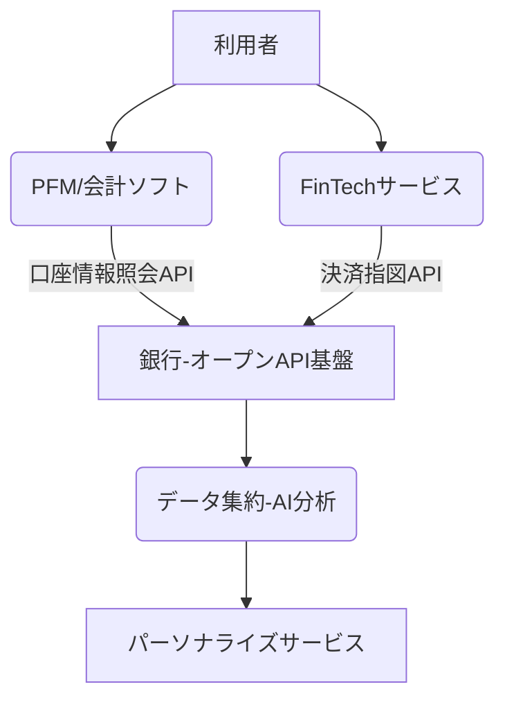

# T16-01-02 オープンバンキングAPI・PSD2準拠

## Summary（5つの要点）

1. **市場成長**: 日本のオープンバンキングシステム市場は2025年から2033年にかけてCAGR 20.5%で成長し、市場規模は数年で4倍以上に拡大予測 `1`。
2. **規制対応と標準化**: 欧州のPSD2に倣い、日本の銀行法改正によりAPI接続が制度化。相互運用性とセキュリティが最重要課題となる `1`。
3. **AI/ML統合**: データ分析機能の向上と金融サービスのパーソナライズのために、API経由で取得した取引データへのAI・機械学習の適用が加速 `1`。
4. **PFM・会計連携の高度化**: 大手銀行コンソーシアムが個人資産管理（PFM）向け標準APIのパイロット運用に成功（2025年）。データ集約の効率化が進む `1`。
5. **BaaSへの進化**: APIを通じて決済、融資などの金融機能を非金融企業に提供するBaaS（Banking as a Service）基盤となり、組込金融の実現を加速させる。

#### 概念図

---

### 技術評価表（定量的な視点）
| 評価項目 | 評価 | 根拠・備考 |
| :--- | :--- | :--- |
| 導入コスト | ⭐⭐⭐⭐☆ | 銀行側のレガシーシステム改修に巨額投資が必要。 |
| 技術成熟度 | ⭐⭐⭐⭐☆ | 技術（REST API、OAuth 2.0）は成熟。ガバナンスと相互運用性が課題。 |
| 日本の競争力 | ⭐⭐⭐☆☆ | 制度化は進んだが、データ流通量や決済機能開放の積極性で欧州に遅れ。 |
| 市場性 | ⭐⭐⭐⭐⭐ | FinTech連携、BaaSの基盤であり、金融イノベーションの必須インフラ。 |
| 品質保証の重要性 | ⭐⭐⭐⭐⭐ | セキュリティとデータ保護（個人情報保護法、通信暗号化）が絶対条件。API認証・認可の堅牢性。 |

---

## 日本の立ち位置・強み弱みのSummary

### 強み

* **制度整備の完了**: 2018年の銀行法改正により、API接続が制度化され、銀行の対応が法的に担保された。
* **銀行のセキュリティ体制**: 伝統的な金融機関が長年培ってきた高度なセキュリティ・リスク管理体制が基盤にある。
* **コンソーシアムによる標準化**: PFMアプリ等向けに、複数の銀行が連携し標準API仕様の策定・実証を進めており、相互運用性を高める努力が進んでいる `1`。

### 弱み

* **API公開範囲の限定**: 欧州PSD2が決済指図（PISP機能）まで広く義務付けているのに対し、日本はデータ照会が中心で、決済機能の開放が限定的。
* **レガシーシステムとの接続**: 多くの銀行がレガシーシステムを抱えており、API公開に伴うシステム改修とコスト負担が重い。
* **データ活用への消極性**: 金融機関側のデータ独占意識や、個人情報保護に対する過剰な慎重さから、APIを通じたデータ活用が進みにくい側面がある。

---

## 技術ロードマップ（短期/中期/長期）

### 短期目標（～2027年）

* PFM、家計簿アプリ向けデータ照会APIの完全普及と、接続先金融機関数の大幅増加。
* 顧客同意取得プロセスの標準化と、情報銀行（ID管理）との連携強化。
* FinTech企業向けAPIテスト環境の提供と、開発者コミュニティの活性化。

### 中期目標（2028年～2031年）

* 決済指図API（PISP機能）の本格的な展開と、非金融企業による決済サービスの提供開始。
* API経由の取引データに基づく、AI与信審査モデルの共同開発と実用化。
* 複数のAPIを組み合わせたクロスファンクショナルな金融サービス（例：融資と保険）の創出。

### 長期目標（2032年～2035年）

* 金融機関の機能がモジュール化され、BaaS（Banking as a Service）基盤として完全に機能。
* オープンファイナンス（証券、保険を含む）への拡張と、全金融データが相互運用可能となる。
* DID（分散型ID）と連携し、自己主権型データ管理下でAPIが利用される未来。

### 📚 参照リンク

1. [オープンバンキングシステム市場Trend：持続可能な成長要因と技術革新の分析](https://www.innovations-i.com/release/1775433.html)