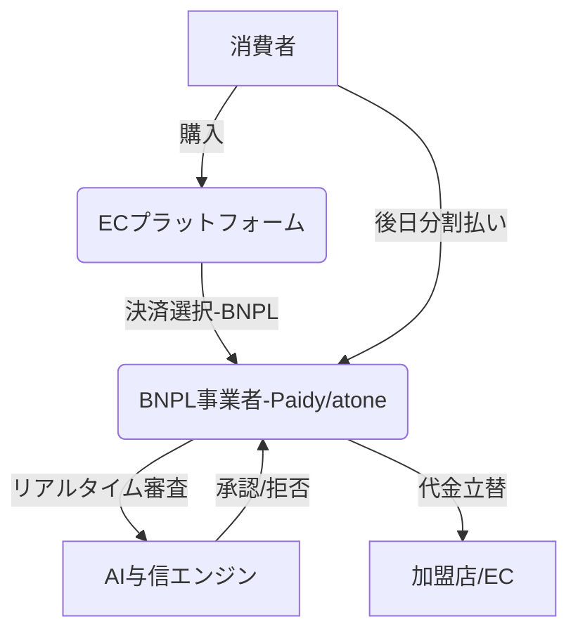

# T16-01-03 BNPL（Buy Now, Pay Later）・後払い決済

## Summary（5つの要点）

1. **EC決済の主流化**: クレジットカードを持たない層や分割払いを望む層を中心に普及し、一部EC市場では決済の30%以上を占めるまでに成長。
2. **AIによる与信審査**: 従来の信用情報に依存せず、ECの購買履歴や行動データを用いた**AI与信審査**がリアルタイムで実行され、少額融資の承認を自動化する。
3. **規制強化の動向**: 世界的に過剰債務リスクが問題視されており、日本国内では2025年前後に「資金決済法」や「割賦販売法」に基づく規制の具体化が見込まれる `1`。
4. **金融包摂の促進**: クレジットカード審査に通らない若年層や非正規雇用者など、伝統的金融からこぼれ落ちた層への金融アクセスを提供する。
5. **組込金融との連携**: BNPL機能がECプラットフォームや非金融サービスに直接組み込まれ（Embedded Finance）、シームレスな購入体験を実現する。

#### 概念図

---

### 技術評価表（定量的な視点）
| 評価項目 | 評価 | 根拠・備考 |
| :--- | :--- | :--- |
| 導入コスト | ⭐⭐⭐⭐☆ | EC事業者にとって決済システムの組み込みコストは低い。 |
| 技術成熟度 | ⭐⭐⭐⭐☆ | 決済インターフェースは成熟。AI与信モデルの精度向上が継続的課題。 |
| 日本の競争力 | ⭐⭐⭐⭐☆ | Paidy、atoneなど国内勢が市場で優位性を確立。技術力も高い。 |
| 市場性 | ⭐⭐⭐⭐⭐ | クレジットカード非保有層、若年層の取り込みにより市場は急速拡大。 |
| 品質保証の重要性 | ⭐⭐⭐⭐⭐ | 延滞・債務超過リスクの管理と、AI与信モデルの公平性・透明性の確保が必須。 |

---

## 日本の立ち位置・強み弱みのSummary

### 強み

* **国内市場の優位性**: クレジットカード保有率が欧米より低い日本において、BNPLは若年層や非カード保有層の金融包摂手段として高い需要と浸透率を持つ。
* **独自のAI与信ノウハウ**: Paidyなどの国内事業者が、日本の消費者行動に最適化された独自のAI与信モデルを構築・運用している。
* **決済手段の多様性**: コンビニ支払い、口座振替など、日本独自の多様な後払い手段に対応しており、ユーザーの利便性が高い。

### 弱み

* **規制強化リスク**: BNPLを「少額包括信用購入あっせん」として捉える動きがあり、2025年前後の法改正で過剰債務防止のための規制が強化される懸念がある `1`。
* **海外への展開力**: Klarna、Afterpayなどのグローバル大手と比較し、日本国内事業者の海外市場への展開力がまだ限定的である。
* **延滞債権の資産化**: 延滞債権の管理・回収にかかるコストや、それを適切に資産化（証券化）する仕組みの整備が遅れている。

---

## 技術ロードマップ（短期/中期/長期）

### 短期目標（～2027年）

* 規制強化（割賦販売法等）に先回りした、ユーザーへの利用上限額設定、情報開示の透明性向上。
* AI与信モデルへの代替信用情報（携帯電話の支払い履歴等）の統合による精度向上。
* B2B向けBNPLサービス（企業間後払い）の本格的な立ち上げ。

### 中期目標（2028年～2031年）

* BNPLの機能を他の金融サービス（例：保険、資産運用）と連携させ、組込金融のエコシステムを構築。
* 延滞債務の二次流通市場の確立と、債権回収業務のAI/RPAによる自動化。
* 海外大手BNPL事業者との技術・資本提携によるグローバル展開の加速。

### 長期目標（2032年～2035年）

* BNPLが次世代の標準的なマイクロファイナンス手段として社会に定着。
* 金融機関との連携により、BNPL利用履歴を伝統的な信用スコアリングに完全に統合。
* サービス利用を通じて、ユーザーの金融リテラシー向上に貢献する仕組みの構築。

### 📚 参照リンク

1. [BNPLの普及と規制強化｜後払い決済の最新動向 - Virtuspayment](https://virtuspayment.com/column/bnpl%E3%81%AE%E6%99%AE%E5%8F%8A%E3%81%A8%E8%A6%8F%E5%88%B6%E5%BC%B7%E5%8C%96%EF%BD%9C%E5%BE%8C%E6%89%95%E3%81%84%E6%B1%BA%E6%B8%88%E3%81%AE%E6%9C%80%E6%96%B0%E5%8B%95%E5%90%91/)