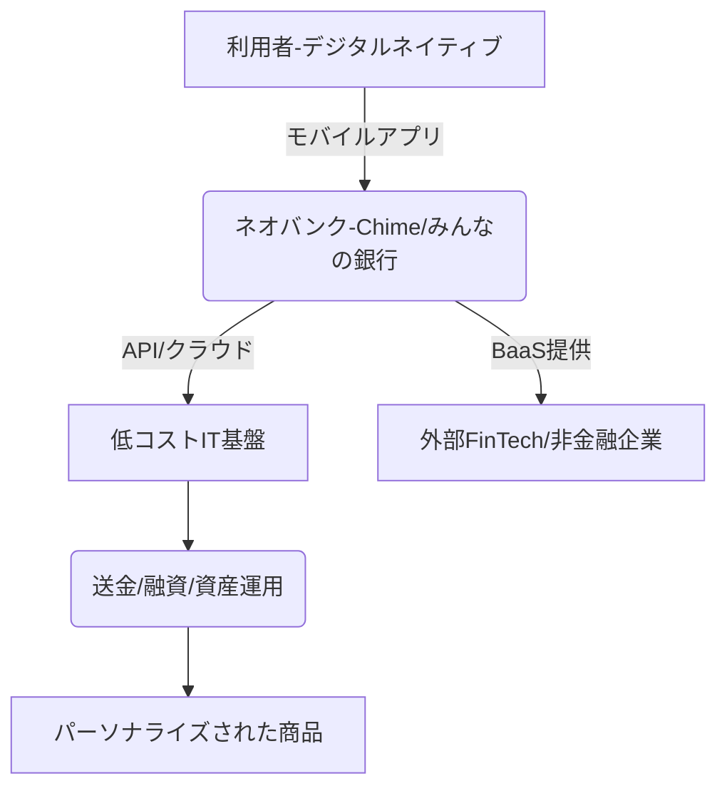

# T16-01-04 ネオバンク・デジタル専業銀行

## Summary（5つの要点）

1. **爆発的成長**: ネオバンク市場はグローバルで2025年の750億米ドルから2032年には3,300億米ドルに達すると予測され、CAGR 23.4%で成長する `3`。
2. **顧客体験の破壊的革新**: 実店舗を持たず、モバイルアプリ完結、低手数料、パーソナライズされたサービスを提供し、顧客満足度で従来型銀行を凌駕する `3`。
3. **技術的優位性**: クラウドコンピューティング、オープンAPIを最大限に活用し、高い拡張性と効率性を実現。米国Chimeは870万アクティブユーザーに急成長 `2`。
4. **日本のネット銀行の拡大**: 既存のインターネット専業銀行（ネット銀行）の預金残高は2025年3月末で38.2兆円に達し、10年間で3倍以上の規模に拡大している `1`。
5. **規制と競争激化**: 伝統的銀行との競争が激化するとともに、マネーロンダリング対策や顧客保護に関する規制当局からの監視も強まる。

#### 概念図

---

### 技術評価表（定量的な視点）
| 評価項目 | 評価 | 根拠・備考 |
| :--- | :--- | :--- |
| 導入コスト | ⭐⭐⭐☆☆ | 実店舗不要のため低コストだが、セキュリティ・クラウドインフラへの投資は高額。 |
| 技術成熟度 | ⭐⭐⭐⭐☆ | クラウドネイティブな技術は成熟。AI/MLの適用領域拡大が継続的課題。 |
| 日本の競争力 | ⭐⭐⭐☆☆ | 既存ネット銀行は強いが、真のネオバンク（みんなの銀行等）は海外勢に口座数で後れ。 |
| 市場性 | ⭐⭐⭐⭐⭐ | 2035年には金融サービスの中核を担うと見込まれる破壊的イノベーション。 |
| 品質保証の重要性 | ⭐⭐⭐⭐⭐ | システムの可用性（ダウンタイムゼロ）、金融詐欺対策、データプライバシー保護が必須。 |

---

## 日本の立ち位置・強み弱みのSummary

### 強み

* **既存ネット銀行の蓄積**: 楽天銀行、住信SBIネット銀行など、既存のネット銀行が安定した預金残高とユーザーベースを持ち、低コスト運営のノウハウを蓄積している `1`。
* **高水準のセキュリティ**: 日本の金融業界全体が高いセキュリティ基準を保持しており、ネオバンクもその恩恵を受けている。
* **メガバンクからのスピンアウト**: みんなの銀行（ふくおかFG系）など、伝統的金融機関の知見と資本力を背景に立ち上げられた事例がある。

### 弱み

* **ブランド信頼性の課題**: Revolutなどの海外勢と比較し、日本のネオバンク（みんなの銀行、UI銀行）は、認知度・預金残高・ブランド力でまだ大きな差がある。
* **収益源の多様化の遅れ**: 低コストを売りにする一方で、融資や資産運用などの高収益事業への本格展開が遅れている。
* **高齢者層の取り込み**: デジタル・モバイル完結型サービスのため、高齢者層への浸透が難しく、国内の顧客ベース拡大に障壁がある。

---

## 技術ロードマップ（短期/中期/長期）

### 短期目標（～2027年）

* 給与前払い、残高自動立替など、顧客目線の革新的サービスの導入と口座数の大幅拡大。
* AIを活用したパーソナライズされた融資・資産運用アドバイス機能の標準搭載。
* 既存銀行との提携によるATM網の拡充と、デジタルサービスの利便性向上。

### 中期目標（2028年～2031年）

* BaaSプラットフォームの確立と、他のネオバンクへのITインフラ提供（モジュラーバンキング）。
* Web3技術を取り込み、NFTアセットの保管や分散型金融（DeFi）へのゲートウェイ機能の提供。
* グローバル市場への進出（特にアジア圏）と、クロスボーダー送金手数料の完全撤廃。

### 長期目標（2032年～2035年）

* ネオバンクが金融サービスにおける主要プレイヤーとなり、金融機関の再編を主導。
* 独自のデジタル通貨（ステーブルコイン）発行と、その経済圏の確立。
* 金融サービスをライフスタイルに完全に統合する、真の「組込金融」プラットフォームとなる。

### 📚 参照リンク

1. [インターネット専業銀行の預金動向 No.2025－27 （2025.6.5）](https://www.scbri.jp/reports/.assets/newstopics_20250605.pdf)
2. [ネオバンク「Chime（チャイム）」とは？ メガバンクも震える「銀行業界革命」の仕組み - ビジネス+IT](https://www.sbbit.jp/article/fj/170354)
3. [ネオバンクとチャレンジャーバンク市場規模と動向｜業界レポート2025年～2032年 - イノベーションズアイ](https://www.innovations-i.com/release/1785059.html)