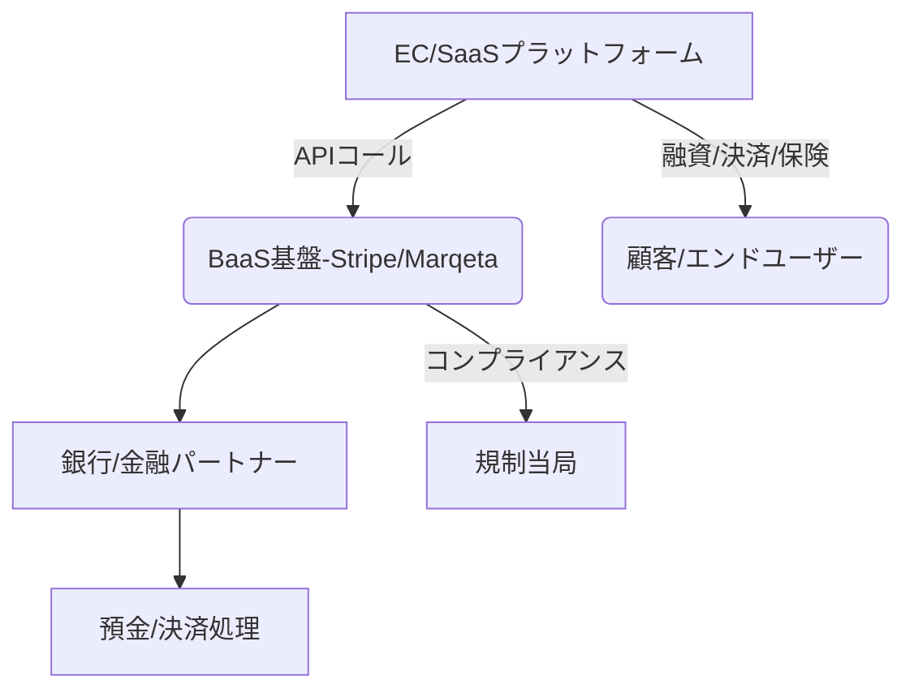

# T16-01-05 組込金融（Embedded Finance）

## Summary（5つの要点）

1. **市場の急拡大**: 世界市場規模は2024年の104.8億米ドルから2034年には834.1億米ドルへ、CAGR 23.3%で急速に成長する `2`。
2. **BaaS基盤の確立**: BaaS（Banking as a Service）プラットフォームが非金融企業への参入障壁を下げ、金融ライセンスやインフラなしでのサービス提供を可能にする `2`。
3. **非金融企業による金融提供**: EC、ライドシェア、SaaSなどの非金融企業が、自社プラットフォーム内で決済、融資、保険をシームレスに提供し、顧客体験を向上させる（例: Shopify Payments）。
4. **デジタル決済の促進**: 消費者と事業セグメント全体でのデジタル決済の急速な採用が、埋め込まれた金融の成長を強力に牽引する `2`。
5. **地域DXへの応用**: 地域金融機関と連携し、地域交通機関や自治体サービスに金融機能を組み込むことで、地域DX（デジタルトランスフォーメーション）の核となる `1`。

#### 概念図

---

### 技術評価表（定量的な視点）
| 評価項目 | 評価 | 根拠・備考 |
| :--- | :--- | :--- |
| 導入コスト | ⭐⭐⭐☆☆ | BaaS利用料とAPI連携の開発費が必要だが、自前構築に比べると低コスト。 |
| 技術成熟度 | ⭐⭐⭐⭐☆ | BaaSプラットフォーム技術は成熟。非金融企業側の金融ノウハウ獲得が課題。 |
| 日本の競争力 | ⭐⭐⭐☆☆ | BaaSプロバイダーは増加傾向だが、グローバル大手（Stripe、Marqeta）に劣後。 |
| 市場性 | ⭐⭐⭐⭐⭐ | 2035年に向けて非金融産業の収益源となる最重要技術。 |
| 品質保証の重要性 | ⭐⭐⭐⭐⭐ | 非金融企業側のコンプライアンス管理、不正リスク、顧客資産保護の責任範囲が複雑化。 |

---

## 日本の立ち位置・強み弱みのSummary

### 強み

* **地域金融機関の連携**: NTTデータなど、地域金融機関と連携した地域DX推進のためのBaaSソリューションの実証が進んでいる `1`。
* **EC市場の成熟**: 楽天、ヤフー、メルカリといった大規模ECプラットフォームが、既存の決済・融資サービスを内包する形で先行している。
* **高い技術品質**: BaaS提供企業（金融ITベンダー）が持つ高いシステム品質と安定性。

### 弱み

* **規制対応の複雑性**: 金融ライセンスを持たない非金融企業が金融サービスを提供する場合の、業法上の解釈とコンプライアンス管理が複雑かつ重い。
* **BaaS専業プレイヤーの不足**: グローバルのように、金融インフラ提供に特化した大規模なBaaS専業プレイヤーがまだ少なく、競争が限定的。
* **セキュリティ・不正リスク**: 非金融企業のシステムが金融機能を持つことで、新たなセキュリティホールや不正利用のリスクが発生する。

---

## 技術ロードマップ（短期/中期/長期）

### 短期目標（～2027年）

* BaaSプラットフォームの機能標準化と、中堅・中小SaaS企業への導入支援プログラムの展開。
* BNPL、ペイメントに続き、簡易的な保険商品（返品保険、旅行保険）の組込型提供開始。
* BaaS利用者向けのコンプライアンス・不正対策ガイドラインの策定。

### 中期目標（2028年～2031年）

* 非金融企業による高度な融資サービス（サプライチェーンファイナンス、即時運転資金融資）の本格的な提供。
* 医療・ヘルスケア分野など、規制が厳しい産業への金融サービス組み込みの実証。
* 金融データと非金融データ（行動、在庫、物流）を統合したAI与信モデルの構築。

### 長期目標（2032年～2035年）

* あらゆるサービス（Web3、メタバースを含む）に金融機能が不可視に組み込まれる。
* 「金融機関」の概念が希薄化し、金融機能が標準的なITモジュールとなる。
* 金融サービスが完全にコンテキストベースとなり、必要な時に必要なサービスが自動で提供される。

### 📚 参照リンク

1. [Embedded Finance／BaaS活用の地域金融×地域DXアプローチ | DATA INSIGHT | NTTデータ](https://www.nttdata.com/jp/ja/trends/data-insight/2024/0215/)
2. [組み込み金融市場規模、成長分析 2025-2034 - Global Market Insights](https://www.gminsights.com/ja/industry-analysis/embedded-finance-market)