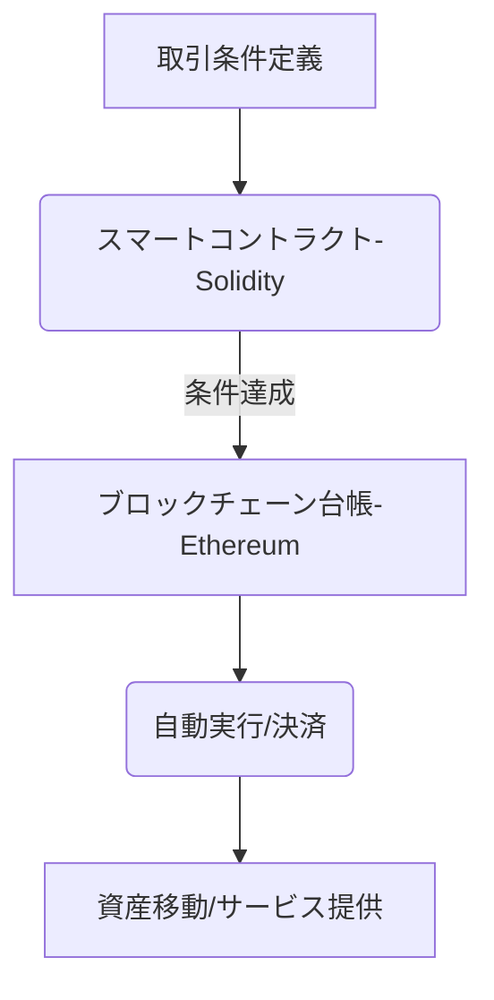

# T16-02-01 スマートコントラクト（Ethereum, Solidity）

## Summary（5つの要点）

1. **自動実行と透明性**: 事前に定義された取引条件が満たされた際に、中央管理者を介さず、プログラムコード（Solidity等）に基づき自動で資産移動や決済を実行する。
2. **Dappsの基盤**: 分散型アプリケーション（Dapps）の論理層を形成し、DeFi、NFT、サプライチェーンなどのWeb3サービスの信頼性を担保する。
3. **コード監査と形式検証**: コードのバグや脆弱性が資金流出の重大リスクとなるため、第三者によるセキュリティ監査、および形式検証（Formal Verification）による数学的証明が不可欠となっている。
4. **応用分野の拡大**: 金融派生商品（CDS等）の自動決済、保険金の自動支払い、著作権・ロイヤリティの自動配分など、適用領域が従来の暗号資産取引を超えて拡大。
5. **スケーラビリティの向上**: Ethereumのレイヤー2ソリューション（Optimism, Arbitrum等）の普及により、取引速度とガス代（手数料）の課題が大幅に改善され、実用性が高まった。

#### 概念図

---

### 技術評価表（定量的な視点）
| 評価項目 | 評価 | 根拠・備考 |
| :--- | :--- | :--- |
| 導入コスト | ⭐⭐⭐☆☆ | 開発・監査費用が高額。既存システムとの連携コストも考慮が必要。 |
| 技術成熟度 | ⭐⭐⭐⭐☆ | 基本技術は確立。セキュリティ確保（監査）と形式検証技術が課題。 |
| 日本の競争力 | ⭐⭐⭐☆☆ | エンタープライズ向け（Hyperledger等）での実績は豊富だが、パブリックチェーンでの開発者層が薄い。 |
| 市場性 | ⭐⭐⭐⭐⭐ | Web3、DeFi、ST（セキュリティトークン）の基盤であり、金融・非金融分野で必須の技術。 |
| 品質保証の重要性 | ⭐⭐⭐⭐⭐ | **コードバグは即資金流出に直結**するため、セキュリティ監査が最重要項目。 |

---

## 日本の立ち位置・強み弱みのSummary

### 強み

* **高信頼性システム構築ノウハウ**: 伝統的な金融システムで培われた、堅牢なシステム設計とセキュリティ運用に関するノウハウが豊富。
* **エンタープライズチェーンの実績**: NTT、富士通などが中心となり、企業間取引向けのプライベート/コンソーシアム型ブロックチェーン（Hyperledger Fabric, Quorum）の開発と実証実験が進んでいる。
* **金融機関の関与**: メガバンクや証券会社がセキュリティトークンやデジタル通貨（DCJPY）の基盤としてスマートコントラクト技術の採用を積極的に検討している。

### 弱み

* **パブリックチェーン開発人材不足**: グローバルなDeFiやDapps開発で主流のSolidityエンジニア、Web3ネイティブな開発者の層が薄い。
* **規制の不確実性**: スマートコントラクトで実行される取引の法的解釈（特に契約の成立、執行力）に関する明確な指針が遅れている。
* **DeFi市場への参入障壁**: 暗号資産に対する税制（雑所得）が、DeFiへの個人・企業による積極的な参入を阻害している。

---

## 技術ロードマップ（短期/中期/長期）

### 短期目標（～2027年）

* スマートコントラクトの脆弱性自動検知・形式検証ツールの普及と標準化。
* 金融庁等による、ST（セキュリティトークン）におけるスマートコントラクトの法的有効性に関するガイドライン策定。
* Ethereumレイヤー2ソリューションを基盤とした、国内Dappsの利用者拡大。

### 中期目標（2028年～2031年）

* 分散型保険（DeInsure）など、自動化された保険・保証サービスの本格的な実用化。
* クロスチェーン技術と連携し、異なるブロックチェーン間でのスマートコントラクト連携（例：資産の担保化）。
* 大規模なサプライチェーン管理やIoTデータ連携における、エンタープライズスマートコントラクトの標準基盤化。

### 長期目標（2032年～2035年）

* 全てのデジタル契約がスマートコントラクトとして処理されるデジタル公証社会の実現。
* AIによる自動契約生成、形式検証、最適化までを一貫して行うシステムの確立。
* DAO（分散型自律組織）が法的な執行力を持つ組織形態として認知される。

### 📚 参照リンク

1. [JBA：スマートコントラクトに関する技術動向レポート 2025](https://www.japan-blockchain-association.org/news/smartcontract-trend-2025/)
2. [Ethereum L2 Adoption Report Q3 2025 - CoinGecko](https://www.coingecko.com/research/reports/ethereum-l2-adoption-q3-2025)