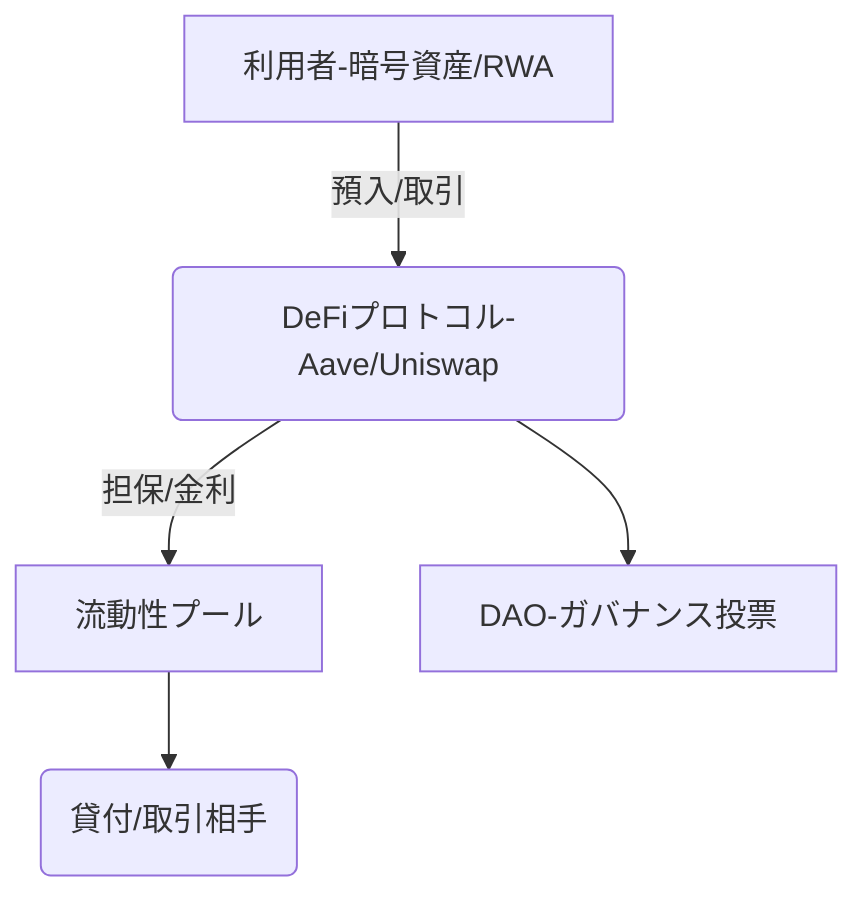

# T16-02-02 DeFi（分散型金融）プロトコル

## Summary（5つの要点）

1. **金融仲介の排除**: 従来の銀行、証券会社といった中央集権的な金融機関を介さず、スマートコントラクトを通じて個人間で直接融資、取引、保険などの金融サービスを提供する。
2. **主要プロトコル群の確立**: Uniswap（分散型取引所: DEX）、Aave/Compound（レンディング）、MakerDAO（ステーブルコイン発行）など、金融機能のモジュール化が進み、TVL（Total Value Locked、総預かり資産）は依然として巨大な市場を形成している。
3. **イールドファーミングの進化**: 資産を流動性プールに提供することで利回りを得る仕組みが、より複雑な戦略（レバレッジ取引、自動運用）を取り入れたイールドアグリゲーターへと進化。
4. **RWA（現実資産）の取り込み**: 不動産、コモディティ、未公開株など、現実世界の資産をトークン化し、DeFiプロトコルの担保や流動性として活用するRWA（Real World Assets）が急速に成長。
5. **規制の対応**: ハッキング・脆弱性リスクに加え、マネーロンダリング（AML）対策や本人確認（KYC）への対応が喫緊の課題となり、コンプライアンス準拠型のDeFi（Permissioned DeFi）が模索されている。

#### 概念図

---

### 技術評価表（定量的な視点）
| 評価項目 | 評価 | 根拠・備考 |
| :--- | :--- | :--- |
| 導入コスト | ⭐⭐⭐☆☆ | サービス提供者側（プロトコル開発）は監査費用が高い。利用者側は手数料（ガス代）次第。 |
| 技術成熟度 | ⭐⭐⭐☆☆ | コア技術は確立。ブリッジや複合的なプロトコルのセキュリティ脆弱性が依然として問題。 |
| 日本の競争力 | ⭐⭐☆☆☆ | 国内の規制環境と税制が厳しく、プロトコル開発者、投資家ともに海外に大きく後れを取っている。 |
| 市場性 | ⭐⭐⭐⭐⭐ | 伝統的金融システムを置き換えうる破壊的な可能性を持つ。グローバルでの資金流入は継続。
| 品質保証の重要性 | ⭐⭐⭐⭐⭐ | スマートコントラクトのバグ、フラッシュローン攻撃によるハッキングリスクが常時存在する。 |

---

## 日本の立ち位置・強み弱みのSummary

### 強み

* **高い技術リテラシー**: 伝統的な金融機関やIT企業がWeb3技術に対する基礎研究やPoC（概念実証）を進めており、技術理解度は高い。
* **ステーブルコイン規制の整備**: 2023年施行の改正資金決済法により、日本におけるステーブルコイン発行の法的基盤が整備され、DeFiへの資金流入の道筋ができつつある。
* **堅牢なサイバーセキュリティ**: 既存の金融システムで培われたセキュリティ対策、監視体制は世界でもトップクラス。

### 弱み

* **税制の障壁**: 暗号資産取引で得た利益（イールドファーミング含む）に対する**雑所得課税（最大55%）**が、個人・企業によるDeFiへの積極的な参加を著しく阻害している。
* **規制の未整備**: DeFiプロトコルの運営主体（DAO）の法的地位、プロトコル自体を誰が規制するかといった課題が未解決。
* **開発者・エコシステムの流出**: 規制や税制の不利さから、日本の優秀なブロックチェーン開発者やプロジェクトがシンガポール、ドバイなどの海外拠点へ流出している。

---

## 技術ロードマップ（短期/中期/長期）

### 短期目標（～2027年）

* RWA（現実資産）をトークン化し、国内の不動産融資などと連携するコンプライアンス準拠DeFiの実証。
* AML/KYC機能を持つDeFiレンディングプロトコルの開発とパイロット運用。
* 規制サンドボックス制度を活用した、国内DeFiプロジェクトのテストケース創出。

### 中期目標（2028年～2031年）

* 伝統的な金融機関（銀行、証券会社）が、DeFiプロトコルの一部機能（例：流動性提供）を業務に組み込む（CeFi-DeFi連携）。
* DeFiiに特化した保険サービス（プロトコルハッキング保険）の市場確立。
* DAOの法的地位に関する国際的な標準化、または国内での限定的な法整備の実現。

### 長期目標（2032年～2035年）

* DeFiが主要な金融インフラのモジュールとなり、全ての人が国境・時間・仲介者を気にせず金融サービスを利用できる社会の実現。
* 中央銀行デジタル通貨（CBDC）とDeFiプロトコルのシームレスな相互運用性の確保。
* AIが個人の資産状況に基づき、最適なDeFi戦略を自動で実行するシステムの実現。

### 📚 参照リンク

1. [分散型金融（DeFi）の市場動向と将来予測 2026年版 - CoinDesk Japan](https://www.coindeskjapan.com/defi-2026-report/)
2. [日本におけるWeb3関連税制の現状と課題 - 経済産業省](https://www.meti.go.jp/policy/economy/security/web3/)