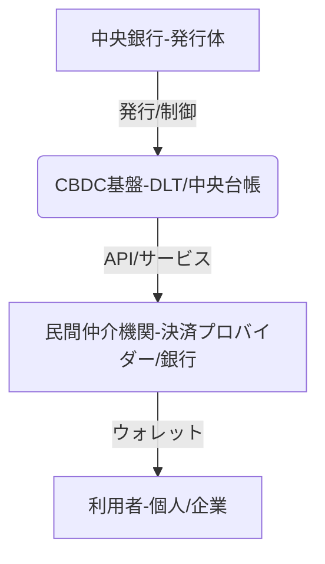

# T16-02-03 CBDC（中央銀行デジタル通貨）技術基盤

## Summary（5つの要点）

1. **法定通貨のデジタル化**: 中央銀行（日銀、ECBなど）が直接発行・債務保証するデジタル形態の法定通貨であり、現金と同等の安全性を確保する。
2. **技術の二択**: 中央集権型台帳（ハイブリッド方式含む）と、ブロックチェーン/DLT（分散型台帳技術）のどちらを基盤技術とするか、各国で実証実験が進行中。
3. **決済システムの効率化**: 銀行間取引やクロスボーダー決済の即時化、コスト削減、決済リスク低減に貢献し、金融システム全体の効率性を向上させる。
4. **金融包摂とディスインターミディエーション**: 銀行口座を持たない層（金融包摂）への金融アクセスを提供する一方で、民間銀行から中央銀行への預金流出（ディスインターミディエーション）を防ぐための仕組み（例：保有上限額設定）の設計が不可欠。
5. **日銀の実証実験フェーズ**: 日本銀行は2025年までにフェーズ2（機能実装の技術的検証）を完了させ、2026年以降のパイロットプログラム（民間との連携検証）への移行を目指している `1`。

#### 概念図

---

### 技術評価表（定量的な視点）
| 評価項目 | 評価 | 根拠・備考 |
| :--- | :--- | :--- |
| 導入コスト | ⭐⭐⭐⭐☆ | 国家インフラとしての大規模なシステム構築・運用コストが必要。 |
| 技術成熟度 | ⭐⭐⭐☆☆ | 基盤技術は確立したが、大規模流通時の負荷耐性、プライバシー保護機能の実証が課題。 |
| 日本の競争力 | ⭐⭐⭐⭐☆ | 日銀が着実に実証実験を進め、技術的な検討では世界をリード。社会受容性・プライバシーに配慮。 |
| 市場性 | ⭐⭐⭐⭐⭐ | 現金代替、国際決済の標準となり、経済活動の根幹を支えるインフラとなる。 |
| 品質保証の重要性 | ⭐⭐⭐⭐⭐ | 国家の信用の基盤であり、システムダウン、セキュリティ、プライバシー保護が最優先。 |

---

## 日本の立ち位置・強み弱みのSummary

### 強み

* **日銀による着実な実証**: 日本銀行が民間企業と連携し、機能検証を2段階（フェーズ1/2）で慎重かつ着実に進めており、設計思想が堅牢である。
* **プライバシー保護への配慮**: デジタル円の設計原則として、利用者のプライバシー保護（データ収集の最小化）を重視しており、国民の受容性を高める土壌がある。
* **高い決済インフラの信頼性**: 既存の銀行システムや決済ネットワークの運用で培われた、高可用性・高セキュリティなインフラ構築技術を持つ。

### 弱み

* **国民の現金志向**: 世界でも有数の現金利用率であり、デジタル通貨の利用を国民に促すインセンティブ設計が難しい。
* **民間連携の遅れ**: フェーズ2までは技術検証が中心であり、民間サービスやモバイルウォレットへの統合、ビジネスモデル構築の議論が、欧州や中国に比べると遅れ気味。
* **オフライン決済の課題**: 災害時や通信途絶時にも利用可能なオフライン決済技術（例：ICカード、セキュアチップ）の実装とコストが課題。

---

## 技術ロードマップ（短期/中期/長期）

### 短期目標（～2027年）

* 日銀がフェーズ2を完了し、パイロットプログラム（民間との連携）を開始。
* CBDC発行を前提とした、民間銀行のシステム改修・API連携仕様の標準化。
* プライバシー保護と不正利用防止（AML/CFT）を両立させる技術的解決策（ゼロ知識証明等）の実証。

### 中期目標（2028年～2031年）

* パイロットプログラムに基づき、限定的な範囲（例：公共サービス、特定の地域）での試験的流通開始。
* 他国の中央銀行デジタル通貨（CBDC）基盤との国際的なクロスボーダー決済の共同実証。
* オフライン決済機能の実用化と、災害時利用を想定した耐久性検証。

### 長期目標（2032年～2035年）

* デジタル円の本格的な発行・流通開始（発行判断に基づく）。
* CBDCが新しい金融取引（DeFi、ST）の決済手段として広く採用される。
* 預金離れを防ぐための金利付与設計（Tiered Interest Rate）など、金融安定性を確保するための仕組みが機能する。

### 📚 参照リンク

1. [中央銀行デジタル通貨に関する日本銀行の取り組み - 日本銀行](https://www.boj.or.jp/research/brp/cbdc/)
2. [CBDCの技術設計に関する論点整理 - 金融庁](https://www.fsa.go.jp/singi/ginkou/cbdc/)