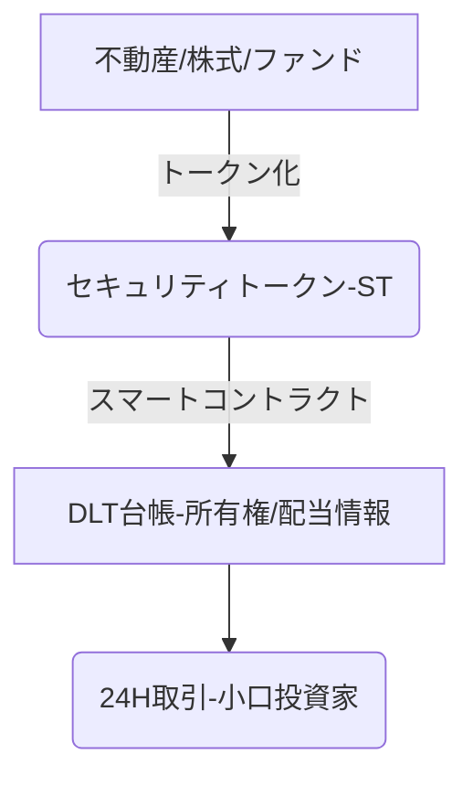

# T16-02-04 セキュリティトークン・デジタル証券

## Summary（5つの要点）

1. **証券のトークン化**: 株式、債券、不動産などの従来の有価証券を、ブロックチェーン（DLT）上のデジタルトークンとして発行・管理する。
2. **即時決済の実現**: 従来の証券決済システム（T+2日）を不要とし、取引と同時に所有権移転と決済が完了する**アトミック・セツルメント**を実現する。
3. **小口化と流動性向上**: 不動産やファンドなどの高額な資産を1万円単位などに小口化し、より多くの投資家にアクセスを提供することで、資産の流動性を高める。
4. **規制の整備と準拠**: 日本では金融商品取引法に基づく電子記録移転権利として規定され、発行・流通には金融規制を遵守するためのスマートコントラクト設計が不可欠。
5. **新市場の創出**: 従来の市場では扱えなかった非流動性の高い資産（例：アート、ワイン、インフラプロジェクト）や、STO（Security Token Offering）による資金調達の手段を提供する。

#### 概念図

---

### 技術評価表（定量的な視点）
| 評価項目 | 評価 | 根拠・備考 |
| :--- | :--- | :--- |
| 導入コスト | ⭐⭐⭐⭐☆ | 既存証券システムからの移行・連携にコストがかかるが、長期的な運用コストは削減。 |
| 技術成熟度 | ⭐⭐⭐☆☆ | 基盤技術は確立。法的規制対応のための複雑なスマートコントラクト設計が課題。 |
| 日本の競争力 | ⭐⭐⭐⭐⭐ | **法規制（金商法）の整備がグローバルでも先進的**。業界団体の標準化も進む。 |
| 市場性 | ⭐⭐⭐⭐⭐ | 2035年に向けて、金融商品の発行・流通の主要な形態になると予測される。 |
| 品質保証の重要性 | ⭐⭐⭐⭐⭐ | 金融規制を確実に遵守するスマートコントラクトの設計と監査、セキュリティが絶対条件。 |

---

## 日本の立ち位置・強み弱みのSummary

### 強み

* **先進的な規制環境**: 日本は2020年の金融商品取引法改正により、セキュリティトークンの法的地位を明確に定めており、欧米と並ぶ世界最速レベルの規制整備が進んだ。
* **業界主導の標準化**: 日本セキュリティトークン協会（JSTA）などが中心となり、不動産、投資信託などの分野で技術的・業務的な標準化を主導している。
* **大手金融機関のコミット**: SBIホールディングス、野村証券、三井住友信託銀行などの大手金融機関がプラットフォーム開発や実証実験に積極的に参画している。

### 弱み

* **既存システムの制約**: 既存の証券決済・保管システムとの互換性確保、移行コスト、二重管理の期間が負担となっている。
* **投資家層の拡大**: STOによる資金調達、ST市場への投資家層が、まだ不動産など特定分野に偏っており、市場全体への認知度、普及率が低い。
* **流動性の課題**: 発行されたセキュリティトークンの二次流通市場の流動性をどう確保するか、取引所の整備がグローバルな課題となっている。

---

## 技術ロードマップ（短期/中期/長期）

### 短期目標（～2027年）

* 不動産ST、特定目的会社（SPC）を利用したインフラSTの本格的な発行案件数の大幅増加。
* STのセカンダリーマーケット（二次流通市場）の取引システムの安定運用と流動性の向上。
* 伝統的な証券会社がSTを取り扱うためのシステム連携APIの標準化。

### 中期目標（2028年～2031年）

* 株式・社債など、より広範な伝統的有価証券のST化に関する実証実験と市場への部分的導入。
* STプラットフォーム間の相互運用性を高め、グローバルなクロスボーダーST取引を可能にする技術の確立。
* STのスマートコントラクトに、税務報告やコンプライアンス機能を自動で組み込む仕組みの実現。

### 長期目標（2032年～2035年）

* 証券の発行・流通・決済がDLTを基盤とするデジタル証券システムに全面的に移行。
* 地域の未公開企業や中小企業の資産（知財、売掛金）もST化され、新しい資金調達手段が社会に浸透。
* 全ての金融商品がデジタル化され、即時決済が世界の標準となる。

### 📚 参照リンク

1. [セキュリティトークン市場の動向と展望 2025 - 日本セキュリティトークン協会](https://www.j-sto.or.jp/news/report-2025/)
2. [金融商品取引法におけるデジタル証券に関する解説 - 金融庁](https://www.fsa.go.jp/policy/st/)