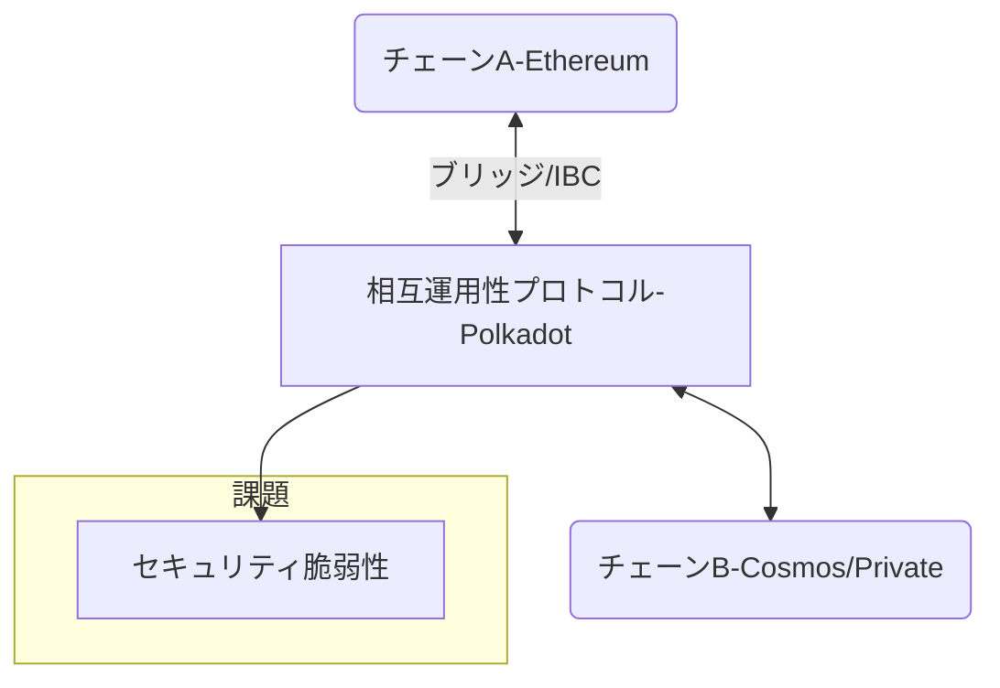

# T16-02-05 ブロックチェーン相互運用性（クロスチェーン技術）

## Summary（5つの要点）

1. **分断の解消**: 多数存在する異なるブロックチェーン（例：Ethereum、Solana、プライベートチェーン）間で、資産、データ、スマートコントラクトを安全かつシームレスに移転・連携させる技術。
2. **ブリッジ技術の主流化**: 資産を一時的にロックし、別のチェーンでラップドトークンを発行する**ブリッジ**が主流だが、管理者（マルチシグ）の集中リスクやハッキング被害が多発し、分散化が急務となっている。
3. **プロトコルの進化**: Polkadot（リレーチェーン）、Cosmos（IBCプロトコル）、LayerZero（オムニチェーン）など、特定のアーキテクチャやプロトコルを通じて相互運用性をネイティブに実現する技術が進化。
4. **CBDC間の連携**: 将来的に各国が発行する中央銀行デジタル通貨（CBDC）間の即時かつ安全なクロスボーダー決済（Project mBridgeなど）の基盤技術となる。
5. **セキュリティリスクの克服**: クロスチェーンブリッジの脆弱性を突いたハッキングによる巨額の資産流出が頻発しており、信頼性の高い、非カストディアルな相互運用性プロトコルの開発が最大の課題。

#### 概念図

---

### 技術評価表（定量的な視点）
| 評価項目 | 評価 | 根拠・備考 |
| :--- | :--- | :--- |
| 導入コスト | ⭐⭐⭐☆☆ | 新規プロトコルへの接続は容易だが、既存のプライベートチェーン連携に調整が必要。 |
| 技術成熟度 | ⭐⭐⭐☆☆ | 解決すべき問題（セキュリティ）は多いが、技術進化のスピードは速い。 |
| 日本の競争力 | ⭐⭐⭐☆☆ | パブリックチェーンでのプロトコル開発は限定的だが、企業間連携（サプライチェーン）でのニーズは高い。 |
| 市場性 | ⭐⭐⭐⭐⭐ | ブロックチェーンの「インターネット」化に不可欠であり、市場規模は数兆円に及ぶと予測。 |
| 品質保証の重要性 | ⭐⭐⭐⭐⭐ | **ブリッジハックによる資産流出**リスクが高く、プロトコルの安全性と監査が最重要。 |

---

## 日本の立ち位置・強み弱みのSummary

### 強み

* **企業間サプライチェーンのニーズ**: 製造業、物流業におけるブロックチェーン導入が先行しており、異なる企業・業界のチェーンを連携させるための相互運用技術に対する具体的なニーズが高い。
* **エンタープライズDLTの連携技術**: NTT、富士通などが、Hyperledger FabricやR3 Cordaなどの企業向けDLT間の連携を円滑にするための技術研究を進めている。
* **CBDC連携への貢献**: 日本銀行が、デジタル円を国際的なCBDC連携（クロスボーダー決済）に組み込むための技術的な議論に積極的に参加している。

### 弱み

* **パブリックチェーンブリッジ開発への参画不足**: グローバルなDeFi市場で使われる非カストディアルなブリッジやネイティブプロトコル（LayerZero、IBC）の開発エコシステムへの参画が限定的。
* **ブリッジハックの対策ノウハウ**: 国内事業者がブリッジハックの脅威に対して、設計レベルでどう対策するかという知見や経験が不足している。
* **規制対応の複雑性**: 複数のチェーンをまたぐ取引に対するマネーロンダリング（AML）対策や税務上の取り扱いが複雑で、規制当局からのガイドラインが未整備。

---

## 技術ロードマップ（短期/中期/長期）

### 短期目標（～2027年）

* マルチチェーン開発環境（複数のチェーンに対応するツール）の普及と、セキュリティ監査の標準化。
* 企業間取引において、異なるコンソーシアムチェーンをセキュアに連携させるPoC（概念実証）の増加。
* 分散型ブリッジ（非カストディアル）技術の安全性評価と、国内事業者の導入支援。

### 中期目標（2028年～2031年）

* クロスチェーン技術を活用したCBDC間決済のプロトコル標準化と、大規模な国際実証実験の開始。
* オムニチェーン（全チェーン連携）技術を基盤とした、金融・非金融サービス間のシームレスなデータ連携を実現。
* 保険機能を持つブリッジなど、セキュリティリスクを担保する仕組みの市場確立。

### 長期目標（2032年～2035年）

* ユーザーがチェーンの違いを意識することなく、あらゆるブロックチェーン上の資産やデータを操作できる「ブロックチェーンのインターネット」が実現。
* 金融資産、デジタルID、データ主権が国境を越えてシームレスに移転・連携される社会インフラの確立。

### 📚 参照リンク

1. [クロスチェーン相互運用性市場規模、成長分析 2026-2034 - Global Market Insights](https://www.gmi.com/cross-chain-market-report-2026/)
2. [ブロックチェーン相互運用技術の現状と課題 - NTT技術ジャーナル](https://www.ntt.co.jp/journal/)