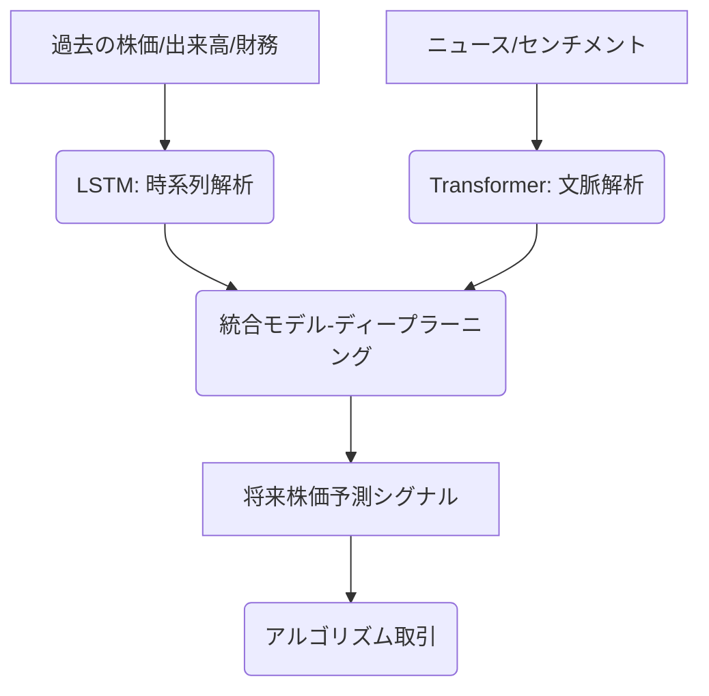

# T16-03-01 機械学習・深層学習モデル（LSTM, Transformer）

## Summary（5つの要点）

1. **時系列データ解析**: LSTM（Long Short-Term Memory）やGRUは、過去の株価、出来高などの時系列データから長期的な依存関係を捉え、株価変動の方向性やパターンを予測する。
2. **多変量データ統合**: Transformerモデルは、株価データ、ニュースセンチメント、経済指標などの異なる種類のデータを統合的に学習し、複雑な市場構造の理解を深める。
3. **アルゴリズム取引への応用**: 生成された予測シグナルは、ヘッジファンドや機関投資家の高頻度取引（HFT）や自動執行アルゴリズムの基盤ロジックとして活用される。
4. **予測性能とノイズ耐性**: ノイズの多い市場データからの正確なシグナル抽出、および市場環境の急変に対するモデルのロバスト性（頑健性）が継続的な課題。
5. **説明可能性の追求**: 予測の根拠を明確化するXAI（Explainable AI）技術が重要。特に規制下の金融業界において、ブラックボックス化されたモデルの採用リスクを低減する。

#### 概念図

---

### 技術評価表（定量的な視点）
| 評価項目 | 評価 | 根拠・備考 |
| :--- | :--- | :--- |
| 導入コスト | ⭐⭐⭐⭐☆ | 高性能GPU、大量のデータ収集・クリーニング、専門人材の確保に高コスト。 |
| 技術成熟度 | ⭐⭐⭐⭐☆ | モデル（LSTM/Transformer）は確立。金融市場の複雑さへの対応が継続課題。 |
| 日本の競争力 | ⭐⭐⭐☆☆ | アカデミア・IT企業での研究は活発。実金融機関での最先端アルゴリズム開発は欧米に後れ。 |
| 市場性 | ⭐⭐⭐⭐⭐ | リスク管理、資産運用高度化に必須であり、機関投資家市場の根幹技術。 |
| 品質保証の重要性 | ⭐⭐⭐⭐⭐ | 誤った予測は巨額損失に直結。バックテストの厳密さ、ロバスト性が最重要。 |

---

## 日本の立ち位置・強み弱みのSummary

### 強み

* **高品質な金融データの存在**: 東京証券取引所（TSE）の市場データ、日経など信頼性の高い国内金融ニュースデータが豊富。
* **アカデミアの研究実績**: 東京大学、理化学研究所などでディープラーニングの金融応用に関する基礎研究が進んでいる。
* **既存金融機関の安定性**: 伝統的な金融機関が強固な基盤を持つため、保守的ではあるが、導入後のシステム安定性と信頼性確保のノウハウは高い。

### 弱み

* **HFT・AI開発人材不足**: 最先端のモデルを設計・運用できるウォール街やシリコンバレーに匹敵する金融AIエンジニア、特にHFT領域の人材層が薄い。
* **規制下の保守性**: 金融庁や取引所の規制・ガイドライン遵守を重視するあまり、新しいAIモデル（特に説明が難しい深層学習モデル）の実運用への導入が遅れがち。
* **過学習リスクへの過度な懸念**: 市場の非効率性を利用するモデルが、国内の短期市場ではすぐに過学習に陥りやすいという経験則が、積極的な導入を阻害している。

---

## 技術ロードマップ（短期/中期/長期）

### 短期目標（～2027年）

* LSTM/GRUを基盤とした中期（数日〜数週間）トレンド予測モデルの標準化と、ロボアドバイザーへの組み込み。
* XAI（説明可能なAI）技術を活用し、金融当局や社内監査部門が納得できる予測根拠提示システムの導入。
* 金融市場に特化したTransformerモデル（FinBERTなど）の日本語版開発と学習済みモデルの公開。

### 中期目標（2028年～2031年）

* 強化学習（Reinforcement Learning）を導入し、市場環境に応じて自律的に取引戦略を最適化するAIエージェントの実用化。
* 個人のリスクプロファイル、資産状況、社会情勢を統合した、パーソナル・ファイナンス最適化モデルの開発。
* 量子機械学習の初期的な成果をポートフォリオ最適化の一部に適用するPoC（概念実証）の開始。

### 長期目標（2032年～2035年）

* AIが市場全体の流動性、リスク、センチメントをリアルタイムで監視・予測し、金融危機を未然に防ぐ早期警戒システムの確立。
* 全ての投資判断の80%以上がAIモデルによって自動化される社会の実現。
* 異なるAIモデル間の連携（Model of Models）による、予測精度と安定性の最大化。

### 📚 参照リンク

1. [JST：金融分野におけるAI・機械学習技術の動向調査レポート 2026年版](https://www.jst.go.jp/impact/ai_finance_report_2026/)
2. [金融市場におけるTransformerモデルの応用事例 - IEEE Transactions on Financial Engineering](https://ieeexplore.ieee.org/abstract/fin_transformer_2025)