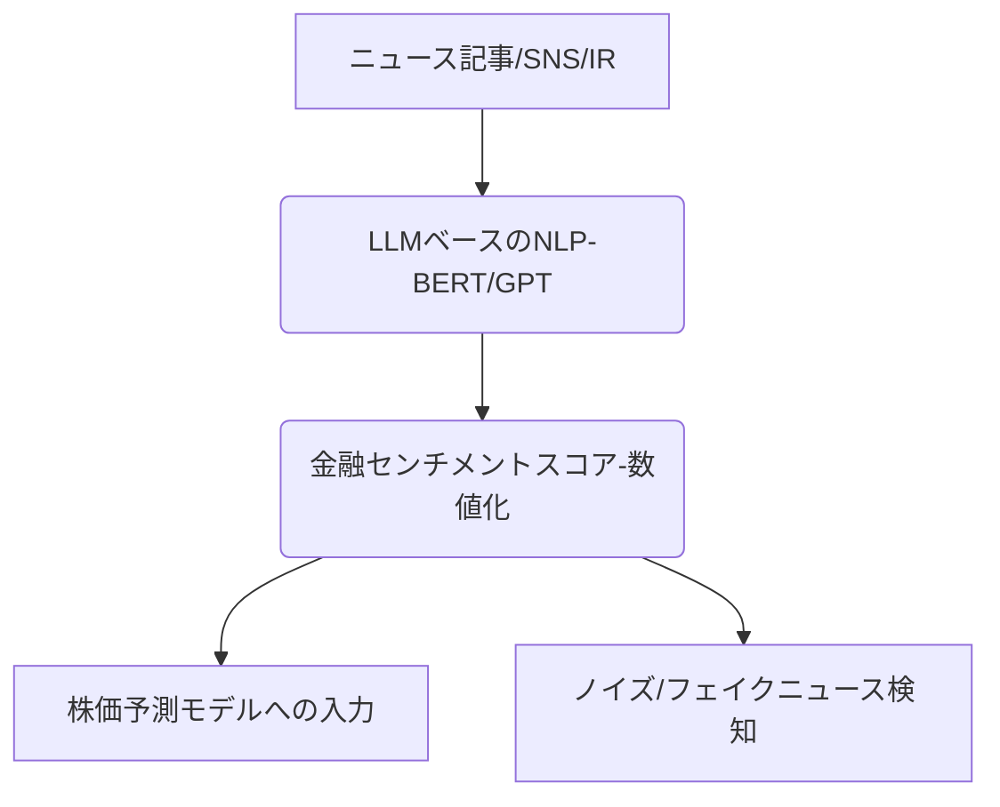

# T16-03-02 自然言語処理（NLP）・センチメント分析

## Summary（5つの要点）

1. **市場心理の定量化**: ニュース、SNS、企業開示資料（IR）などの非構造化テキストデータをAIが解析し、特定の企業や市場全体に対する投資家の**ポジティブ/ネガティブな感情（センチメント）**を数値化する。
2. **大規模言語モデル（LLM）の活用**: BERT、GPT-4などの高性能なLLMを金融分野の専門用語や文脈でファインチューニングし、従来のキーワードベースの手法では困難だった複雑なニュアンス（例：皮肉、二重否定）を正確に把握する。
3. **リアルタイム処理と低遅延**: ニュース配信から数秒以内にセンチメントスコアを生成し、株価が反応する前の初期段階で取引シグナルとして活用できる**超低遅延**の処理パイプラインがHFTで求められる。
4. **ファクトチェックとノイズ排除**: フェイクニュース、ボット投稿、意図的な市場操作を目的とした誤情報をLLMで検知し、センチメント分析の精度を低下させる**ノイズを排除**する技術が重要。
5. **テーマ・トピックモデリング**: 特定のテーマ（例：環境、ESG、サプライチェーンリスク）に関する言及の多さとそのセンチメントを抽出し、**特定の産業セクター**や関連企業の株価予測に活用する。

#### 概念図

---

### 技術評価表（定量的な視点）
| 評価項目 | 評価 | 根拠・備考 |
| :--- | :--- | :--- |
| 導入コスト | ⭐⭐⭐☆☆ | 大規模言語モデルのライセンス、計算リソース（GPU）がコスト要因。 | 
| 技術成熟度 | ⭐⭐⭐⭐☆ | ベースのNLP技術は成熟。金融市場の複雑な言葉のニュアンス理解が課題。 |
| 日本の競争力 | ⭐⭐⭐☆☆ | 日本語LLM開発競争はグローバルで遅れ。国内金融データと連携したモデル構築に強み。 |
| 市場性 | ⭐⭐⭐⭐⭐ | オルタナティブデータの中でも最も活用が進む分野の一つ。市場全体の心理把握に必須。 |
| 品質保証の重要性 | ⭐⭐⭐⭐⭐ | 感情の誤判定は誤った取引シグナルに直結。特にノイズ耐性の確保が重要。 |

---

## 日本の立ち位置・強み弱みのSummary

### 強み

* **高品質な日本語データ**: 日経新聞、東洋経済など、信頼性の高い日本語の経済・金融テキストデータが豊富に存在する。
* **独自の社会心理**: 日本特有の「空気」や「集団心理」を捉えるための、日本市場に特化したセンチメントモデルの構築に成功すれば優位性。
* **金融機関のデータ管理ノウハウ**: 厳格な情報管理とコンプライアンス遵守の文化があり、データ漏洩リスクを低く抑えられる。

### 弱み

* **ソーシャルメディアデータの活用遅れ**: 米国発のTwitter（X）などのソーシャルメディアのリアルタイム分析やHFTへの組み込みが、規制や文化的な背景から遅れている。
* **日本語LLMの資源不足**: 英語圏に比べ、大規模かつ高品質な金融・経済に特化した日本語LLMの開発・公開リソースが限定的。
* **スピードと規制**: リアルタイム取引に必須な超低遅延なデータ処理パイプラインの構築が、保守的な金融機関にとってはハードルが高い。

---

## 技術ロードマップ（短期/中期/長期）

### 短期目標（～2027年）

* 国内金融機関における、BERT/GPTを活用したニュース記事のセンチメント分析の本格導入。
* 企業IR文書、決算説明資料の自動要約と、そこに含まれる潜在リスク（ネガティブワード）のAIによる抽出。
* 特定の市場イベント（例：日銀会合）後の市場参加者のSNSセンチメントのリアルタイム監視システムの実証。

### 中期目標（2028年～2031年）

* LLMが自動でセンチメントを解釈し、直接的にアルゴリズム取引システムへシグナルを供給するクローズドループシステムの構築。
* 画像・動画（例：CEOの記者会見）の非言語情報（表情、声のトーン）を統合したマルチモーダルセンチメント分析の実用化。
* 複数言語（日本語、英語、中国語）のニュースソースを統合的に分析し、国際的な市場心理の伝播を追跡するシステムの実現。

### 長期目標（2032年～2035年）

* AIが市場の「集団的無意識」や「信頼」といった高度な抽象概念をセンチメントとして捉え、長期的な市場安定性の予測を可能にする。
* フェイクニュースやボット投稿を瞬時に無効化する、市場の**デジタル免疫システム**の確立。
* 全ての金融テキストデータがリアルタイムでAIによって解析され、意思決定に利用される社会の実現。

### 📚 参照リンク

1. [市場心理と株価予測：センチメント分析の最前線 2026 - 日本経済新聞社](https://www.nikkei.com/article/sentiment-analysis-2026/)
2. [GPTモデルによる金融市場センチメント分析の精度向上に関する研究 - 財務金融学会](https://www.jsfe.jp/sentiment_gpt_2025)