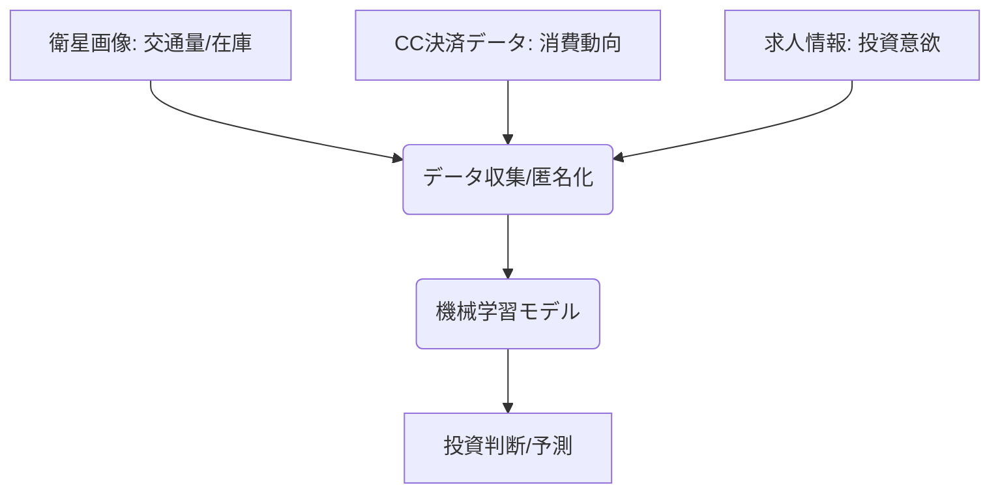

# T16-03-03 オルタナティブデータ活用

## Summary（5つの要点）

1. **非伝統的データの活用**: 従来の財務諸表や市場データ（株価、出来高）だけでは得られない、独自の知見（アルファ）を生み出すための**第三のデータソース**（例：衛星画像、SNSデータ、ECサイトの検索トレンド、クレジットカード決済履歴）を投資分析に活用する。
2. **先行指標としての価値**: 企業の公式発表よりも早く、そのビジネス活動や業績の動向を予測するための**先行指標**（例：駐車場の車台数から小売店の売上を予測）として機能する。
3. **データ収集と標準化**: 膨大かつ多様な形式のデータ（例：画像、地理空間、テキスト）を収集、クレンジングし、機械学習モデルに入力できる形式に**標準化**する技術がコアとなる。
4. **法的・倫理的課題**: データ提供元との契約、個人情報保護法、GDPRなどのプライバシー保護規制を厳守し、**合法性・透明性**を確保した上でのデータ利用が不可欠。
5. **市場の優位性**: 機関投資家の間では、競合他社がアクセスできないユニークなオルタナティブデータを活用することが、短期的な**超過リターン（アルファ）**獲得の主要な源泉となっている。

#### 概念図

---

### 技術評価表（定量的な視点）
| 評価項目 | 評価 | 根拠・備考 |
| :--- | :--- | :--- |
| 導入コスト | ⭐⭐⭐⭐⭐ | データ購入費用、専門分析プラットフォーム、インフラ整備費用が非常に高額。 |
| 技術成熟度 | ⭐⭐⭐☆☆ | 個別データの解析技術は確立。データ統合、ガバナンス、プライバシー保護技術が課題。 |
| 日本の競争力 | ⭐⭐⭐☆☆ | データ供給側は限定的。規制が厳しく、データシェアリング文化が未発達な点が弱み。 |
| 市場性 | ⭐⭐⭐⭐⭐ | 機関投資家の80%以上が活用。競争優位性確保のために必須の技術。 |
| 品質保証の重要性 | ⭐⭐⭐⭐⭐ | データの品質（ノイズ、バイアス、カバレッジ）と、合法性・プライバシー保護の確保が絶対条件。 |

---

## 日本の立ち位置・強み弱みのSummary

### 強み

* **特定分野でのデータ優位性**: 精緻なPOSデータ（コンビニ、小売）、詳細な交通データ、高精細な地理空間データ（衛星画像技術は国際協力）など、特定分野で高品質なデータが存在。
* **データ収集技術の信頼性**: ナウキャストなどのデータプロバイダーが、政府統計データとも連携した信頼性の高い経済指標を提供。
* **堅牢なプライバシー保護**: 個人情報保護法が厳格であり、匿名加工情報や仮名加工情報の取り扱いに関するノウハウが蓄積されている。

### 弱み

* **データシェアリング文化の不足**: 企業間でのデータ共有に対する意識が低く、欧米のような大規模なオルタナティブデータ市場（データブローカー）が未発達。
* **規制と匿名化のコスト**: 厳格なプライバシー規制により、データの匿名化や非個人情報化のプロセスが複雑化し、データ利用のコストと時間がかかっている。
* **グローバルデータの利用格差**: 海外市場を対象とする投資戦略において、米国市場などに比べオルタナティブデータへのアクセスが遅れがち。

---

## 技術ロードマップ（短期/中期/長期）

### 短期目標（～2027年）

* 金融庁等によるオルタナティブデータ利用に関するガイドライン（データ取得の合法性、倫理性）の策定と標準化。
* クレジットカード決済データ、POSデータなど、主要な消費動向データの匿名加工・集計提供サービスの市場拡大。
* 日本の不動産、エネルギーセクターに特化した衛星画像解析による予備的ファンダメンタル分析の導入。

### 中期目標（2028年～2031年）

* AIを活用し、数十種類以上のオルタナティブデータソースを自動で統合・クリーニングするデータレイク（データ基盤）の構築。
* 地域の未公開企業や中小企業の信用分析に、ウェブサイトのトラフィック、求人情報などのオルタナティブデータを活用。
* オルタナティブデータの売買を安全かつトラストレスに行うためのブロックチェーンベースのデータマーケットプレイスの構築。

### 長期目標（2032年～2035年）

* 全ての投資判断がオルタナティブデータをコアとして行われるようになり、従来の財務データが補完的な情報となる。
* 個人のライフスタイルデータ（ウェルビーイング、健康情報）も匿名化されて金融商品設計に活用される社会。
* AIが複数のオルタナティブデータ間の因果関係を自動で発見し、市場の非効率性を継続的に特定するシステムの実現。

### 📚 参照リンク

1. [金融分野におけるオルタナティブデータ活用に関するガイドライン - 金融庁](https://www.fsa.go.jp/alt_data_guidelines_2026/)
2. [オルタナティブデータ活用事例集 2025 - 日本データサイエンティスト協会](https://www.jdsa.gr.jp/alt_data_case_2025)