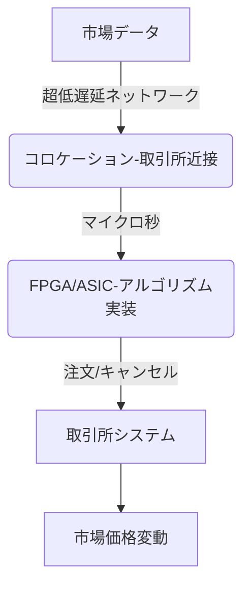

# T16-03-04 高頻度取引（HFT: High Frequency Trading）

## Summary（5つの要点）

1. **超低遅延技術**: **マイクロ秒（100万分の1秒）単位**で注文を出し入れし、わずかな価格差（アビトラージ）や市場の非効率性を利用して利益を獲得する取引手法。
2. **ハードウェアの最適化**: ソフトウェアによる処理の遅延を避けるため、FPGA（Field-Programmable Gate Array）やASIC（特定用途向け集積回路）などの専用ハードウェアに取引ロジックを実装し、超高速なデータ処理を実現する。
3. **コロケーションの利用**: 取引所が設置するサーバー（システム）の物理的に**最も近い場所**に取引システムを設置（コロケーション）することで、ネットワーク遅延を極限まで最小化する。
4. **市場への影響**: HFTは市場に流動性を供給する一方で、短期間に大量の注文を発生させることで、2010年の**フラッシュクラッシュ（瞬間暴落）**のような市場の安定性を脅かすリスクも併せ持つ。
5. **規制と監視**: HFTの市場への影響が大きいため、金融規制当局は、取引アルゴリズムの安全性、注文/約定比率の監視、市場操作防止のための**監視体制を強化**している。

#### 概念図

---

### 技術評価表（定量的な視点）
| 評価項目 | 評価 | 根拠・備考 |
| :--- | :--- | :--- |
| 導入コスト | ⭐⭐⭐⭐⭐ | 専用回線、FPGA/ASIC、コロケーション費用など、参入障壁が極めて高い。 |
| 技術成熟度 | ⭐⭐⭐⭐⭐ | 世界的に最も成熟し、競争が激化している分野。技術進化はミリ秒からナノ秒へ。 |
| 日本の競争力 | ⭐⭐☆☆☆ | 米国・欧州の専門HFTファームが市場を寡占。国内勢の技術力・資金力は劣後。 |
| 市場性 | ⭐⭐⭐⭐☆ | 市場取引の大部分を占め、流動性維持に不可欠だが、新規参入は極めて困難。 |
| 品質保証の重要性 | ⭐⭐⭐⭐⭐ | アルゴリズムの誤作動、バグは即時的な市場混乱と巨額損失を引き起こす。 |

---

## 日本の立ち位置・強み弱みのSummary

### 強み

* **取引所のシステム安定性**: 東京証券取引所のシステム（arrowhead）は高い信頼性と安定性を誇り、HFTの基盤として信頼されている。
* **半導体技術の蓄積**: FPGA、ASICなどの超高速演算チップ、および低遅延ネットワーク機器（光通信）の開発技術は高い。
* **金融規制の厳格さ**: 金融当局の監視体制が厳格なため、市場の乱高下リスクを低く抑えられている（諸刃の剣）。

### 弱み

* **国内HFTプレーヤーの不足**: 市場の大半は欧米系HFTファームが占有。国内の金融機関は、HFTを担う高度な専門人材（物理学者、H/Wエンジニア）の確保が困難。
* **コロケーション環境の競争**: 物理的な距離を巡る競争が激しく、後発の国内企業が優位な立地を確保しにくい。
* **アルゴリズム開発力の格差**: 複雑な市場のマイクロ構造を解析し、利益を生み出し続ける最先端のアルゴリズム開発において、グローバルリーダーに後れを取っている。

---

## 技術ロードマップ（短期/中期/長期）

### 短期目標（～2027年）

* HFTアルゴリズムの異常検知、強制停止（キルスイッチ）機能の標準化と、取引所によるチェック体制の強化。
* FPGAを活用した**遅延競争の極限化**（マイクロ秒以下）と、国内金融機関による部分的な導入開始。
* 市場の透明性確保のため、HFT業者による取引情報の開示に関する規制当局の議論の進展。

### 中期目標（2028年～2031年）

* 量子コンピューティング（アニーリング）の成果を、HFTのリスク管理や小規模な取引戦略の一部に組み込むPoC。
* AIを活用し、HFTが市場価格に与える影響を予測・シミュレーションするシステムの開発と、規制当局での活用。
* 低遅延ネットワーク技術をさらに進化させ、取引所間の**超広域低遅延接続**（例：大阪・東京間の光ファイバー最適化）を実現。

### 長期目標（2032年～2035年）

* HFTが市場流動性の主要な源泉となり、そのリスクがAI監視システムによって完全に制御される社会の実現。
* アルゴリズムの競争がハードウェアの物理的な限界に達し、競争軸が**取引戦略の複雑性（AIの知能）**へと完全に移行。
* 注文の実行が量子暗号技術によって保護され、セキュアな取引環境が実現。

### 📚 参照リンク

1. [東京証券取引所：高頻度取引に関する調査報告 2026 - 日本取引所グループ](https://www.tse.or.jp/market/hft_report_2026/)
2. [FPGAを用いた超低遅延金融取引システムの実装 - 情報処理学会](https://www.ipsj.or.jp/fpga_hft_2025)