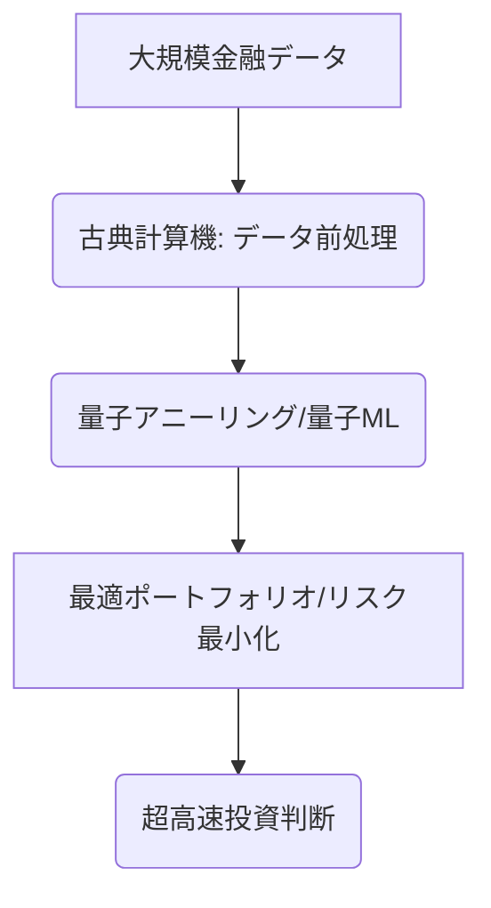

# T16-03-05 量子機械学習・量子アニーリング

## Summary（5つの要点）

1. **大規模最適化の高速化**: 従来の古典コンピューターでは計算不可能な、数千銘柄にわたる**超大規模なポートフォリオ最適化**や、複雑なデリバティブ商品の価格付けを、量子アニーリング（D-Waveなど）やゲート型量子コンピューターで高速に実行する。
2. **金融特化型アルゴリズム**: 量子コンピューターの原理を応用し、株価の時系列データからパターンを抽出する**量子機械学習アルゴリズム**（例：QNN）の研究開発が進められている。
3. **リスク管理の高度化**: 確率的なリスク計算（例：VaR、CVaR）のモンテカルロシミュレーションを量子コンピューターで指数関数的に加速し、より正確で迅速なリスク評価を可能にする。
4. **現在の課題（NISQ）**: 現在の量子コンピューターはNISQ（Noisy Intermediate-Scale Quantum）時代にあり、量子ビット数、誤り率、コヒーレンス時間（安定性）に限界があり、**実用的な計算の精度・規模**に課題が残る。
5. **実用化の時期**: 2030年代には誤り耐性を持った大規模な量子コンピューターが実現し、金融分野でブレークスルーを起こすことが期待されている。

#### 概念図

---

### 技術評価表（定量的な視点）
| 評価項目 | 評価 | 根拠・備考 |
| :--- | :--- | :--- |
| 導入コスト | ⭐⭐⭐⭐⭐ | デバイス利用料、専用アルゴリズム開発費用が極めて高額。 |
| 技術成熟度 | ⭐☆☆☆☆ | 基礎研究、PoC段階。実用的なエラー耐性を持つ量子コンピューターは未実現。 |
| 日本の競争力 | ⭐⭐⭐⭐☆ | 量子アニーリング（D-Waveとの連携、東北大など）では強み。ゲート型量子コンピューターの応用研究も活発。 |
| 市場性 | ⭐⭐⭐⭐⭐ | 実用化すれば金融業界の競争環境を劇的に変える**破壊的な技術**。 |
| 品質保証の重要性 | ⭐⭐⭐☆☆ | 現状は精度・安定性が低いため、計算結果の信頼性検証（フォールトトレランス）が課題。 |

---

## 日本の立ち位置・強み弱みのSummary

### 強み

* **量子アニーリングの優位性**: 組合せ最適化問題に強い量子アニーリング技術（D-Waveなど）を早期から活用し、ポートフォリオ最適化など金融応用に関する研究（大学、日立、富士通など）で先行している。
* **国家プロジェクトの推進**: NEDO、JSTなどの国家プロジェクトが量子技術の開発と産業応用を強く推進しており、研究資金が確保されている。
* **金融機関の積極的なPoC**: 大手銀行、証券会社がIBM Quantumなどのゲート型コンピューターを利用したデリバティブ価格計算のPoCに積極的に参画している。

### 弱み

* **ゲート型量子ML応用での後れ**: 量子機械学習（QML）アルゴリズムの開発と、金融データへの適用経験は欧米に後れを取っている。
* **量子ソフトウェア人材不足**: 量子コンピューターの理論だけでなく、金融ドメイン知識を持つ量子アルゴリズム開発者が圧倒的に不足している。
* **早期の成果出しの困難さ**: 量子アドバンテージを実証できる実用規模の問題設定が難しく、投資家へのアピールが困難。

---

## 技術ロードマップ（短期/中期/長期）

### 短期目標（～2027年）

* 量子アニーリングによる小規模なポートフォリオ最適化（数百銘柄程度）の**実機での検証**と、古典計算との性能比較。
* 金融機関向けに特化したクラウドベースの量子コンピューティング・サービスの利用拡大。
* 量子機械学習アルゴリズム（QML）の基礎研究と金融時系列データへの適用のPoC。

### 中期目標（2028年～2031年）

* NISQデバイスの量子ビット数増加と誤り率低減により、**大規模（数千銘柄）**なリスク管理計算への適用を開始。
* 量子コンピューターの計算結果の信頼性を担保するための検証・監査技術（フォールトトレランス）の確立。
* 量子コンピューターと古典コンピューターを組み合わせた**ハイブリッド計算**による、デリバティブ価格決定の精度向上。

### 長期目標（2032年～2035年）

* 誤り耐性を持つ大規模な量子コンピューター（フォールトトレラント量子コンピューター）が実現し、金融業界の主要な最適化問題を解く**標準インフラ**となる。
* 量子機械学習が従来の深層学習の性能を上回り、株価予測や市場解析の主要な技術となる。
* 量子暗号技術が金融取引の全ての通信プロトコルに組み込まれ、セキュアな取引環境が実現。

### 📚 参照リンク

1. [NEDO：量子技術を活用した金融最適化研究プロジェクト報告 2025](https://www.nedo.go.jp/quantum_finance_2025/)
2. [金融における量子機械学習の最前線 - IBM Quantum Research](https://www.ibm.com/quantum_finance_2025)