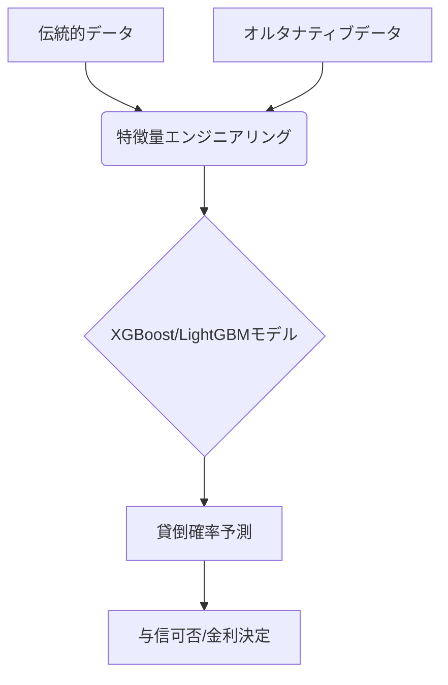

# T16-04-01 AI与信審査モデル（XGBoost, LightGBM）

## Summary（5つの要点）

1. **予測精度の飛躍的向上**: 従来のロジスティック回帰などの統計モデルに比べ、XGBoostやLightGBMといった**勾配ブースティング決定木**モデルは、非線形なデータ特性や複雑な相互作用を捉え、貸倒リスク予測の精度を大幅に向上させる。
2. **多次元データ統合**: 過去の返済履歴、収入、勤務先などの伝統的データに加え、オルタナティブデータや行動データを統合し、膨大な特徴量の中から予測に最も寄与するものを効率的に特定する。
3. **高速な審査とコスト削減**: モデルの学習・実行速度が速いため、数秒以内での与信判断が可能となり、審査にかかる時間と人件費を劇的に削減する。
4. **公平性の確保とバイアス排除**: モデルの予測結果だけでなく、入力データに含まれる**人種や性別などの属性に基づくバイアス**を検出・低減するための技術（アドバーサリアル・デバイアスなど）が不可欠。
5. **説明可能性（XAI）との両立**: 決定木ベースのモデルは、ディープラーニングモデルに比べ、特徴量の寄与度（Feature Importance）を算出しやすいため、説明可能AI（XAI）との親和性が高い。

#### 概念図

---

### 技術評価表（定量的な視点）
| 評価項目 | 評価 | 根拠・備考 |
| :--- | :--- | :--- |
| 導入コスト | ⭐⭐⭐☆☆ | モデル実装は容易だが、データ収集・クレンジング、専門人材の確保に高コスト。 |
| 技術成熟度 | ⭐⭐⭐⭐☆ | 技術は確立。金融規制、公平性、XAI対応が運用上の課題。 |
| 日本の競争力 | ⭐⭐⭐☆☆ | モデル精度は高いが、オルタナティブデータ利用規制により、データ量で欧米・中国に劣る。 |
| 市場性 | ⭐⭐⭐⭐⭐ | 銀行、消費者金融、フィンテック企業の全てで与信審査の標準技術となる。 |
| 品質保証の重要性 | ⭐⭐⭐⭐⭐ | 予測ミスは貸倒損失、バイアスは法的リスクに直結。モデルの安定運用が重要。 |

---

## 日本の立ち位置・強み弱みのSummary

### 強み

* **高品質な信用情報**: CIC、JICCなどの信用情報機関が保有する過去の返済履歴データは、網羅性と品質が高く、予測モデルの基礎精度が高い。
* **堅牢な金融IT基盤**: 既存の銀行・金融機関のシステムは安定性が高く、AIモデル導入後の運用面での信頼性が担保されている。
* **XAIへの積極姿勢**: 金融庁がXAIを推奨しており、金融機関側も説明責任を果たすための技術導入に前向きである。

### 弱み

* **オルタナティブデータ利用の制約**: 欧米・中国に比べ、スマートフォン利用履歴、SNSデータなどの代替信用データの収集・利用が個人情報保護法の制約により限定的。
* **AI人材不足**: 最先端の機械学習モデルを金融リスク管理に応用できるデータサイエンティスト、AIエンジニアの数が絶対的に不足している。
* **既存システムの硬直性**: 伝統的な金融機関の与信システムは柔軟性に欠け、AIモデルの迅速な入れ替え・更新が困難な場合が多い。

---

## 技術ロードマップ（短期/中期/長期）

### 短期目標（～2027年）

* 従来のスコアリングモデルをXGBoost/LightGBMに置き換え、貸倒リスク予測精度を15%以上向上。
* SHAP/LIMEを活用した**与信判断理由の自動生成**システムを導入し、法的説明責任に対応。
* フィンテック企業による、スコアリングモデルのクラウドベースAPI提供が普及。

### 中期目標（2028年～2031年）

* **深層学習モデル（Transformer, RNN）**を与信審査に統合し、時系列データからの複雑な特徴抽出を実現。
* 与信審査プロセスの90%をAIが自動で判断し、人間の審査官は例外処理のみを担当する体制に移行。
* 異なるAIモデルの結果を統合的に判断する**アンサンブルモデル**を標準化し、予測の安定性を向上。

### 長期目標（2032年～2035年）

* AIが個人の財務状況、ライフイベント、市場環境を総合的に判断し、**生涯リスクを最適化**する与信管理システムが実現。
* 量子機械学習がポートフォリオ全体のリスクを瞬時に計算し、AI与信モデルの精度を補完。
* 人種・性別などのバイアスを完全に排除した**倫理的なAI与信モデル**が国際標準となる。

### 📚 参照リンク

1. [JICC：AIを活用した信用スコアリングの動向と課題 2026年版](https://www.jicc.co.jp/report/ai_scoring_2026/)
2. [XGBoost/LightGBMの金融リスク管理への応用 - 日本オペレーションズ・リサーチ学会](https://www.orsj.or.jp/ai_credit_2025)