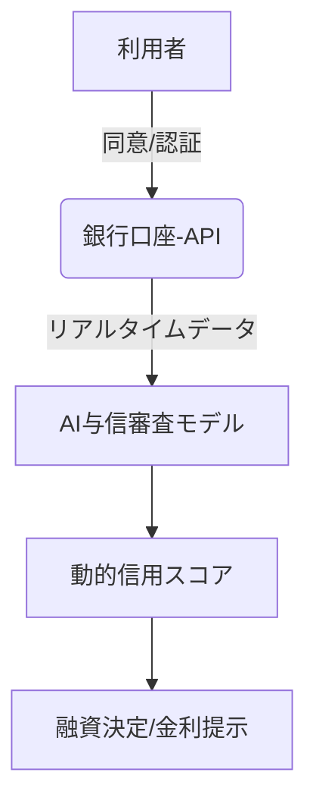

# T16-04-02 オープンバンキングデータ活用

## Summary（5つの要点）

1. **入出金履歴の利用**: 銀行口座の入出金履歴、残高、取引明細を、本人同意のもとでAPIを通じて与信審査企業に提供する。
2. **収入安定性の高精度判定**: 毎月の給与入金、定期的な支払い、貯蓄の習慣などの**金融行動**を詳細に分析し、従来の静的な「年収証明」では見えなかった**収入の安定性**や**支出管理能力**を評価する。
3. **リアルタイム与信の実現**: API連携により最新の銀行データを瞬時に取得できるため、審査に必要な書類提出や待ち時間を大幅に短縮し、**リアルタイムでの与信判断**を可能にする。
4. **金融包摂への貢献**: 過去の信用情報が少ない若年層や、自営業者など、収入が変動しやすい層の**真の返済能力**を評価し、これまで融資を受けられなかった層への金融アクセス（金融包摂）を拡大する。
5. **APIセキュリティと標準化**: データの安全な連携と利用者のプライバシー保護のため、**OAuth 2.0**などの認証認可プロトコルの厳格な遵守と、金融機関間のAPI仕様の標準化が不可欠。

#### 概念図

---

### 技術評価表（定量的な視点）
| 評価項目 | 評価 | 根拠・備考 |
| :--- | :--- | :--- |
| 導入コスト | ⭐⭐⭐⭐☆ | 金融機関側のAPI開発・保守、セキュリティ対策、データ連携基盤の構築に高コスト。 |
| 技術成熟度 | ⭐⭐⭐⭐☆ | API技術は確立。金融機関間の標準化と、レガシーシステムとの連携が課題。 |
| 日本の競争力 | ⭐⭐⭐☆☆ | 規制は整備されたが、データの連携率と利用者の普及率で欧州・英国に遅れ。 |
| 市場性 | ⭐⭐⭐⭐⭐ | 与信、資産運用、家計簿アプリなど、全てのフィンテックサービスに必須のインフラ。 |
| 品質保証の重要性 | ⭐⭐⭐⭐⭐ | 機密性の高い金融データの安全な連携、プライバシー保護、システム安定性が最重要。 |

---

## 日本の立ち位置・強み弱みのSummary

### 強み

* **政府主導の推進**: 金融庁がオープンAPI導入を推進し、メガバンクを中心にAPIの公開が義務化されたため、制度的基盤は整っている。
* **決済インフラの信頼性**: 既存の銀行システムは信頼性が極めて高く、API連携においても高い安定性が期待できる。
* **ユーザーの金融リテラシー**: 自身の口座情報を外部に提供する際のセキュリティ意識が比較的高い。

### 弱み

* **API連携の遅れ**: 地方銀行や信用金庫など、中小規模の金融機関でのAPI公開対応が遅れており、データのカバレッジが限定的。
* **ユーザーのデータ共有への抵抗感**: 自身の機密性の高い入出金データを外部の企業に共有することへの心理的な抵抗感（プライバシー懸念）が根強い。
* **標準化の課題**: 金融機関ごとにAPIの仕様やデータフォーマットが完全に標準化されていない場合があり、データ連携・分析のコストが増加する。

---

## 技術ロードマップ（短期/中期/長期）

### 短期目標（～2027年）

* 全ての銀行・金融機関における入出金データAPIの公開を完了し、API仕様の標準化を推進。
* フィンテック企業がオープンバンキングデータを活用した**少額ローン審査**のパイロットプログラムを大規模に実施。
* 利用者からのデータ共有同意を簡素化・標準化するためのUX/UI改善。

### 中期目標（2028年～2031年）

* 複数銀行の口座情報を統合・分析し、個人の**資産全体のリスクプロファイル**を評価する統合与信モデルの実現。
* オープンバンキングデータに基づく**リアルタイム与信**が、オンライン融資の主流な審査手法となる。
* データ連携のセキュリティを担保する**ゼロ知識証明**などのプライバシー保護技術の導入。

### 長期目標（2032年～2035年）

* オープンバンキングが「オープンファイナンス」に発展し、銀行データだけでなく、証券、保険、年金データも統合された**超高度な個人リスク管理**が実現。
* 中央銀行デジタル通貨（CBDC）の発行・流通と連携し、よりセキュアかつリアルタイムな取引データ連携が可能になる。

### 📚 参照リンク

1. [金融庁：オープンバンキング推進の現状と与信審査への応用 2026年報告書](https://www.fsa.go.jp/openbanking_report_2026/)
2. [銀行APIを活用した与信審査モデルの構築 - FinTech協会](https://www.fintech.or.jp/research/bank_api_2025)