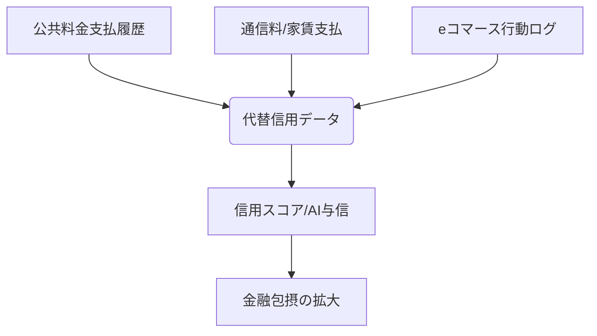

# T16-04-03 代替信用データ（Alternative Credit Data）

## Summary（5つの要点）

1. **信用情報の不足を補完**: 従来の信用情報機関に記録がない、あるいは情報が薄い（**Thin File**）層（若年層、専業主婦、移民、自営業者など）に対し、与信判断に必要なデータを補完する。
2. **データの多様性**: 主に、電気・ガス・水道・通信料などの**公共料金の支払履歴**、家賃の支払履歴、オンラインショッピングの行動データ、学歴、職歴、スマートフォンアプリの利用状況など、非伝統的なデータを用いる。
3. **金融包摂の拡大**: これらのデータを利用することで、金融機関の与信判断の対象が拡大し、従来融資を断られていた層への**金融アクセス**が改善され、社会全体の金融包摂に貢献する。
4. **倫理・プライバシー問題**: 収入予測に不適切なデータ（例：特定のSNS投稿内容、健康情報）の利用は、**差別やバイアス**を助長するリスクがあり、個人情報保護法や倫理ガイドラインの厳格な遵守が求められる。
5. **データ連携の技術**: 通信事業者、ユーティリティ企業、Eコマース企業など、異なる業界間で安全かつ匿名化されたデータを連携するための技術（API、セキュアなデータ保管）が重要。

#### 概念図

---

### 技術評価表（定量的な視点）
| 評価項目 | 評価 | 根拠・備考 |
| :--- | :--- | :--- |
| 導入コスト | ⭐⭐⭐⭐☆ | 異業種からのデータ収集、匿名化、法務チェック、データ連携基盤の構築に高コスト。 |
| 技術成熟度 | ⭐⭐⭐☆☆ | データ連携・匿名化技術は確立。利用できるデータの法規制が世界的にまだ発展途上。 |
| 日本の競争力 | ⭐⭐☆☆☆ | プライバシー規制が厳格で、データ連携が進みにくい。中国・米国に比べ利用データが限定的。 |
| 市場性 | ⭐⭐⭐⭐⭐ | 信用情報が薄い層（約30%）への融資機会創出、特に若年層市場で大きな可能性。 |
| 品質保証の重要性 | ⭐⭐⭐⭐⭐ | データの品質（ノイズ、バイアス）と、プライバシー保護、公平性の確保が絶対条件。 |

---

## 日本の立ち位置・強み弱みのSummary

### 強み

* **高い匿名化技術**: 個人情報保護法の厳格な運用経験から、仮名加工情報や匿名加工情報の作成・管理に関する高い技術とノウハウを持つ。
* **信頼性の高いデータソース**: 電力、ガス、通信事業者などのインフラ企業からの支払履歴データは、その信頼性が非常に高い。
* **スコアリングサービス**: J.Score、LINEスコアなど、既に一部の代替データを取り入れたスコアリングサービスが先行導入されている。

### 弱み

* **データ利用の法的制約**: 個人情報保護法が欧米・中国に比べ厳格であり、**「本人の同意」**を得るプロセスが複雑で、利用できるデータが限定されがち。
* **異業種間連携の障壁**: 業界間の壁が高く、通信事業者やユーティリティ企業が金融機関に対してデータを提供するための連携基盤や文化が未発達。
* **ユーザーの理解不足**: 信用スコアとオルタナティブデータの関係性、データ提供のメリットについての国民的な理解がまだ深まっていない。

---

## 技術ロードマップ（短期/中期/長期）

### 短期目標（～2027年）

* 総務省・金融庁連携のもと、公共料金・通信料の支払履歴データ利用に関する**統一的なガイドライン**を策定。
* 特定のフィンテック企業と通信事業者との間で、個人同意に基づくデータのセキュアな連携（API）をPoCで実証。
* AIモデルに組み込むオルタナティブデータ項目の**公平性チェック**を義務化。

### 中期目標（2028年～2031年）

* 代替信用データを活用した信用スコアが、従来の信用スコアを補完する形で社会的に認知され、若年層の金融取引に広く利用される。
* ブロックチェーン技術を用いた**DID（分散型ID）**と連携し、個人が自身の代替信用データの提供先と利用目的を完全に管理できるシステムが実現。
* 地域の未公開企業の信用評価に、その企業の**ウェブトラフィックや求人情報**などのオルタナティブデータを活用。

### 長期目標（2032年～2035年）

* **個人が自身の全データ（金融・行動・生活）を主権的に管理**し、必要なサービス提供者にのみ提供する「データ主権社会」が実現。
* 代替信用データが全ての与信判断の基盤となり、クレジットヒストリーの有無による金融格差が解消される。

### 📚 参照リンク

1. [総務省：代替信用データに関する国際動向と国内法制度の整合性 2026年版](https://www.soumu.go.jp/privacy/alt_credit_data_2026/)
2. [金融包摂におけるオルタナティブデータ活用の課題 - 金融リテラシー研究会](https://www.jfrc.or.jp/research/alt_data_2025)