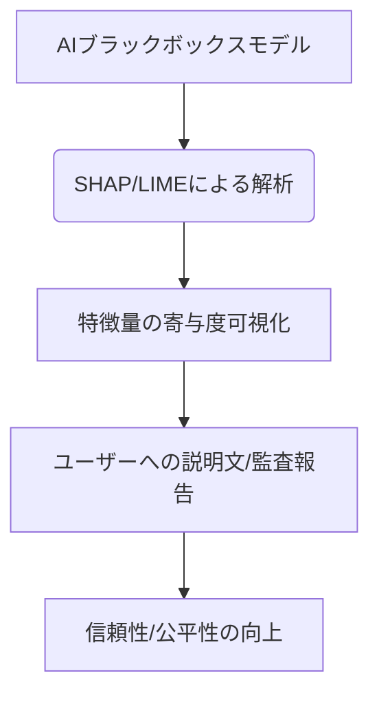

# T16-04-04 説明可能AI（XAI: Explainable AI）

## Summary（5つの要点）

1. **透明性の確保**: AIによる与信審査の結果（融資の可否、金利など）に対し、その判断に至った**根拠と要因（特徴量の寄与度）**を人間が理解できる形で提示する技術。
2. **法的コンプライアンス**: EUのGDPRにおける「**説明を受ける権利**」や、米国の公正信用報告法（FCRA）といった国際的な法的要求に対応するために不可欠な技術であり、日本でもAI事業者ガイドラインで導入が推奨されている。
3. **主要な手法（SHAP/LIME）**: SHAP（SHapley Additive exPlanations）は予測に対する各特徴量の貢献度を公平に分解し、LIME（Local Interpretable Model-agnostic Explanations）は特定の個人の予測結果に対して局所的な説明を提供する。
4. **信頼と公平性の構築**: 審査に落ちた利用者に対し、**「なぜ落ちたのか」「どうすればスコアが上がるか」**を明確に説明することで、金融サービスに対するユーザーの信頼性と公平感を高める。
5. **モデルのデバッグ**: AIモデルが学習データ内の**バイアス**や**ノイズ**を拾って誤った判断をしていないかを、XAIによって可視化・監査することで、モデルの精度と安定性を向上させる。

#### 概念図

---

### 技術評価表（定量的な視点）
| 評価項目 | 評価 | 根拠・備考 |
| :--- | :--- | :--- || 導入コスト | ⭐⭐⭐☆☆ | 解析ツール導入、説明文の自動生成ロジックの開発、法務監査にコストがかかる。 || 技術成熟度 | ⭐⭐⭐☆☆ | SHAP/LIMEなどの手法は確立。大規模データへの適用と、説明の質の標準化が課題。 || 日本の競争力 | ⭐⭐⭐⭐☆ | 規制対応と品質管理を重視する文化があり、XAIの導入では比較的先行できる可能性。 || 市場性 | ⭐⭐⭐⭐⭐ | 金融、医療、自動運転など、人間の命や権利に関わる全てのAIシステムで必須となる。 || 品質保証の重要性 | ⭐⭐⭐⭐⭐ | 法的リスク、風評リスクを回避し、モデルの倫理性を担保するための最重要技術。 |
---

## 日本の立ち位置・強み弱みのSummary

### 強み

* **高いコンプライアンス意識**: 金融機関は規制当局への説明責任を果たす意識が高く、XAI導入に対する理解と動機が強い。
* **政府のガイドライン**: 経済産業省、金融庁がAIの利用に関する倫理的・法的ガイドラインを積極的に策定しており、導入の道筋が整備されている。
* **日本語対応**: 日本語特有の表現や金融用語に対応したXAIツールの開発が進んでおり、日本人審査官への説明の質が高い。

### 弱み

* **精度と説明性のトレードオフ**: 説明性が高いモデル（例：線形モデル）は精度が低い、精度が高いモデル（例：ディープラーニング）は説明性が低い、という**トレードオフ**の解消が困難。
* **説明の標準化の遅れ**: 「どこまで説明すれば十分か」という**説明の質の基準**が、法的に明確化されておらず、現場での対応にばらつきが生じる。
* **計算負荷の高さ**: SHAPなどの高精度な説明手法は計算負荷が高く、リアルタイム審査での利用が困難な場合がある。

---

## 技術ロードマップ（短期/中期/長期）

### 短期目標（～2027年）

* 新規導入する全てのAI与信審査モデルに対し、SHAPまたはLIMEによる**判断根拠の開示**を義務付け。
* 審査落ちした利用者に対し、最も影響を与えた特徴量（例：「貯蓄期間が短い」「負債比率が高い」など）を3つ提示するシステムを標準化。
* 規制当局向けに、モデル全体の挙動をXAIで可視化・監査するレポートの自動生成。

### 中期目標（2028年～2031年）

* **高精度と説明性を両立**させる、**本質的に説明可能な（White-box）ディープラーニングモデル**の研究開発・実用化。
* XAIが生成した説明文を、**自然言語生成AI（LLM）**で利用者一人ひとりの理解度に合わせて自動調整し、提供。
* AIモデルの**公平性バイアス**をXAIで検出し、自動で是正するフィードバックループの構築。

### 長期目標（2032年～2035年）

* 全てのAI判断が透明化され、利用者がAIの判断に対して異議申し立てを行い、人間が再審査する仕組み（Human-in-the-Loop）が社会インフラとなる。
* AIが判断根拠を法的な条文や契約書と紐づけて説明する、**完全な法的説明責任**の自動化。

### 📚 参照リンク

1. [経産省：AI事業者ガイドラインにおけるXAIの役割と与信審査への応用 2025年版](https://www.meti.go.jp/policy/ai_guideline_2025/)
2. [金融サービスにおけるSHAPおよびLIMEの適用に関する研究 - 人工知能学会](https://www.ai-gakkai.or.jp/xai_finance_2025)