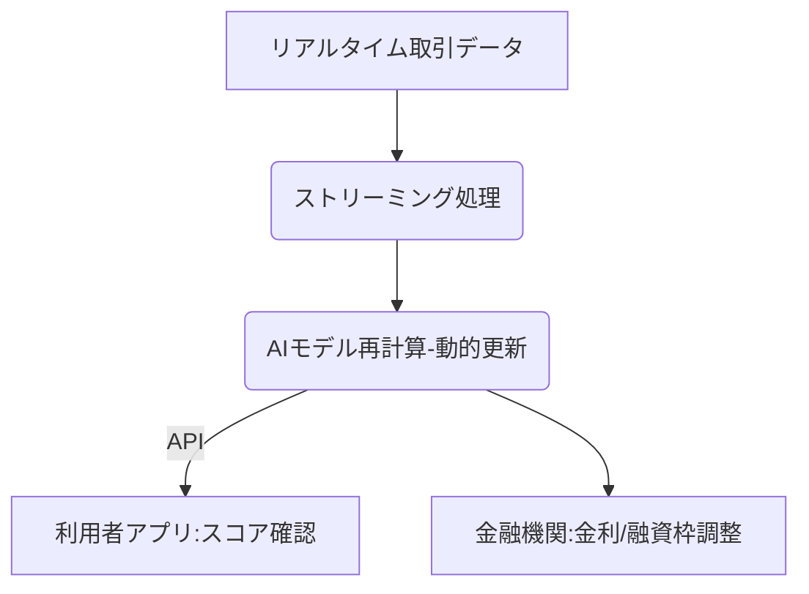

# T16-04-05 リアルタイム与信・動的信用スコア

## Summary（5つの要点）

1. **常時更新されるスコア**: 従来の信用スコアが過去数ヶ月〜数年間の履歴を基に静的に算出されるのに対し、動的信用スコアは入出金、返済、消費行動などの**最新のデータ**に基づき、**日次またはリアルタイム**でスコアを更新する。
2. **動的な金利設定と融資枠**: スコアがリアルタイムで変動することで、貸し手はリスクの変化を瞬時に捉え、利用者の返済能力に応じて**金利や融資枠を動的に調整**できる（パーソナライズされた融資）。
3. **ユーザー行動の変容**: 利用者は自身のスコアの変化をモバイルアプリなどでリアルタイムに確認できるため、スコアを向上させる行動（例：定期的な貯蓄、延滞の解消）を促し、**金融行動の改善**に繋がる。
4. **「Credit as a Service」の提供**: 信用スコア自体がAPIを通じて様々なサービス（例：不動産賃貸、就職、保険料算定）に組み込まれ、**スコアを軸とした金融サービス**がシームレスに提供される。
5. **データ処理の高速化**: オープンバンキングAPIや代替信用データからの膨大なストリーミングデータを、**エッジコンピューティング**や**インメモリデータベース**を用いて超低遅延で処理し、AIモデルに供給する技術が不可欠。

#### 概念図

---

### 技術評価表（定量的な視点）
| 評価項目 | 評価 | 根拠・備考 |
| :--- | :--- | :--- || 導入コスト | ⭐⭐⭐⭐⭐ | データパイプライン、ストリーミング処理、常時稼働するAIモデル運用に高コスト。 || 技術成熟度 | ⭐⭐⭐☆☆ | ストリーミング処理、AI高速化は進展。金融分野での大規模な実績と規制対応が課題。 || 日本の競争力 | ⭐⭐⭐☆☆ | 決済インフラは強みだが、動的スコアリングサービスの展開スピードは遅れ。 || 市場性 | ⭐⭐⭐⭐⭐ | 従来の静的スコアを置き換え、パーソナライズされた金融取引の標準となる。 || 品質保証の重要性 | ⭐⭐⭐⭐⭐ | スコアの計算ミスが瞬時に金利や融資枠に影響。超低遅延での安定性と信頼性が絶対条件。 |
---

## 日本の立ち位置・強み弱みのSummary

### 強み

* **高速な通信インフラ**: 5Gネットワークや光ファイバー網が高度に整備されており、データのリアルタイム収集と伝送に適している。
* **QR/モバイル決済の普及**: PayPay、楽天ペイなどの普及により、リアルタイムな消費行動データを収集する基盤が整備されつつある。
* **ネオバンクの参入**: みんなの銀行などの新しいデジタルバンクが、従来の銀行に比べて動的与信モデルの導入に積極的である。

### 弱み

* **レガシーシステムの制約**: 既存の金融機関の勘定系システムはバッチ処理が主流であり、リアルタイムでのデータ連携・スコア更新への対応が困難。
* **規制下の頻繁な変更**: 金融当局の監督下、与信審査モデルの頻繁な変更・更新（動的スコア）に対する監査や承認プロセスが重い。
* **信用情報機関の対応**: 従来の信用情報機関（CIC/JICC）がリアルタイムなデータ更新・提供サービスへの移行に時間を要している。

---

## 技術ロードマップ（短期/中期/長期）

### 短期目標（～2027年）

* フィンテック企業において、オープンバンキングデータや代替信用データに基づき、**日次でスコアを更新**するサービスのパイロット導入。
* リアルタイムデータ処理（ストリーミング分析）に適した**クラウドベースのデータパイプライン**構築を推進。
* 利用者のモバイルアプリに、スコアを向上させるための**リアルタイムな金融行動アドバイス**機能を追加。

### 中期目標（2028年～2031年）

* 主要な銀行・金融機関が、従来の静的スコアと動的スコアを統合した**ハイブリッド型与信モデル**に完全に移行。
* 動的スコアに基づく**マイクロローン**（少額・短期）のリアルタイム融資が広く普及し、個人が金融サービスをサブスクリプションのように利用可能となる。
* AIが自動で個人のリスクを評価し、**金利を毎月見直す**システムの標準化。

### 長期目標（2032年～2035年）

* 動的信用スコアが、住宅ローンや保険料、雇用機会など、社会生活のあらゆる領域に組み込まれる**社会信用インフラ**となる。
* 個人のID（DID）と紐づいた**ポータブルな動的信用スコア**が実現し、どのサービス事業者でも共通で利用可能になる。

### 📚 参照リンク

1. [Experian：リアルタイム与信と動的信用スコアの市場展望 2026年版](https://www.experian.com/realtime_credit_report_2026/)
2. [動的信用スコアリングを実現するストリーミングデータ解析技術 - 日本金融IT協会](https://www.jfit.or.jp/realtime_scoring_2025)