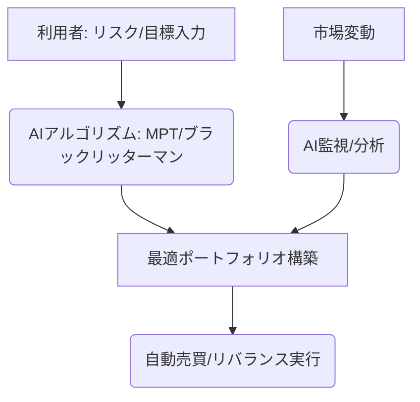

# T16-05-01 ロボアドバイザー（自動資産運用）

## Summary（5つの要点）

1. **自動ポートフォリオ構築**: 投資家のリスク許容度、投資目的、投資期間などの質問への回答に基づき、**現代ポートフォリオ理論（MPT）**を応用して最適な資産配分（ポートフォリオ）を自動で提案・構築する。
2. **自動リバランス**: 市場変動により資産配分が当初の目標から乖離した場合、AIが自動で資産の売買を行い、**目標とするリスク・リターン水準**を維持する（リバランス）。
3. **低コスト運用**: 人間によるアドバイスや運用を介さないため、従来のファンドマネージャー運用に比べ、手数料（信託報酬、フィー）を**年率1%前後**に抑えることが可能。
4. **金融包摂と民主化**: 投資初心者や少額投資家に対し、高度な専門知識なしに、**プロ並みの分散投資**を低コストで提供し、資産運用を民主化する。
5. **AIによるパーソナライズ**: 単なるMPTだけでなく、個人の**支出パターン、キャッシュフロー、ライフイベント**をAIで分析し、より高度にパーソナライズされた運用戦略を提案する機能が進化している。

#### 概念図

---

### 技術評価表（定量的な視点）
| 評価項目 | 評価 | 根拠・備考 |
| :--- | :--- | :--- |
| 導入コスト | ⭐⭐⭐⭐☆ | システム開発は高コストだが、サービス提供後の運用コストは低く抑えられる。 |
| 技術成熟度 | ⭐⭐⭐⭐⭐ | MPT、自動売買システムは確立。AIによるパーソナライズが進化中。 |
| 日本の競争力 | ⭐⭐⭐⭐☆ | WealthNavi、THEOなど国内事業者が成功例を持ち、グローバルでも競争力あり。 |
| 市場性 | ⭐⭐⭐⭐⭐ | NISA/iDeCoの普及と相まって、若年層・投資初心者に必須のサービス。 |
| 品質保証の重要性 | ⭐⭐⭐⭐⭐ | システム障害は巨額の運用損失に直結。アルゴリズムの安定性と透明性が最重要。 |

---

## 日本の立ち位置・強み弱みのSummary

### 強み

* **税制優遇制度との連携**: つみたてNISAやiDeCoといった日本の優遇税制に最適化されたポートフォリオ提案や自動積立機能が充実している。
* **国内最大級の利用者数**: WealthNaviが業界をリードし、利用者数、預かり資産でグローバルに通用する実績を保有。
* **既存金融機関との協業**: 証券会社や銀行がロボアドサービスを導入・提供しており、信頼性が高い。

### 弱み

* **フィー競争の激化**: 米国（Betterment、Wealthfront）では手数料無料化が進んでおり、国内のフィー（年率1%前後）は割高との声もある。
* **リスク管理の保守性**: 多くのサービスがMPTベースの比較的保守的な運用に留まり、AIを活用した**積極的な短期リターン追求**アルゴリズムの導入が遅れている。
* **複雑な税制対応**: 外国株・為替取引を含む複雑な損益通算や税務処理への自動対応が、米国サービスに比べ限定的。

---

## 技術ロードマップ（短期/中期/長期）

### 短期目標（～2027年）

* NISAの成長投資枠に対応した、**税最適化・ロスハーベスティング機能**の標準搭載。
* **自然言語処理（NLP）**を活用し、顧客の目標設定やリスク許容度をより詳細にヒアリングするチャットボット導入。
* ロボアドバイザーが提供する**投資対象に暗号資産、NFT**などのデジタルアセットを追加。

### 中期目標（2028年～2031年）

* **強化学習（Reinforcement Learning）**を導入し、市場環境に応じて自律的にリスク調整やリバランスのタイミングを最適化するAIモデルの実用化。
* ロボアドバイザーが自動で保険や年金商品を選定し、**資産運用と保障を統合したワンストップ提案**を実現。
* オープンバンキングデータと連携し、毎月の収入・支出パターンに基づいた**超パーソナライズされた積立計画**を自動調整。

### 長期目標（2032年～2035年）

* 量子コンピューターを活用した**超大規模ポートフォリオ最適化**により、数千銘柄からなる最適な資産配分をリアルタイムで構築。
* AIが個人の健康状態、ウェルビーイングデータも統合し、**生涯収支・健康リスク**まで考慮した金融・人生設計を自動実行。

### 📚 参照リンク

1. [金融庁：ロボアドバイザーの規制と市場動向に関する報告書 2026年版](https://www.fsa.go.jp/report/robo_advisor_2026/)
2. [日本のロボアドバイザー市場と利用者動向 - 資産運用研究センター](https://www.amrc.or.jp/robo_advisor_jp_2025)