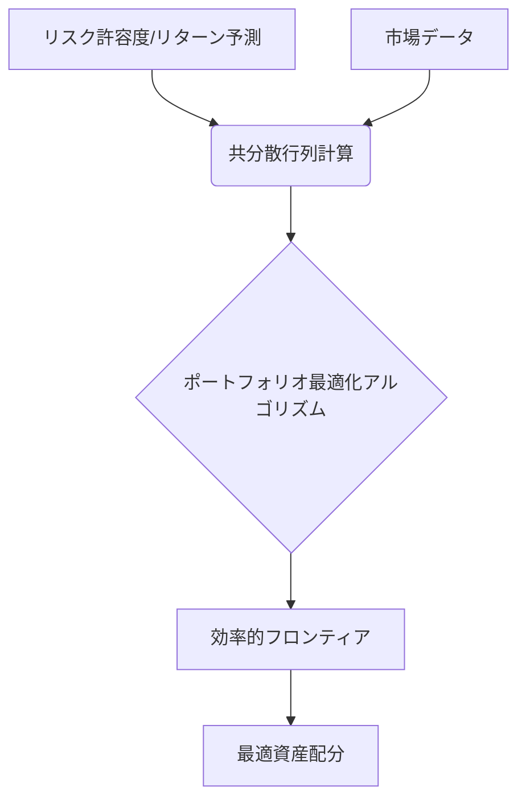

# T16-05-02 分散投資アルゴリズム・MPT（現代ポートフォリオ理論）

## Summary（5つの要点）

1. **リスク・リターン最適化（MPT）**: ハリー・マーコウィッツの**現代ポートフォリオ理論（MPT）**に基づき、異なる資産（株式、債券、不動産、コモディティなど）の相関性を分析し、**リスクの最小化とリターンの最大化**を両立する資産配分を数学的に計算する。
2. **効率的フロンティア**: 特定のリスク水準で得られる最大のリターン、または特定のリターン水準で達成できる最小のリスクを示す境界線（**効率的フロンティア**）を算出し、投資家はその曲線上の最適なポートフォリオを選択する。
3. **ブラック・リッターマンモデル**: MPTが過去のデータに過度に依存する点を克服するため、投資家の**主観的な見通し（ビュー）**を組み込み、よりロバストで実用的なポートフォリオを構築する。
4. **シャープレシオの活用**: ポートフォリオのリスク対比リターン（超過リターン）を評価する指標として**シャープレシオ**を用い、リスクに見合った効率的な運用ができているかを定量的に評価する。
5. **アルゴリズムによる自動実装**: 複雑な最適化計算をPythonの**scipy.optimize**などのライブラリや専用の金融工学ソフトウェアで自動で実行し、ロボアドバイザーや機関投資家のファンド運用システムに組み込む。

#### 概念図

---

### 技術評価表（定量的な視点）
| 評価項目 | 評価 | 根拠・備考 |
| :--- | :--- | :--- |
| 導入コスト | ⭐⭐⭐☆☆ | 理論は公開済み。実装は専門知識を要するが、計算インフラは比較的安価。 |
| 技術成熟度 | ⭐⭐⭐⭐⭐ | MPTはノーベル賞受賞の古典的理論であり、確立済み。応用アルゴリズムが進化中。 |
| 日本の競争力 | ⭐⭐⭐⭐☆ | 金融工学研究は活発。MPTを組み込んだロボアド普及率も高い。 |
| 市場性 | ⭐⭐⭐⭐⭐ | 資産運用を行う全ての金融機関、個人投資家にとっての基盤理論。 |
| 品質保証の重要性 | ⭐⭐⭐⭐⭐ | リスクとリターンの計算ミスは運用方針の根幹を揺るがす。数理的な正当性が重要。 |

---

## 日本の立ち位置・強み弱みのSummary

### 強み

* **金融工学の専門人材**: 金融機関や大学において、数理ファイナンス、金融工学の高度な研究者が多数存在し、理論的なバックグラウンドは堅固。
* **長期投資文化の醸成**: NISA、iDeCoの普及により、長期・国際分散投資の重要性に対する意識が高まっており、MPTの浸透が進んでいる。
* **安定的な市場環境**: 日本株市場は、欧米市場に比べ変動が緩やかな時期があり、伝統的なMPTのモデルが比較的安定して機能しやすい側面がある。

### 弱み

* **オルタナティブ資産の組み込み遅れ**: プライベートエクイティ、ヘッジファンド、未上場株などのオルタナティブ資産をポートフォリオに組み込むためのデータやアルゴリズム開発が、欧米の機関投資家に比べ遅れている。
* **市場見通しの組み込み**: ブラック・リッターマンモデルで必要とされる、**投資家独自の市場見通し**をAIやデータサイエンスで自動生成する技術の導入が遅れている。
* **レガシーシステム依存**: 伝統的な金融機関のポートフォリオ管理システムが、柔軟な最適化アルゴリズムの導入を阻害している場合がある。

---

## 技術ロードマップ（短期/中期/長期）

### 短期目標（～2027年）

* ロボアドバイザーにおけるMPTの基礎理論に加え、**ブラック・リッターマンモデル**の本格導入によるポートフォリオの安定性向上。
* 地域の未公開株や不動産クラウドファンディングなど、**非流動性資産**を考慮した最適化モデルの研究開始。
* ポートフォリオの**ストレス耐性**を評価するためのシミュレーション技術（モンテカルロ法など）の標準化。

### 中期目標（2028年～2031年）

* **深層学習（ディープラーニング）**を用いて、資産間の非線形な相関関係を予測し、MPTの入力値（期待リターン、リスク）を自動で高度化するモデルの実用化。
* **ESG（環境・社会・ガバナンス）スコア**をリスク・リターンと同様に考慮した**多目的ポートフォリオ最適化**アルゴリズムの標準化。
* AIによる**市場センチメント分析**の結果をブラック・リッターマンモデルの「ビュー」として自動で組み込むシステムの実現。

### 長期目標（2032年～2035年）

* 量子コンピューターを活用し、数万変数に及ぶ**超大規模かつ複雑な制約条件**を持つポートフォリオ最適化問題をリアルタイムで解決。
* 資産運用の目的がリターンだけでなく、**社会貢献度やサステナビリティ**など非財務的指標の最大化へと進化し、アルゴリズムもそれに合わせて進化。

### 📚 参照リンク

1. [JST：現代ポートフォリオ理論の進化とAI応用に関する研究 2026年](https://www.jst.go.jp/impact/mpt_future_2026/)
2. [ブラック・リッターマンモデルの計算ファイナンス応用 - 日本金融工学学会](https://www.jsfeg.or.jp/bl_model_2025)