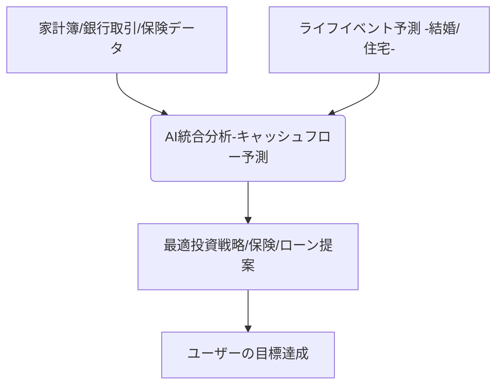

# T16-05-03 AIパーソナライズ投資提案

## Summary（5つの要点）

1. **全データ統合分析**: 家計簿アプリ、銀行口座（オープンバンキング）、クレジットカード、保険、年金データなど、個人の**全財務データ**をAIが統合的に分析する。
2. **ライフイベントと連動**: 結婚、住宅購入、出産、子の教育費、退職などの**将来のライフイベント**と、それにかかるコストを予測し、その目標達成に必要な投資戦略（積立額、リスク水準）を提案する。
3. **キャッシュフロー予測**: AIが個人の**収入、支出パターン、貯蓄習慣**から、将来の月次・年次のキャッシュフローをシミュレーションし、老後資金不足などの潜在リスクを早期に警告する。
4. **金融商品の自動最適化**: 投資だけでなく、リスク回避のための**最適な保険商品**、資金調達のための**最適な住宅ローン**などを横断的に提案・選定し、個人の金融全体を最適化する。
5. **行動経済学の応用**: AIが利用者の**意思決定バイアス**（例：損失回避、現状維持バイアス）を検知し、バイアスを克服するためのパーソナライズされた行動変容アプローチ（ナッジ）を提供する。

#### 概念図

---

### 技術評価表（定量的な視点）
| 評価項目 | 評価 | 根拠・備考 |
| :--- | :--- | :--- || 導入コスト | ⭐⭐⭐⭐☆ | データ統合基盤、高度なAIモデル（時系列予測、LLM）の開発に高コスト。 || 技術成熟度 | ⭐⭐⭐☆☆ | 個別技術は確立。複数の金融ドメインを横断する統合AIの実現が課題。 || 日本の競争力 | ⭐⭐⭐⭐☆ | マネーフォワード、freeeなど家計簿・PFMサービスが強く、データ基盤で先行。 || 市場性 | ⭐⭐⭐⭐⭐ | 従来の対面アドバイスを代替し、全ての人に必須の「生涯金融コンシェルジュ」となる。 || 品質保証の重要性 | ⭐⭐⭐⭐⭐ | 誤ったアドバイスは人生設計の破綻に繋がる。予測モデルの精度と倫理性が重要。 |
---

## 日本の立ち位置・強み弱みのSummary

### 強み

* **PFM（個人財務管理）アプリの普及**: マネーフォワード、ZaimなどのPFMサービスが広く普及し、個人の支出・資産データ収集のプラットフォームが確立している。
* **オープンバンキングの推進**: 金融庁主導のAPI公開により、銀行口座データとの連携が制度的に保証されており、データ統合が進みやすい。
* **国民の高齢化**: 老後資金に対する国民の不安が強く、AIによる生涯キャッシュフロー予測のニーズが極めて高い。

### 弱み

* **保険・年金データの連携遅れ**: 投資データに比べ、個人の加入している保険や年金に関するデータのデジタル連携や標準化が遅れており、統合分析が難しい。
* **人間によるファイナンシャルプランナーの抵抗**: 質の高い対面アドバイスを重視する富裕層向けサービスでは、AIによる提案への信頼感・受け入れに抵抗がある。
* **プライバシー規制の複雑さ**: センシティブな個人のライフイベントや健康情報、詳細な支出データを統合的に扱うことに対する法規制・倫理的な配慮が複雑。

---

## 技術ロードマップ（短期/中期/長期）

### 短期目標（～2027年）

* PFMアプリとロボアドバイザーの機能を統合し、**収支状況に基づく自動積立・投資調整**を実現。
* **大規模言語モデル（LLM）**を活用し、利用者との自然な会話を通じてライフプランに関する情報を収集・分析。
* 個人の支出パターンを分析し、最適な**サブスクリプションサービスの解約**や**固定費削減**の提案。

### 中期目標（2028年～2031年）

* AIが個人の健康診断データやウェアラブルデバイスのデータと連携し、**健康寿命と資産寿命を統合した予測**を開始。
* 複数の金融機関のデータを統合し、ローン、投資、保険の**一括借り換え・最適化**をAIが自動実行。
* **強化学習**を導入し、個人の目標達成に向けて自律的に行動を最適化するAIエージェントの実用化。

### 長期目標（2032年～2035年）

* AIが個人に代わって金融機関と交渉し、**金利や手数料の自動最適化**を行う「デジタル交渉人」が実現。
* **脳波や視線データ**などのバイオメトリクス情報と連携し、真のリスク許容度を測定した上で投資提案を行う。

### 📚 参照リンク

1. [日本マネジメント協会：AIを活用したパーソナライズ投資提案の最新動向 2026年](https://www.moneymanagement_institute.jp/report/ai_personalization_2026/)
2. [行動経済学とAIナッジングによる金融行動変容 - 経済産業省研究会](https://www.meti.go.jp/policy/ai_nudge_2025)