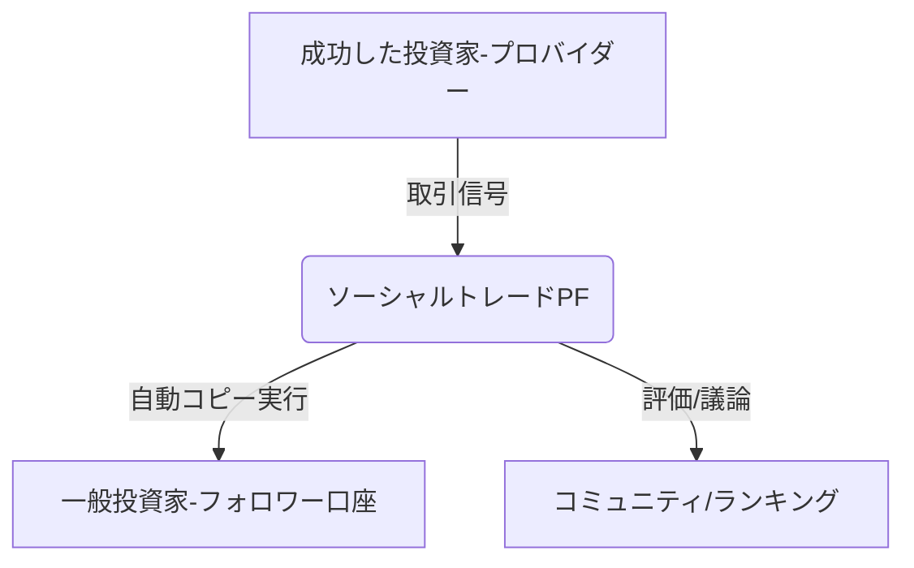

# T16-05-04 ソーシャルトレーディング・コピートレード

## Summary（5つの要点）

1. **専門家の戦略を模倣**: 経験豊富で実績のある投資家（プロバイダー）のポートフォリオや取引を、他の一般投資家（フォロワー）が**リアルタイムで自動的にコピー**して実行できるシステム。
2. **透明性の確保**: プロバイダーの過去のリターン、リスク水準、取引履歴、フォロワー数などの**パフォーマンス指標**がプラットフォーム上で公開され、フォロワーが透明性の高い基準で選択できる。
3. **投資学習の場**: コピートレードは自動運用の一方で、投資戦略や市場分析、リスク管理の手法を実践的に学ぶことができる**投資教育ツール**としての側面を持つ。
4. **コミュニティ形成**: 投資家同士が意見交換や戦略の議論を行う**ソーシャルメディア機能**を統合し、投資に関する知見の共有を促進する。
5. **規制とリスク**: 成功している投資家をコピーするとはいえ、過去のパフォーマンスが将来を保証するものではなく、**ハイリスクな取引（例：CFD、FX）**に集中するリスク、および無許可の投資助言業とみなされないための規制遵守が課題。

#### 概念図

---

### 技術評価表（定量的な視点）
| 評価項目 | 評価 | 根拠・備考 || :--- | :--- | :--- || 導入コスト | ⭐⭐⭐⭐☆ | リアルタイムの取引データ連携、コピーシステムの低遅延化、法規制対応システム構築に高コスト。 || 技術成熟度 | ⭐⭐⭐⭐☆ | 海外PF（eToro）で成熟。国内では金融商品取引法との整合性が課題。 || 日本の競争力 | ⭐⭐⭐☆☆ | 国内証券会社も類似サービスを開始したが、市場規模・多様性で海外に劣る。 || 市場性 | ⭐⭐⭐⭐☆ | 投資未経験者が手軽に投資を始める手段として需要が高い。 || 品質保証の重要性 | ⭐⭐⭐⭐⭐ | 取引の遅延はフォロワーの損失に直結。システム応答速度と、プロバイダーの信頼性評価が重要。 |
---

## 日本の立ち位置・強み弱みのSummary

### 強み

* **高い技術力**: 証券システムの構築・運用における信頼性の高い技術力があり、コピートレードに必要な低遅延な取引実行システム構築は可能。
* **投資教育のニーズ**: 投資初心者層が増加しており、「プロの戦略を学べる」という付加価値に対するニーズが高い。

### 弱み

* **金融商品取引法の制約**: 投資助言・代理業に関する厳格な規制があり、コピートレードの形式が「無許可の投資助言」とみなされないよう、サービス設計に高度な配慮が必要。
* **ハイリスク商品への依存**: 海外のソーシャルトレーディングはFXやCFDなどハイリスクな取引が中心となる傾向があり、日本の保守的な投資文化との適合性に課題がある。
* **プロバイダーの層の薄さ**: 魅力的なリターンを安定して出せるプロのトレーダー層が、海外プラットフォームに比べてまだ薄い。

---

## 技術ロードマップ（短期/中期/長期）

### 短期目標（～2027年）

* 国内の規制当局（金融庁）と連携し、**コピートレードに関するガイドライン**を策定し、法的な安定性を確保。
* 投資信託やETFなど**比較的低リスクな商品**を対象としたコピートレードサービスを普及させる。
* プロバイダーの過去の取引における**リスク評価指標**（最大ドローダウンなど）の公開を義務付け、透明性を向上。

### 中期目標（2028年～2031年）

* AIがプロバイダーの取引戦略を分析し、フォロワーのリスク許容度に応じて**戦略の切り替えを自動で提案・実行**するシステムの導入。
* コピートレードを通じて得た知識を**ゲーミフィケーション**で可視化し、投資初心者の学習を促進。
* ブロックチェーン技術を活用し、プロバイダーの取引実績の改ざんが不可能な**トラストレスな記録**を実現。

### 長期目標（2032年～2035年）

* コピートレードが、プロの戦略をAIが解析・学習するための**大規模なデータセット**として機能し、AI投資モデルの進化を加速。
* 個人が特定のスキルや知見（例：ESG分析、特定の産業知識）を持つユーザーの投資を部分的にコピーするなど、**超細分化されたソーシャルトレーディング**が実現。

### 📚 参照リンク

1. [日本証券業協会：ソーシャルトレーディングの法規制と市場の健全性 2026年](https://www.jsda.or.jp/report/social_trading_2026/)
2. [コピートレードにおけるリスク管理と情報開示に関する研究 - 金融先物取引業協会](https://www.fsa.go.jp/ffaj_research_2025)