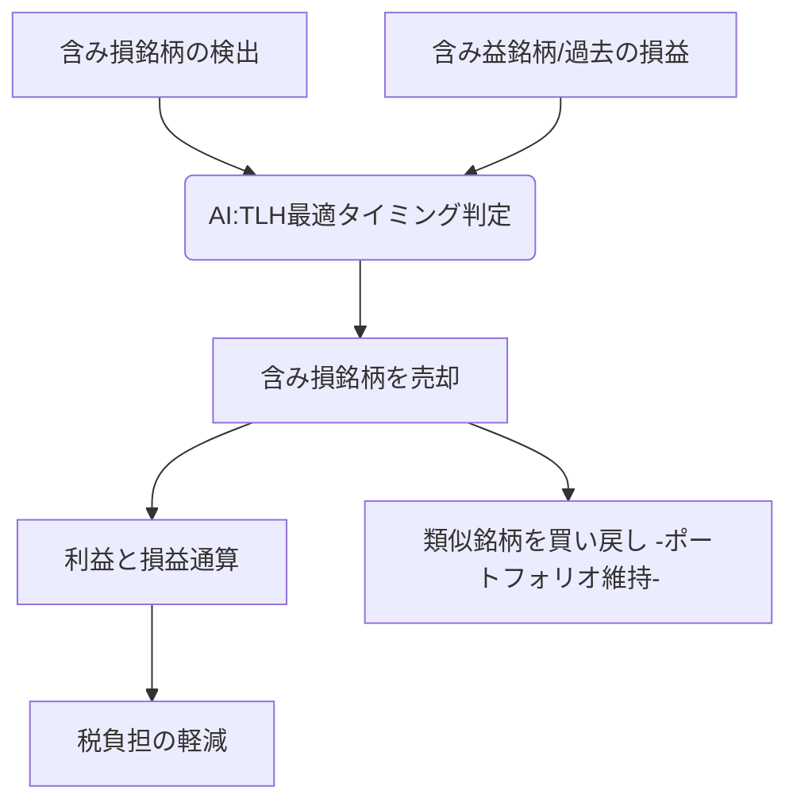

# T16-05-05 税最適化・ロスハーベスティング

## Summary（5つの要点）

1. **ロスハーベスティング（TLH）**: 含み損を抱えている銘柄を期末（年末）に売却して**損失を確定**し、同年に確定している利益と**損益通算**することで、**税負担を軽減**する戦略。売却直後に同等だが異なる銘柄（例：類似ETF）を買い戻し、ポートフォリオ構成を維持する。
2. **AIによる自動実行**: 投資家の税務状況、ポートフォリオ、市場の流動性などをAIがリアルタイムで監視し、最適なタイミングでTLHを自動で実行する。
3. **NISA枠の最大活用**: 日本の**NISA（少額投資非課税制度）**の非課税投資枠を最も効率的に活用するため、課税口座とNISA口座間のリバランス、特定口座内でのTLHを最適化するアルゴリズム。
4. **税務処理の複雑性解消**: 損益通算、繰越控除、非課税枠の計算など、個人投資家にとっては複雑な**税務処理**をAIが自動化し、投資活動における**隠れたコスト**を最小化する。
5. **パフォーマンス向上効果**: TLHによる節税効果は、長期的な運用において**年間0.5%〜1%程度**の追加リターンに相当するとされ、特に富裕層・高所得層の運用において不可欠な技術となる。

#### 概念図

---

### 技術評価表（定量的な視点）
| 評価項目 | 評価 | 根拠・備考 |
| :--- | :--- | :--- || 導入コスト | ⭐⭐⭐⭐☆ | 高度な税務ロジックの実装、リアルタイムの損益監視、取引実行システム統合に高コスト。 || 技術成熟度 | ⭐⭐⭐⭐☆ | 米国では既にWealthfrontなどが実装し成熟。日本の複雑な税制への対応が課題。 || 日本の競争力 | ⭐⭐⭐☆☆ | 国内では特定口座（源泉徴収あり）での対応が中心。NISA枠対応が今後の焦点。 || 市場性 | ⭐⭐⭐⭐⭐ | 富裕層・長期積立投資家にとって、リターンを底上げする「無料のランチ」として必須。 || 品質保証の重要性 | ⭐⭐⭐⭐⭐ | 税務処理のミスは追徴課税に直結。税法改正への迅速な対応と計算の正確性が最重要。 |
---

## 日本の立ち位置・強み弱みのSummary

### 強み

* **特定口座の仕組み**: 特定口座（源泉徴収あり）では、証券会社が自動で損益通算を行う仕組みがあり、TLHの基礎となる技術的基盤は存在する。
* **NISA枠の拡大**: 新しいNISA制度における非課税枠の拡大に伴い、課税口座と非課税口座を横断した資金移動・リバランスの最適化ニーズが高まっている。

### 弱み

* **税法の複雑性**: 日本の税法は細かく、特に売却後一定期間（米国のWash Sale Ruleに相当する明確な規定はないが）での再購入に関するリスクなど、AIによる完全自動化の難易度が高い。
* **TLHの認知度**: 米国に比べ、個人投資家や金融機関におけるTLHの戦略としての認知度や積極的な導入が遅れている。
* **既存システムの制約**: 既存の証券会社のシステムが、リアルタイムでの損益計算と、それをトリガーとする自動取引実行に柔軟に対応できていない場合がある。

---

## 技術ロードマップ（短期/中期/長期）

### 短期目標（～2027年）

* AIによる**特定口座内での年間損益通算の最適化**（TLH）機能を搭載したロボアドバイザーサービスの普及。
* 新NISAの成長投資枠・つみたて投資枠の残存期間や枠を考慮した、**非課税枠を最大活用する自動リバランス**機能の標準化。
* 税制改正リスクをAIが予測し、自動取引を一時停止する**ロバスト性確保**機能の導入。

### 中期目標（2028年～2031年）

* 複数証券会社、複数口座を横断した**損益通算・繰越控除の最適化**をAIが自動で支援するPFMサービスの実現。
* **地域限定型クラウドファンディング**など非流動性資産の評価額変動をAIが予測し、他の課税資産とのTLHを提案。
* AIが利用者の**確定申告書を自動作成**し、税務当局への提出までをサポートするシステムの実現。

### 長期目標（2032年～2035年）

* 全ての金融取引がブロックチェーン上で記録され、税務当局と投資家間でリアルタイムに情報が共有され、**税務処理が完全に自動化**される社会の実現。
* AIが個人の生涯収支を最適化する中で、税最適化が**投資アルゴリズムの一部**として完全に組み込まれ、意識されることがなくなる。

### 📚 参照リンク

1. [国税庁：AIを活用した税務の効率化とロスハーベスティングの展望 2026年版](https://www.nta.go.jp/report/tax_harvesting_2026/)
2. [日本におけるTax Loss Harvestingの法務・税務課題 - 監査法人協会](https://www.jicpa.or.jp/tax_loss_harvesting_2025)