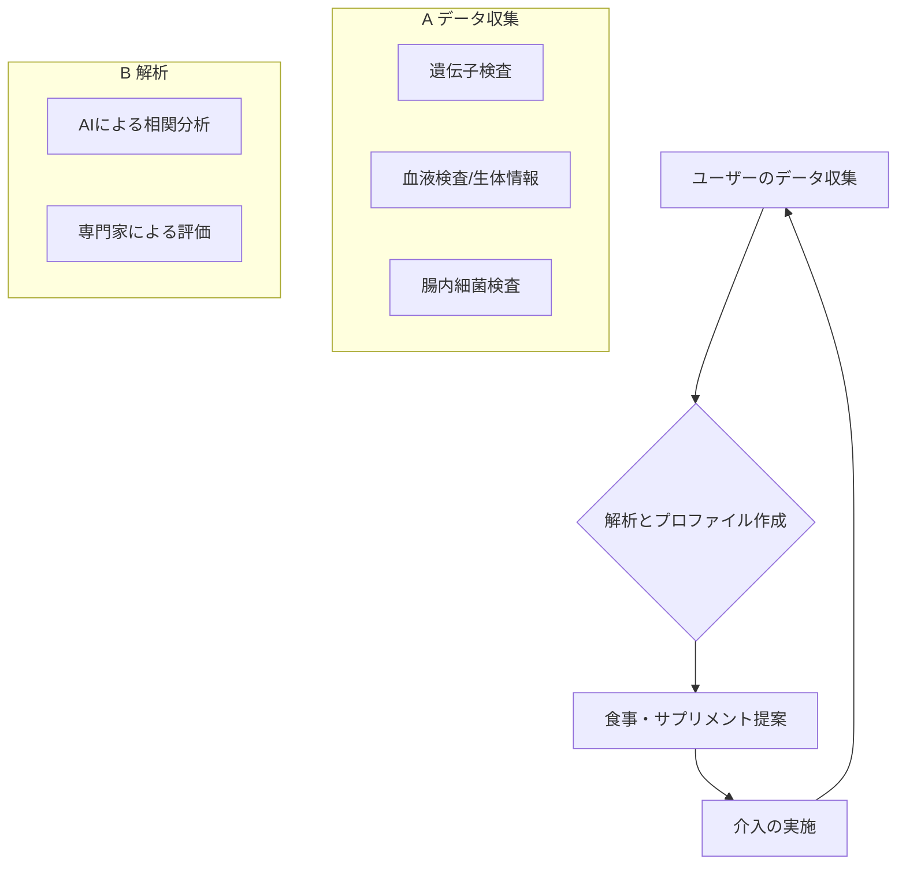

# T17-06-02 個別化栄養（パーソナライズド・ニュートリション）

## Summary（5つの要点）

1.  **多角的データ解析**: **遺伝子検査、血液検査、腸内細菌検査**の結果から、個人の体質、栄養状態、代謝傾向を詳細に解析する。
2.  **最適メニュー・サプリメント提案**: 解析結果に基づき、**最適な食事メニュー**や**サプリメント**をカスタマイズして提案する。
3.  **生活習慣病の予防・改善**: 糖尿病、高血圧、脂質異常症などの**生活習慣病の予防**や改善を支援することを目的としている。
4.  **基盤技術の統合**: T17-01-02（腸内マイクロバイオーム解析技術）やT17-01-01（機能性成分データベース）と連携し、エビデンスに基づく提案を行う。
5.  **主要プレイヤー**: FiNC、ジーンクエストなどの企業が、個人の検査データに基づいた栄養指導サービスを提供している。

## 具体的プロダクト事例

* **遺伝子検査キット**: 疾患リスクや体質（脂質代謝、アルコール耐性など）を解析し、最適な食生活を指導。
* **腸内細菌検査サービス**: 腸内フローラを解析し、不足している善玉菌を補うプロバイオティクスやプレバイオティクスの提案。
* **個別化サプリメント**: 検査結果に応じて、必要な機能性成分（ビタミン、ミネラル等）を組み合わせた専用サプリメントの提供。
* **開発事例**: FiNC、ジーンクエストがパーソナライズド・ニュートリションサービスを提供。

#### 概念図：個別化栄養のフィードバックループ

## Rating（5段階評価）

* **技術成熟度**: ⭐⭐⭐⭐☆（検査技術は確立、AIによる解析・提案技術が発展途上）
* **日本の競争力**: ⭐⭐⭐⭐☆（腸内細菌研究やゲノム解析サービスで国際的な実績あり）
* **市場性**: ⭐⭐⭐⭐⭐（健康志向の高まり、予防医療へのニーズから急速な市場拡大が見込まれる）
* **品質保証の重要性**: ⭐⭐⭐⭐⭐（検査データの正確性、解析アルゴリズムの妥当性、プライバシー保護が必須）
* **実装可能性**: ⭐⭐⭐⭐☆（技術は実用化レベルだが、価格と普及率が課題）