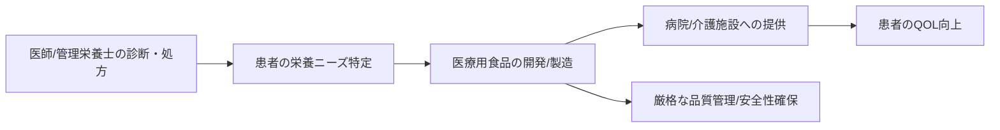

# T17-06-03 医療用食品（メディカルフード）開発技術

## Summary（5つの要点）

1.  **特定疾患患者向け開発**: 腎臓病、糖尿病、嚥下困難者など、特定の疾患や病態を持つ患者向けに、**栄養組成を調整**して開発される食品。
2.  **治療効果の補完**: 医師や管理栄養士の指示のもと使用され、**治療効果を補完**する役割を担う。
3.  **組成調整の技術**: **低タンパク食**（腎臓病向け）、**低GI食**（糖尿病向け）、**嚥下補助ゼリー食**（嚥下困難者向け）など、高度な栄養学的・食品加工技術が必要とされる。
4.  **高い安全性と品質管理**: 摂取が必須となるケースが多く、**栄養密度、成分の均一性、無菌性**など、一般的な食品より厳格な品質管理が要求される。
5.  **主要プレイヤー**: ニュートリー、クリニコなどの企業が、医療機関や介護施設向けに製品を製造している。

## 具体的プロダクト事例

* **低タンパク質米・パン**: 腎臓病患者の食事療法として、タンパク質含有量を抑えた食品。
* **低GI・高繊維の栄養補助飲料**: 糖尿病患者の血糖値コントロールをサポートする飲料。
* **栄養強化ゼリー**: 少量で高エネルギー・高タンパクを摂取できる、嚥下しやすいゼリー食。
* **開発事例**: ニュートリー、クリニコ（森永乳業グループ）が医療用食品を製造。

#### 概念図：メディカルフード開発の連携

## Rating（5段階評価）

* **技術成熟度**: ⭐⭐⭐⭐⭐（臨床栄養学に基づき、製品ラインナップと製造技術は確立）
* **日本の競争力**: ⭐⭐⭐⭐☆（高齢化社会を背景に、特に高齢者向けの製品開発で強み）
* **市場性**: ⭐⭐⭐⭐☆（高齢化と特定疾患患者の増加により、安定的な市場成長が見込まれる）
* **品質保証の重要性**: ⭐⭐⭐⭐⭐（製品の栄養組成と品質は、患者の生命維持に直結するため最重要）
* **実装可能性**: ⭐⭐⭐⭐⭐（法規制と医療現場での使用が定着）