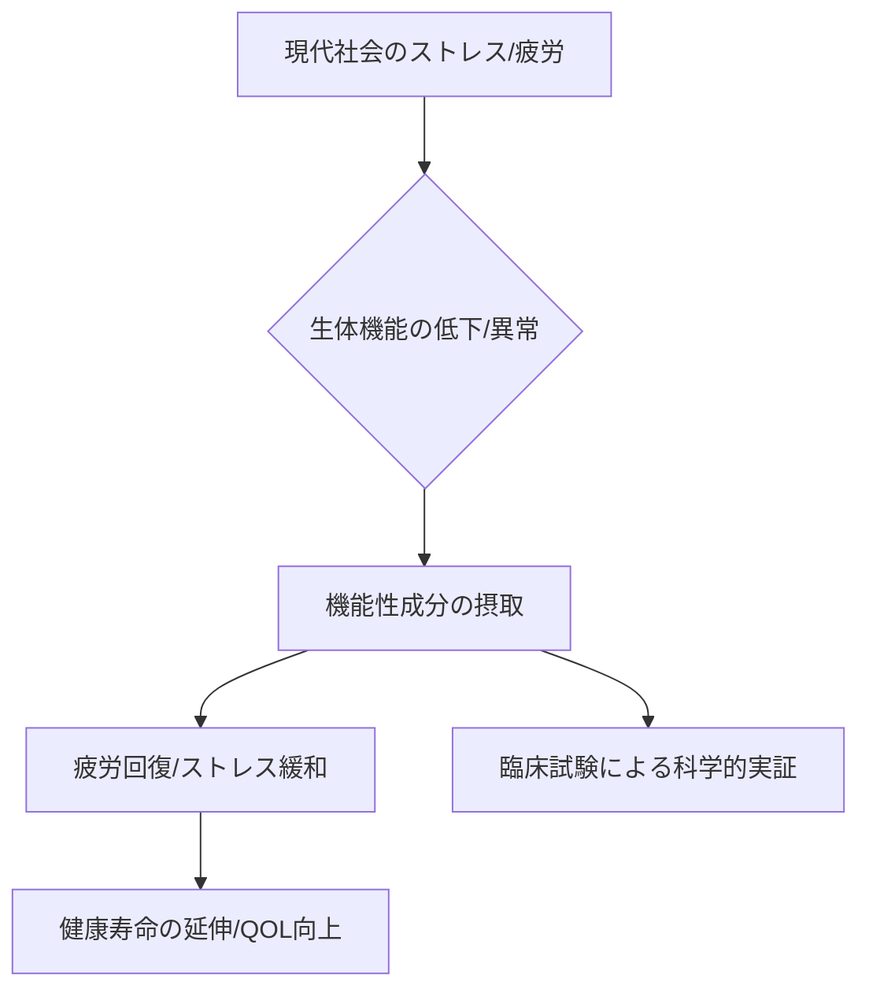

# T17-06-04 抗疲労・抗ストレス食品開発

## Summary（5つの要点）

1.  **特定機能性成分の配合**: **イミダゾールジペプチド**（抗疲労）、**GABA**（抗ストレス・睡眠改善）、**テアニン**（リラックス・集中力向上）等の成分を機能性食品に配合する。
2.  **臨床試験による効果実証**: これらの成分の**抗疲労作用、抗ストレス作用**を、**臨床試験（ヒト介入研究）**で科学的に実証する。
3.  **機能性表示食品として販売**: エビデンスに基づき、**機能性表示食品**として消費者に販売されることが多い。
4.  **社会課題への対応**: 現代社会における**過労、ストレス、メンタルヘルス**といった社会課題への対応策の一つとして、市場が拡大している。
5.  **主要事例**: 日本予防医薬の「イミダペプチド」が代表的な抗疲労食品の事例として挙げられる。

## 具体的プロダクト事例

* **イミダゾールジペプチド含有飲料**: 鶏むね肉などに多く含まれ、疲労の原因物質（活性酸素）を抑制する成分を配合した飲料。
* **GABA配合チョコレート・サプリメント**: 一時的な精神的ストレス緩和や血圧降下作用を訴求する食品。
* **テアニン配合飲料**: 睡眠の質（眠りの深さ、覚醒後の疲労感軽減）向上を訴求する飲料。
* **開発事例**: 日本予防医薬「イミダペプチド」等。

#### 概念図：機能性食品による健康サポート

## Rating（5段階評価）

* **技術成熟度**: ⭐⭐⭐⭐☆（主要成分の特定と効果実証は進展、個別最適化が今後の課題）
* **日本の競争力**: ⭐⭐⭐⭐☆（機能性表示食品制度と臨床研究の基盤で、アジア市場をリード）
* **市場性**: ⭐⭐⭐⭐⭐（メンタルヘルス・疲労回復ニーズが高く、市場成長が継続）
* **品質保証の重要性**: ⭐⭐⭐⭐☆（成分の含有量と効果の再現性、エビデンスの正確性が重要）
* **実装可能性**: ⭐⭐⭐⭐⭐（既に関係製品が多数市場に投入されている）