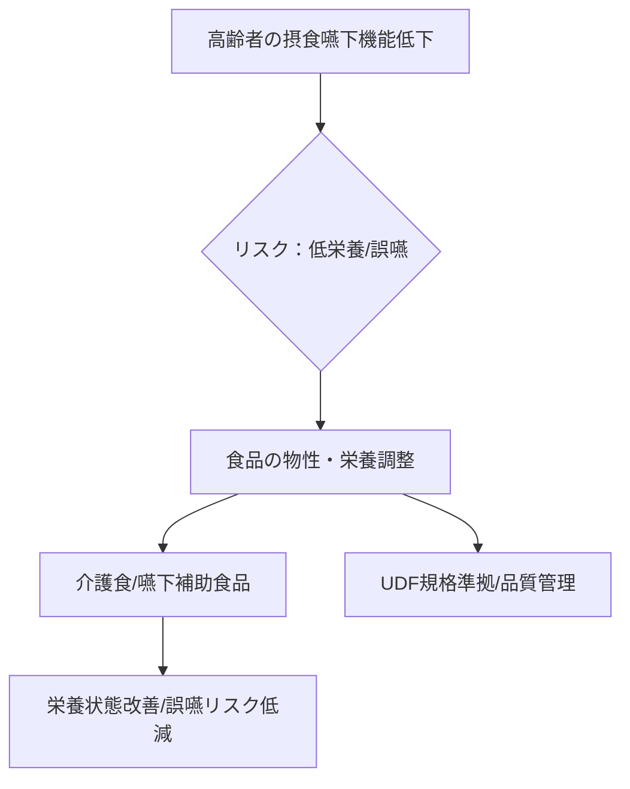

# T17-06-05 高齢者向け介護食・嚥下補助食品

## Summary（5つの要点）

1.  **咀嚼・嚥下機能への対応**: 咀嚼（噛むこと）や嚥下（飲み込むこと）機能が低下した高齢者向けに、**物性（硬さ、とろみ）を調整**した食品。
2.  **誤嚥リスクの低減**: 誤嚥しにくい**適切なとろみ**をつけたり、舌で潰せる**柔らかさ**を実現することで、誤嚥性肺炎のリスク低減に貢献する。
3.  **栄養密度の向上**: 少量でも必要なエネルギーやタンパク質などの栄養を摂取できるように、**栄養密度を高めた**食品である。
4.  **標準規格への準拠**: **UDF（ユニバーサルデザインフード）**規格など、業界標準の区分に準拠した製品開発が進められている。
5.  **主要プレイヤー**: キユーピー、アサヒグループ食品などの大手食品メーカーが、高齢者向け介護食市場をリードしている。

## 具体的プロダクト事例

* **舌で潰せるやわらかさのレトルト食品**: 固形物が苦手な高齢者向けに、ムース状やペースト状に加工されたおかず。
* **とろみ調整剤**: 液体に混ぜて、誤嚥しにくい適切な粘度（とろみ）をつける粉末。
* **高カロリー/高タンパク補助ゼリー**: 食事量が少ない高齢者向けの栄養補助用ゼリー。
* **開発事例**: キユーピー、アサヒグループ食品がUDF規格に準拠した製品を製造。

#### 概念図：介護食の機能と安全性

## Rating（5段階評価）

* **技術成熟度**: ⭐⭐⭐⭐⭐（食品加工技術、栄養学に基づき、製品と規格が確立）
* **日本の競争力**: ⭐⭐⭐⭐⭐（世界に先駆けた超高齢社会を背景に、製品開発と市場が成熟）
* **市場性**: ⭐⭐⭐⭐⭐（高齢化の進展により、市場規模は今後も継続的に拡大）
* **品質保証の重要性**: ⭐⭐⭐⭐⭐（物性、栄養組成、衛生面が利用者の健康に直結するため最重要）
* **実装可能性**: ⭐⭐⭐⭐⭐（病院、介護施設、在宅介護での使用が一般化）