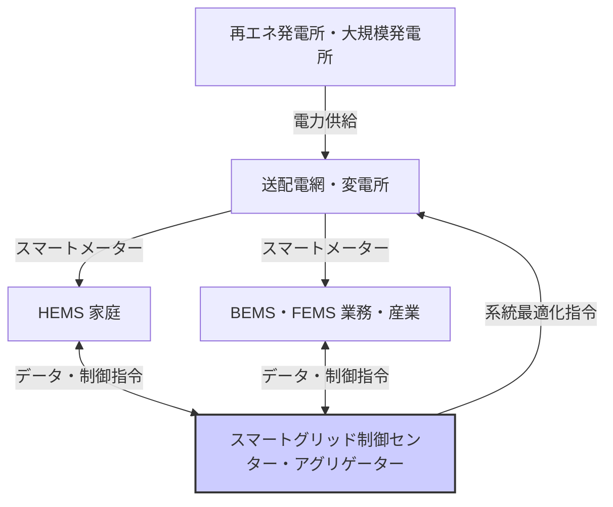

# T18-03-01 スマートグリッド・HEMS/BEMS統合制御

## Summary（5つの要点）

1. **需給最適化の基盤**: 発電・送配電・消費を双方向通信でリアルタイム制御し、電力需給を最適化する次世代電力網の基盤技術である。
2. **分散型電源の統合**: 家庭（HEMS）やビル（BEMS）の太陽光発電や蓄電池を統合制御することで、再生可能エネルギー（再エネ）の変動を吸収する。
3. **VPP/DRの実現**: この統合制御システムが、**仮想発電所（VPP）**や**デマンドレスポンス（DR）**といった新たな電力市場取引の技術基盤となる。
4. **スマートメーター普及完了**: 日本ではスマートメーターの全戸導入がほぼ完了しており、技術インフラは成熟段階にある。
5. **AIによる高度化**: 今後はAIによる高精度な需要予測と、分散電源への自律的制御指令の実現が焦点となる。

## 💡 全体要約と特徴

**スマートグリッド**は、情報通信技術（ICT）を活用し、電力網全体を最適に制御するシステムであり、再エネの大量導入に伴う系統不安定化の課題を解決するために不可欠な技術である。

この技術の中核は、各家庭の**HEMS**やビルの**BEMS**といったエネルギー管理システム（EMS）と連携し、電力需給の状況に応じて、需要家側の機器（エアコン、給湯器、蓄電池など）を遠隔で制御する能力にある。これにより、需要のピークカットや、再エネ発電の余剰電力を効率的に利用する**地産地消**が促進される。技術的には、スマートメーターを経由した高速かつセキュアな双方向通信プロトコル（例: ECHONET Lite、OpenADR）が重要となる。

#### 概念図: スマートグリッドとエネルギー管理システム（EMS）の統合

## 🛠️ 主要技術要素

| 技術要素 | 概要 | 応用例 |
| :--- | :--- | :--- |
| **スマートメーター** | 30分単位での電力使用量計測、双方向通信機能 | リアルタイム料金制度、DRへの活用 |
| **アグリゲーション技術** | 多数の分散電源（HEMS/BEMS内の蓄電池等）を統合制御する技術 | VPPの運用、需給調整市場への参入 |
| **通信プロトコル** (ECHONET Lite, OpenADR) | EMSと制御センター間のデータ連携・制御指令に使われる標準規格 | 機器間の相互接続性、DRの自動実行 |

## 📝 技術評価表（定量的な視点）

| 項目 | 評価 | 根拠 |
| :--- | :--- | :--- |
| **導入コスト** | 中 | スマートメーター設置は完了。HEMS/BEMS導入費用が主要コスト要因 |
| **技術成熟度** | 確立 | 基盤技術は確立済み。現在はAI連携など高度化フェーズ |
| **日本の競争力** | ⭐⭐⭐☆☆ | スマートメーター普及率は高いが、アグリゲーションプラットフォームは発展途上 |
| **市場性** | ⭐⭐⭐⭐⭐ | VPP/DR市場の拡大、再エネ拡大に伴う必須インフラ |
| **品質保証の重要性** | ⭐⭐⭐⭐⭐ | 通信途絶、制御遅延が系統の安定性に直結するため、極めて重要 |

## 日本の立ち位置・強み弱みのSummary

### 強み

* **スマートメーター普及率**: 電力メーターのスマート化がほぼ完了しており、データ収集の基盤が整備されている。
* **EMS技術**: HEMS/BEMSの開発・提供において、家電メーカーやシステムインテグレーターが技術的な強みを持つ。
* **既存法制度**: VPP/DRを可能にするための法制度（特定卸供給制度、需給調整市場など）の整備が進んでいる。

### 弱み

* **データ連携・標準化**: EMS間、およびEMSとアグリゲーター間でのデータフォーマットやAPIの標準化が不十分で、相互運用性に課題が残る。
* **サイバーセキュリティ**: スマートグリッド全体がネットワーク化されることで、サイバー攻撃に対するリスクが高まっている。
* **消費者インセンティブ**: DRへの参加インセンティブや利便性が低く、一般家庭での積極的な参加が進んでいない。

## 技術ロードマップ（短期/中期/長期）の視点

### 短期目標（～2027年）

* **需給調整市場の本格稼働**: 需給調整市場におけるVPPリソースの活用を本格化し、取引量を拡大する。
* **EMSの相互運用性向上**: ECHONET Liteの普及促進とAPIの標準化により、異なるEMS間のデータ連携を容易にする。

### 中期目標（2028年～2031年）

* **AIによる自律制御**: AIがリアルタイムの気象・需要予測に基づき、HEMS/BEMS内の分散電源を自律的に制御するシステムの全国展開。
* **EV・PHVとの連携強化**: 電気自動車（EV）の蓄電池（V2G: Vehicle to Grid）をVPPのリソースとして大規模に統合する。

### 長期目標（2032年～2035年）

* **地域間マイクログリッドの形成**: 災害時にも自立可能な地域単位のマイクログリッドを多数構築し、広域系統と統合したレジリエンスの高い電力システムを実現する。
* **カーボンニュートラル系統の実現**: 再エネ比率50%超に対応可能な、デジタル技術を駆使した究極の最適化された系統運用を確立する。

### 📚 参照リンク

[電気新聞 - 広域機関、連系線増強で３案を優先検討。北海道～本州間の直流送電など](https://www.denkishimbun.com/sp/125570)
