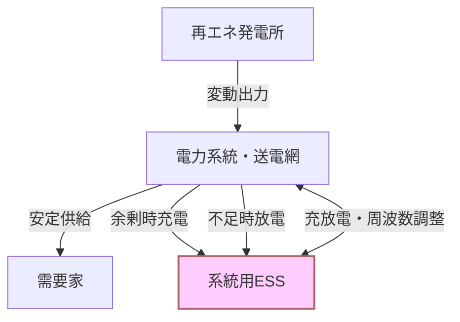

# T18-03-02 大容量蓄電池・系統用ESS（Energy Storage System）

## Summary（5つの要点）

1. **再エネ変動吸収の切り札**: 太陽光・風力といった変動性の高い再エネの余剰電力を貯蔵し、必要な時に放電することで、系統安定化に決定的に貢献する。
2. **周波数調整市場の主役**: 発電量の急峻な変化に対応し、電力系統の周波数維持に貢献する主要な調整力として、需給調整市場での活用が急速に進む。
3. **導入目標14.1～23.8GWh**: 経済産業省は2030年の国内導入見通しを**累計14.1～23.8GWh**と設定しており、導入が急加速している。
4. **リチウムイオン電池が主流**: 性能向上、コストダウンが進むリチウムイオン電池が主流だが、NAS電池やレドックスフロー電池など多様な技術も活用される。
5. **GI基金によるコスト目標**: NEDOのグリーンイノベーション基金事業では、**2030年までの社会実装と発電コスト14円/kWh以下**の達成が目標とされている。

## 💡 全体要約と特徴

**系統用ESS（Energy Storage System）**は、変電所などの電力系統に直接連系接続される大規模な蓄電池設備である。従来の自家消費用蓄電池と異なり、系統の需給バランス調整のために充放電を行い、電力網全体をサポートする役割を担う。

ESSの主な機能は、**ピークカット・ピークシフト**による電力コスト削減効果と、再エネの発電量変動を吸収し、**電力の品質（周波数）を維持**することである。近年、電力システム改革と再エネ導入拡大を背景に、日本国内でESSの市場が急拡大しており、電力系統への**逆潮流**（系統への放電）が可能な設備として、事業化が認められた。

#### 概念図: 系統用ESSによる系統安定化

## 🛠️ 主要技術要素

| 蓄電池種類 | 特徴 | 主な用途 |
| :--- | :--- | :--- |
| **リチウムイオン電池** | 高エネルギー密度、高性能化が進展中 | 短時間の大出力調整、周波数調整 |
| **NAS電池** (ナトリウム硫黄) | 長寿命、長時間の貯蔵が可能 | 長時間放電が必要なピークシフト、負荷平準化 |
| **レドックスフロー電池** | 安全性、長寿命、大規模化が容易 | 大規模再エネ貯蔵、系統安定化 |

## 📝 技術評価表（定量的な視点）

| 項目 | 評価 | 根拠 |
| :--- | :--- | :--- |
| **導入コスト** | 高 | 蓄電池セルの調達コストが依然高水準。GI基金によるコストダウンが目標 |
| **技術成熟度** | 成熟 | リチウムイオン電池は成熟。長寿命・高安全性の次世代技術が開発途上 |
| **日本の競争力** | ⭐⭐⭐☆☆ | 自動車用リチウムイオン電池に強み。定置用は海外企業との競争激化 |
| **市場性** | ⭐⭐⭐⭐⭐ | 2030年に向けて導入量が急増予測。国際市場も拡大 |
| **品質保証の重要性** | ⭐⭐⭐⭐⭐ | 火災リスク、充放電サイクルの劣化、系統への影響など、極めて重要 |

## 日本の立ち位置・強み弱みのSummary

### 強み

* **電池技術の基盤**: 自動車用リチウムイオン電池やNAS電池などの分野で培った高い製造技術と品質管理能力。
* **政策的推進**: 系統用蓄電池の事業化を認める法改正と、GI基金による大規模な導入・コスト目標設定による強力な後押し。
* **地域共生**: 防災拠点としての活用や、地域住民との対話を通じたレジリエンス強化への貢献が重視されている。

### 弱み

* **定置用メーカーの競争力**: 汎用的な定置用蓄電池市場では、中国・韓国メーカーが価格競争力で先行し、国内メーカーは劣勢になりつつある。
* **安全性への懸念**: 大規模な電池火災事例が海外であり、国内でも設置場所や設計における安全性確保が重要な課題。
* **長寿命化技術の不足**: 長期間にわたる充放電サイクルにおける劣化抑制や寿命予測技術において、更なるブレークスルーが必要。

## 技術ロードマップ（短期/中期/長期）の視点

### 短期目標（～2027年）

* **需給調整市場での活用拡大**: ESSを主要な調整力リソースとして需給調整市場で活用し、運用実績を積み重ねる。
* **安全性基準の強化**: 系統連系ガイドライン、消防法などの規制を整備し、大規模ESSの安全性・信頼性を確保する。

### 中期目標（2028年～2031年）

* **導入目標達成**: 2030年に向けた累計14.1～23.8GWhの導入目標を達成し、再エネ比率36～38%の系統安定化に貢献する。
* **コスト競争力の獲得**: GI基金の目標である発電コスト14円/kWh以下を達成し、主流市場での経済性を確保する。

### 長期目標（2032年～2035年）

* **次世代ESSの社会実装**: 液化空気エネルギー貯蔵（LAES）や、非リチウム系蓄電池などの次世代ESSを実用化し、多様なニーズに対応する。
* **VPPとの完全統合**: 系統用ESSと分散型ESS（HEMS/BEMS）がAIによりシームレスに連携し、系統全体で最適なエネルギーマネジメントを実現する。

### 📚 参照リンク

[ESSとは？電力貯蔵システムの役割や機能、普及に向けた課題などを解説](https://www.wsew.jp/hub/ja-jp/blog/article_114.html)
[リチウムイオン電池を活用した電力貯蔵システム（ESS） - TECH TIMES](https://techtimes.dexerials.jp/electronics/energy-storage-system/)
[系統用蓄電池とは？注目の電力ビジネスをわかりやすく解説します](https://www.eneres.jp/journal/grid-scale-battery/)
[太陽光・蓄電池業界の経営層・マネージャー層に役立つ2050年脱炭素ロードマップ戦略カレンダー](https://www.enegaeru.com/2050decarbonizationroadmapstrategycalendar-forthesolar-storagebatteryindustry)
[系統用蓄電池の現状と課題 - 経済産業省](https://www.meti.go.jp/shingikai/enecho/denryoku_gas/saisei_kano/pdf/062_05_00.pdf)
