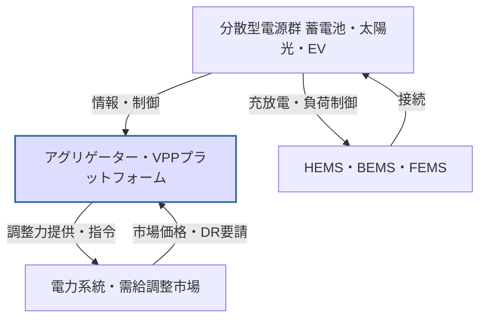

# T18-03-03 VPP（仮想発電所）・DR（デマンドレスポンス）

## Summary（5つの要点）

1. **分散電源の統合制御**: 家庭、ビル、工場の分散型電源（蓄電池、太陽光、EVなど）をIoTで統合し、あたかも一つの発電所のように遠隔制御する技術である。
2. **需給調整力の創出**: VPPにより、これまで系統制御外にあった小規模な電源・需要家を電力市場の調整力として活用し、系統の安定化に貢献する。
3. **DRの多様化**: 従来のピーク時節電要請（ネガワット）に加え、再エネ余剰時の需要増加要請（ポジワット）など、DRの種類と活用範囲が拡大している。
4. **アグリゲーターの役割**: 電力需給データとAI予測に基づき、分散電源の充放電・運転計画を策定・実行する**エネルギーアグリゲーター**が市場の主導権を握る。
5. **2030年5GW目標**: 経済産業省はVPPによって**原発5基分に相当する5GW**の調整力創出を目指す目標を掲げている。

## 💡 全体要約と特徴

**VPP（Virtual Power Plant：仮想発電所）**は、IoTを活用した高度なエネルギーマネジメント技術により、地域に散在する電源や蓄電池、需要家負荷（DR）を束ね（アグリゲーション）、遠隔・統合制御することで、電力の需給バランス調整に役立てる仕組みである。

VPPの実現には、需要家側が電力会社の要請や市場価格に応じて電力消費を抑制・増加させる**DR（Demand Response：デマンドレスポンス）**が不可欠である。特に、AIを用いた高精度な需給予測技術と、分散電源へのリアルタイム制御技術が、VPPの経済性と信頼性を高める鍵となる。

#### 概念図: VPP（仮想発電所）の仕組み

## 🛠️ 主要技術要素

| 技術要素 | 概要 | 役割 |
| :--- | :--- | :--- |
| **アグリゲーション技術** | 多数の分散電源を統合し、一つの発電所として制御・取引する技術 | 大規模な調整力創出 |
| **IoT/通信プロトコル** (OpenADR) | VPPプラットフォームと需要家機器間のリアルタイムデータ通信規格 | 制御指令の迅速かつ正確な伝達 |
| **AI需給予測・最適化** | 電力需要と再エネ発電量を高精度に予測し、VPPの運用計画を策定 | 調整力確保の精度向上、経済性向上 |

## 📝 技術評価表（定量的な視点）

| 項目 | 評価 | 根拠 |
| :--- | :--- | :--- |
| **導入コスト** | 中 | 制御システム導入、HEMS/BEMS側の通信機器整備コスト |
| **技術成熟度** | 成熟 | 技術は確立。実証実験から商用サービスへの移行段階 |
| **日本の競争力** | ⭐⭐⭐☆☆ | 制度設計は先行するが、海外プラットフォーマーの参入が激化 |
| **市場性** | ⭐⭐⭐⭐⭐ | 需給調整市場の立ち上がりと再エネ拡大で市場は急成長 |
| **品質保証の重要性** | ⭐⭐⭐⭐⭐ | 系統安定化に直結するため、指令どおりの充放電・負荷制御実行が必須 |

## 日本の立ち位置・強み弱みのSummary

### 強み

* **制度設計の先行**: 2017年のネガワット取引開始以降、需給調整市場の整備など、VPP/DRを可能にする制度設計が世界的に見ても先行している。
* **EV普及のポテンシャル**: 今後のEV普及に伴い、V2G（Vehicle to Grid）技術による移動型蓄電池リソースの活用ポテンシャルが非常に高い。
* **EMS普及率**: 業務・産業部門におけるBEMS/FEMSの導入が進んでおり、DRリソースとしての基盤が整備されている。

### 弱み

* **アグリゲーターの技術力**: 海外のAutoGridなどのプラットフォーマーに比べ、AIによる最適化技術やデータ解析能力が国内アグリゲーターで劣る部分がある。
* **標準化の遅れ**: 制御機器や通信プロトコルの標準化が国際的なスピードに追いつかず、機器接続の煩雑さが残る。
* **家庭部門の参加率**: DRへの参加インセンティブが低く、一般家庭のDRリソースが十分に活用されていない。

## 技術ロードマップ（短期/中期/長期）の視点

### 短期目標（～2027年）

* **VPPの市場取引本格化**: 需給調整市場でのVPPリソースの入札・取引を本格化し、実運用における信頼性を確立する。
* **EVとの連携実証**: V2G技術を用いたEV群の充放電制御実証を完了させ、大規模導入に向けた課題を抽出する。

### 中期目標（2028年～2031年）

* **5GW調整力達成**: 2030年までに5GW相当のVPP調整力を確保し、再エネ導入拡大を支える主要な電源として機能させる。
* **AIによる自律型VPP**: 気象・市場価格・系統状況をAIがリアルタイムで判断し、人間を介さず自律的に制御するシステムの導入を拡大する。

### 長期目標（2032年～2035年）

* **地域マイクログリッドとの統合**: VPPが地域のマイクログリッドと連携し、災害時のレジリエンス強化に貢献するとともに、地域内でのエネルギー自給自足を実現する。
* **国際的なDR連携**: 国際連系線経由で他国の電力系統とDR連携を行うための技術・制度基盤を確立する。

### 📚 参照リンク

[大容量蓄電システム | 株式会社TMEIC](https://www.tmeic.co.jp/technology/no08_3/)
[AI×再生可能エネルギー発電で業務効率化！活用事例や投資の未来を徹底解説](https://ai-front-trend.jp/renewable-energy-generation-ai/)
