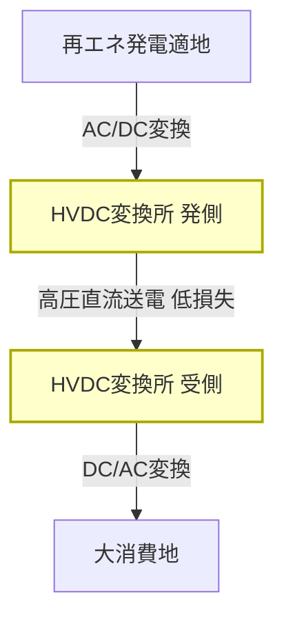

# T18-03-04 直流送電（HVDC）・広域連系線整備

## Summary（5つの要点）

1. **長距離・低損失送電**: **高圧直流送電（HVDC）**は、交流送電に比べて送電損失が少なく、長距離・大容量の電力輸送に最適である。
2. **再エネ適地活用**: 北海道の洋上風力や九州の太陽光など、再エネ発電の適地で発電された電力を、効率的に大消費地へ輸送するためのインフラとなる。
3. **周波数統一問題の解決**: 日本の東西で異なる周波数（50Hz/60Hz）を直流で接続することで、電力融通時の周波数変換問題を解決する。
4. **連系線の大幅増強**: 電力広域的運営推進機関（広域機関）は、北海道〜本州間、中部〜関西間、九州〜中国間などの連系線を大幅に増強する計画を進めている。
5. **系統強靭化への貢献**: 広域連系線が強化されることで、特定地域の電源脱落や災害発生時にも他地域から電力を融通でき、系統のレジリエンスが向上する。

## 💡 全体要約と特徴

**直流送電（HVDC）**は、主に長距離、海底ケーブル、または周波数の異なる系統間を接続するために利用される技術である。交流送電では、長距離になるほど送電損失が大きくなるが、直流ではその損失を大幅に抑えることが可能である。

この技術は、**広域連系線**の整備に不可欠であり、日本列島全体での電力融通能力を向上させることを目的としている。具体的には、北本連系線（北海道-本州）や中関連系線（中部-関西）の容量増強が優先検討されており、これにより再エネ導入の制約緩和と、電力市場の活性化が期待される。

#### 概念図: HVDCによる広域連系線の機能

## 🛠️ 主要技術要素

| 技術要素 | 概要 | 役割 |
| :--- | :--- | :--- |
| **HVDC変換技術** (VSC) | 電圧形変換器（VSC: Voltage Source Converter）による高速・高精度な交流/直流変換技術 | 潮流の双方向制御、異なる周波数系統間の接続 |
| **直流ケーブル** | 高電圧、大電流に耐える高性能な海底・地中直流ケーブル | 長距離・大容量の電力輸送を実現 |
| **連系線制御技術** | 電力広域的運営推進機関による系統全体の潮流を最適化するシステム | 融通電力の最大化と系統安定性の維持 |

## 📝 技術評価表（定量的な視点）

| 項目 | 評価 | 根拠 |
| :--- | :--- | :--- |
| **導入コスト** | 高 | 変換所建設費、ケーブル敷設費が高額 |
| **技術成熟度** | 確立 | 基盤技術は確立済み。日本でも既存連系線で運用実績あり |
| **日本の競争力** | ⭐⭐⭐☆☆ | 変換器技術は海外企業が強い分野。ケーブル技術は国内企業に強み |
| **市場性** | ⭐⭐⭐⭐☆ | 再エネ制約解消とレジリエンス向上のため、国内での需要は確実 |
| **品質保証の重要性** | ⭐⭐⭐⭐⭐ | 連系線の事故が広域停電につながるため、極めて重要 |

## 日本の立ち位置・強み弱みのSummary

### 強み

* **電力広域的運営推進機関の主導**: 系統整備計画を一元的に策定・推進する体制が整っており、整備計画の具体化が迅速に進められている。
* **ケーブル製造技術**: 地理的な特性から海底ケーブル技術に関する知見と製造能力が高く、特に直流ケーブルの信頼性に強みがある。
* **既存資産**: 既存の周波数変換設備（FC）や連系線の運用経験・ノウハウを保有している。

### 弱み

* **変換器の海外依存**: HVDC変換所の主要機器であるVSC（電圧形変換器）などの技術は、ABBやSiemensといった欧州企業が市場を支配しており、海外依存度が高い。
* **長期の整備期間**: 連系線増強には調査、環境影響評価、建設に長期間（10年以上）を要するため、再エネ導入のスピードに追いつくことが課題である。
* **コスト負担**: 整備コストが高額であり、最終的に託送料金を通じて国民・企業が負担する構造になっている。

## 技術ロードマップ（短期/中期/長期）の視点

### 短期目標（～2027年）

* **増強計画の具体化**: 北海道〜本州間（HVDC新ルート）などの優先検討案件について、整備計画を具体化し、早期着工を目指す。
* **系統運用の高度化**: 既存連系線の融通容量を最大限に活用するための、高度な系統安定化技術（調整力確保、慣性力維持など）を導入する。

### 中期目標（2028年～2031年）

* **主要連系線の運用開始**: 優先整備された主要な連系線（例: 北本連系線増強分）の運用を開始し、再エネの出力制御を大幅に削減する。
* **国内技術の育成**: 変換器など海外依存度の高い技術について、国内での研究開発・製造基盤を強化する。

### 長期目標（2032年～2035年）

* **全国的な高効率連系網の完成**: 全国規模で電力融通が円滑に行える強靭な超広域連系網を完成させ、再エネの導入限界を引き上げる。
* **オフショアDCグリッド**: 洋上風力発電の本格導入に向け、洋上DCグリッドの構築技術を確立し、商用化する。

### 📚 参照リンク

[電気新聞 - 広域機関、連系線増強で３案を優先検討。北海道～本州間の直流送電など](https://www.denkishimbun.com/sp/125570)
