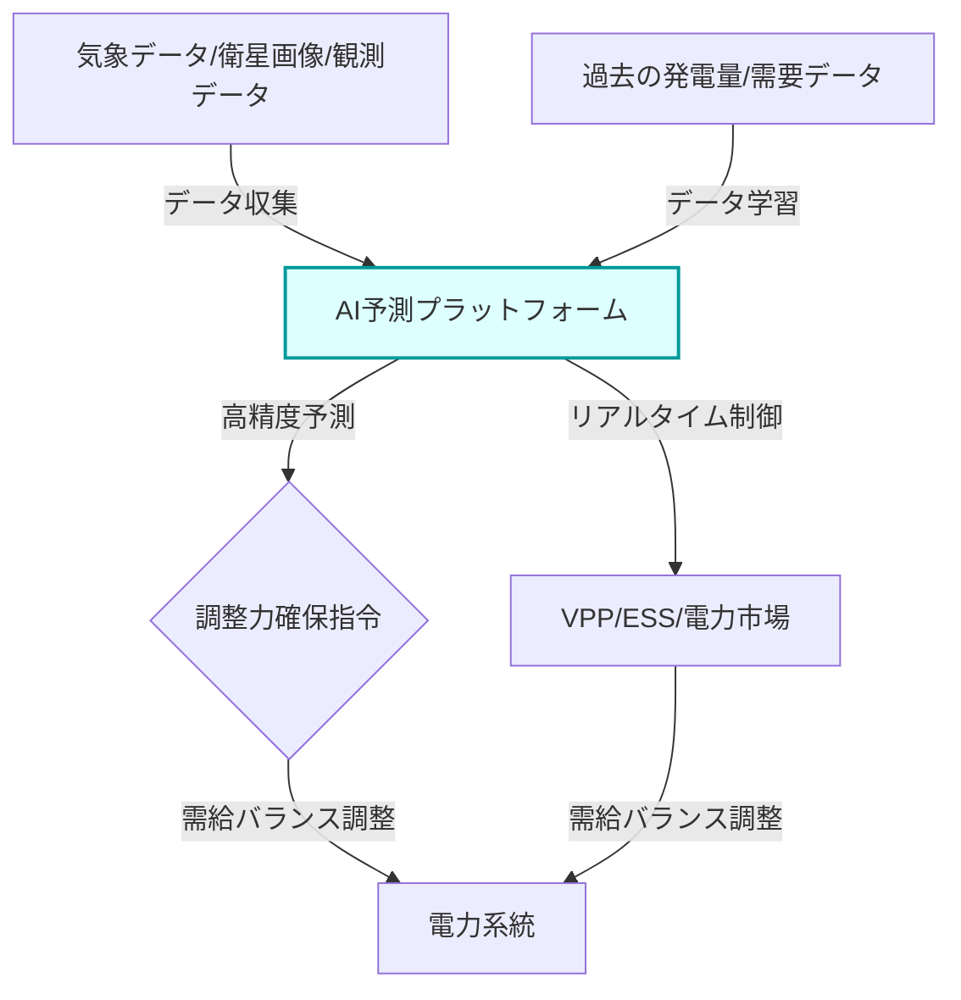

# T18-03-05 再エネ予測・AI需給調整技術

## Summary（5つの要点）

1. **予測精度の飛躍的向上**: 太陽光・風力の出力予測にディープラーニング（RNN、Transformer）を適用し、従来の予測誤差を大幅に低減している。
2. **需給バランスの最適化**: 高精度な予測データに基づき、火力発電などの調整力確保を最適化し、電力系統の安定運用と経済性を両立させる。
3. **出力制御の削減**: 予測精度が向上することで、予備力確保のための過剰な再エネの**出力制御（抑制）**を最小限に抑えることが可能となる。
4. **リアルタイム制御への進化**: 予測技術は、VPPやDRへの制御指令に直結し、数分先の需給変動に対応するリアルタイム制御の基盤となる。
5. **GI基金による後押し**: NEDOのグリーンイノベーション基金事業では、再エネの大量導入に向けた次世代電力ネットワーク安定化技術として、AI予測技術の開発が推進されている。

## 💡 全体要約と特徴

**再エネ予測・AI需給調整技術**は、天候に左右される太陽光発電や風力発電の出力を、過去の発電データ、詳細な気象データ（衛星画像、風速・風向、降水量など）を統合してリアルタイムで分析・学習することで、高精度に予測する技術である。従来の予測モデルでは困難だった、局所的な雲の発生や突風といった急激な変動も正確に捉えることが可能となった。

AIは、この予測情報を用いて、電力需給計画の策定、卸電力市場での取引最適化、およびVPP/ESSへの制御指令を自動的に行うことで、**インバランス料金**の発生リスクを低減し、電力システムの運用効率を向上させる。予測誤差が従来の10%から3%に低減された事例も報告されており、その効果は大きい。

#### 概念図: AIによる再エネ予測と需給調整

## 🛠️ 主要技術要素

| 技術要素 | 概要 | 応用分野 |
| :--- | :--- | :--- |
| **時系列予測AI** (RNN, Transformer) | 過去の時系列データから複雑な変動パターンを学習するディープラーニングモデル | 発電量の短時間予測、長期予測 |
| **統合気象データ解析** | 衛星画像、数値気象モデル、地上センサーを組み合わせたマルチソースデータ解析 | 局所的・突発的な天候変化の迅速な検知 |
| **最適化アルゴリズム** | 経済性、系統制約、インバランスリスクを考慮した運用計画策定アルゴリズム | 発電計画、市場取引、調整力確保の最適化 |

## 📝 技術評価表（定量的な視点）

| 項目 | 評価 | 根拠 |
| :--- | :--- | :--- |
| **導入コスト** | 中 | AIプラットフォーム、計算リソース（GPUなど）、データ収集インフラの費用 |
| **技術成熟度** | 普及途上 | 実用化フェーズに入り導入事例が増加。予測精度がブレークスルー |
| **日本の競争力** | ⭐⭐⭐⭐☆ | 電力中央研究所、ソフトバンク、東電など国内企業の開発・導入が進展中 |
| **市場性** | ⭐⭐⭐⭐⭐ | 再エネ大量導入の必須条件であり、インバランス制度強化で需要が爆発的増加 |
| **品質保証の重要性** | ⭐⭐⭐⭐⭐ | 予測誤差が系統安定性、インバランス料金に直結するため、極めて重要 |

## 日本の立ち位置・強み弱みのSummary

### 強み

* **電力中央研究所の蓄積**: 長年にわたる電力需給予測、気象予測に関する知見と、実運用に貢献する予測技術開発の実績。
* **国内IT企業の参入**: ソフトバンクの「エナジーAIプラットフォーム」など、大手IT企業がAI技術を応用したサービスを提供し、市場を活性化。
* **きめ細やかな気象観測網**: 日本の地理的特性から、詳細な気象データを収集する観測網が整備されている。

### 弱み

* **データ共有の壁**: 予測に必要な発電事業者、送配電事業者、気象予報士間のデータ共有体制に依然として壁があり、統合的な予測モデル構築を阻害している。
* **海外プラットフォーム依存**: 自動運用を担うVPPプラットフォームの一部で、米国のAutoGridのような海外技術への依存が見られる。
* **AI人材の不足**: 電力システムや気象学の知見を持ち、ディープラーニングモデルを開発・運用できるAI専門人材が不足している。

## 技術ロードマップ（短期/中期/長期）の視点

### 短期目標（～2027年）

* **予測精度の向上**: AIを活用し、太陽光・風力発電の予測誤差を3%以下（現在は10%程度）に低減する目標を設定し、実証を完了させる。
* **インバランス料金の抑制**: 予測精度向上により、発電事業者が支払うインバランス料金を半減させる実績を積み上げる。

### 中期目標（2028年～2031年）

* **リアルタイム需給調整への適用**: 30分前市場など、短時間での需給調整にAI予測を適用し、調整力確保の完全自動化を実現する。
* **VPP/ESSとの統合運用**: AI予測結果に基づき、VPPや系統用ESSの充放電スケジュールを自動で最適化し、出力を最大化する。

### 長期目標（2032年～2035年）

* **AIによる完全自律運用**: 電力系統全体がAIによって監視・予測・制御される、人間が介入しない完全自律型の電力ネットワーク運用を実現する。
* **国際連携**: 他国の再エネ予測データと連携し、広域連系線経由での電力融通におけるリスク管理を高度化する。

### 📚 参照リンク

[AI×再生可能エネルギー発電で業務効率化！活用事例や投資の未来を徹底解説](https://ai-front-trend.jp/renewable-energy-generation-ai/)
[2025年最新動向：再生可能エネルギーグリッド最適化のためのAI最前線と太陽光・風力発電の出力予測、需給バランス調整リアルタイム制御データ - note](https://note.com/umibenoheya/n/n3d35301e4c8c)
[【個別報告2】 安定かつ経済的な需給計画・運用に 貢献する再エネ出力予測 - 電力中央研究所](https://criepi.denken.or.jp/intro/hokokukai/2022/pdf/idreport2.pdf)
[電力・エネルギー×AI。AIを活用した国内の最新エネルギービジネス事例① - 新電力ネット](https://pps-net.org/column/108999)
[研究評価委員会 「再生可能エネルギーの大量導入に向けた次世代電力ネットワーク安定化技術 - NEDO](https://www.nedo.go.jp/content/100953180.pdf)
