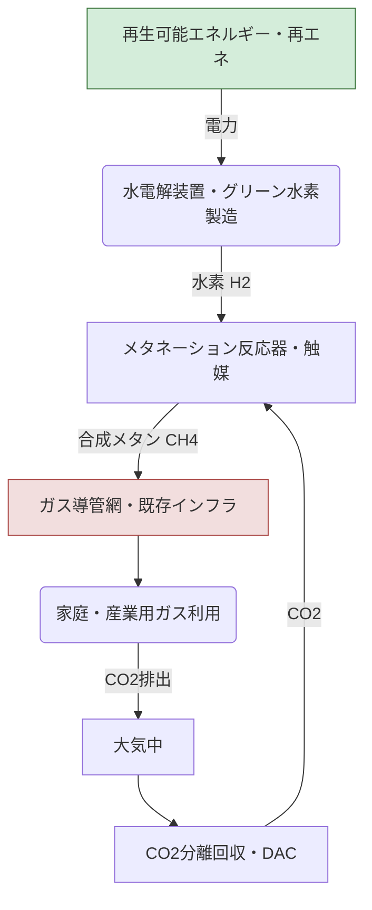

# T18-04-01 メタネーション技術（CO2 + H2 → CH4）

## Summary（5つの要点）

* **合成メタン製造**: 回収したCO2と再生可能エネルギー由来の水素（グリーン水素）を触媒反応（サバティエ反応など）させ、都市ガス主成分である合成メタン（CH4）を製造する技術である。
* **既存インフラ活用**: 製造された合成メタンは、既存の**都市ガス導管**やLNGインフラをそのまま活用できるため、社会インフラの移行コストを最小限に抑えられる点が最大の特長である。
* **カーボンニュートラル**: 燃料として使用しても、燃焼時に排出されるCO2は回収したCO2と相殺されるため、ライフサイクル全体で**カーボンニュートラル**を実現する（Power-to-Gas: P2Gの主要技術）。
* **コストが最大の課題**: 現状、製造コストが天然ガスに比べて非常に高いため、2030年商用化目標達成には、**水素供給コストの削減**と**高効率触媒**の開発による製造コストの大幅な低減が不可欠である。
* **実証段階**: 大阪ガス、INPEX、東京ガスなど、日本の主要ガス事業者が実証プラントを運転中であり、2030年頃の本格商用化を目指して技術開発と制度設計が進められている。

---

#### 概念図: メタネーション（P2G）のプロセスと都市ガスインフラ連携

---

## 技術評価表（定量的な視点）

| 項目 | 評価 | 詳細・理由 | 出典 |
| :--- | :--- | :--- | :--- |
| **導入コスト** | 高 | 水素製造コストとCO2回収コストが高いため、天然ガスに比べ割高。 | |
| **技術成熟度** | 実証段階（TRL 6-7） | パイロットプラントでの実証は完了。触媒の長寿命化や大型化が課題。 | |
| **日本の競争力** | 中～高 | ガス事業者を中心に独自の触媒・プロセス技術開発が進展。 | |
| **市場性** | 高 | 脱炭素化の切り札。既存インフラを活用できるため、国際市場での展開期待大。 | |
| **品質保証の重要性** | 高 | 合成メタンの品質（熱量、不純物）を都市ガス規格に合わせる必要がある。 | |

---

## 日本の立ち位置・強み弱みのSummary

### 強み：
* **既存ガスインフラの活用**: 世界有数の規模を持つ都市ガス導管網をそのまま活用できるため、導入障壁が低い。
* **触媒技術の研究開発**: 大阪ガス、東京ガスなど、ガス事業者が独自の高性能な触媒開発に注力している。
* **高効率なCO2回収技術**: 関連する産業技術として、排ガスからのCO2分離回収技術が進展している。

### 弱み：
* **グリーン水素調達コスト**: 再生可能エネルギーの導入拡大が海外に比べて遅れており、安価なグリーン水素の調達が難しい。
* **エネルギー効率の課題**: 水電解・メタネーションのプロセスを経るため、エネルギー変換ロスが発生する。
* **規制・標準化の遅れ**: 合成メタンのガス導管への注入比率や品質基準に関する法規制の整備が世界的に見て遅れている。

---

## 技術ロードマップ（短期/中期/長期）

### 短期目標（～2027年）
* パイロットプラントでの**触媒耐久性・安定運転**の実証完了。
* 合成メタンのガス導管への**試験的な注入**と安全性評価。
* 製造コストを**天然ガスの2倍以下**に抑制するための技術要素の特定。

### 中期目標（2028年～2031年）
* 製造コストを**2030年商用化目標**のレベルに到達させる（価格目標は未記載のため省略）。
* 数万m3/hクラスの**大規模商用プラント**の建設・運転開始。
* 合成メタンのガス導管への**本格的な注入**（数%程度の混合）開始と制度化。

### 長期目標（2032年～2035年）
* 合成メタンのコストを**天然ガスと同等レベル**に近づける。
* **海外からの合成メタン輸入**体制の構築とサプライチェーンの確立。
* 都市ガス全体に占める合成メタンの割合を**二桁%**まで引き上げ、脱炭素化を加速。

---

### 📚 参照リンク
[Google Search: メタネーション技術 CO2 + H2 → CH4 プロセス図](https://www.google.com/search?q=%E3%83%A1%E3%82%BF%E3%83%8D%E3%83%BC%E3%82%B7%E3%83%A7%E3%83%B3%E6%8A%80%E8%A1%93+CO2+%2B+H2+%E2%86%92+CH4+%E3%83%97%E3%83%AD%E3%82%BB%E3%82%B9%E5%9B%B3)
[内部資料: テクノロジーロードマップ2026-2035 第2部第18章 社会インフラ (T18-04-01)]