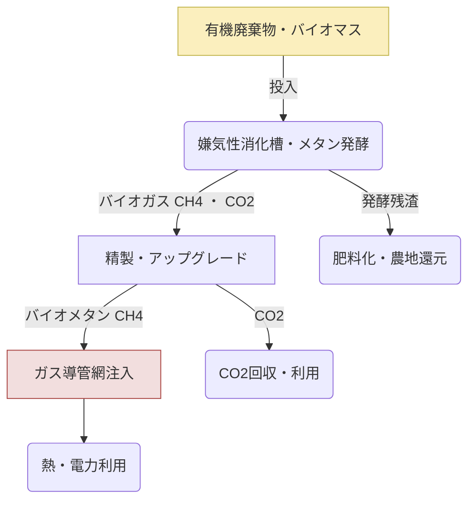

# T18-04-02 バイオメタン製造技術

## Summary（5つの要点）

* **廃棄物からの製造**: 生ごみ、下水汚泥、家畜糞尿などの有機廃棄物を**メタン発酵**（嫌気性消化）させ、バイオガス（CH4主成分）を製造する技術である。
* **精製・ガス導管注入**: 製造されたバイオガスからCO2や不純物を除去・精製し、都市ガスと同品質の**バイオメタン**（Bio-CNG, R-CNGとも）としてガス導管に注入可能にする。
* **資源循環**: 廃棄物処理とエネルギー生産を両立させ、**資源循環型社会**の実現に貢献する。発酵残渣は肥料として利用可能である。
* **欧州が先行**: ドイツやスウェーデンなど欧州では、バイオメタンの製造・利用が普及しており、日本も**2030年に年間3億m3**のバイオガス目標を掲げている（環境省）。
* **分散型エネルギー**: 地域の廃棄物処理施設や農場などで分散型に製造できるため、**地域エネルギーの自立**に役立つ。

---

#### 概念図: バイオメタン製造プロセスと利用

---

## 技術評価表（定量的な視点）

| 項目 | 評価 | 詳細・理由 | 出典 |
| :--- | :--- | :--- | :--- |
| **導入コスト** | 中 | 嫌気性消化槽や精製設備に初期投資が必要だが、廃棄物処理費用の削減効果あり。 | |
| **技術成熟度** | 実用段階（TRL 8-9） | 欧州では成熟。日本では導入拡大に向けた精製効率化が課題。 | |
| **日本の競争力** | 中 | 既存技術はあるが、原料となる家畜糞尿や生ごみの収集・集中化に課題。 | |
| **市場性** | 中～高 | 廃棄物処理の需要が安定しており、環境政策の強化で需要拡大が見込まれる。 | |
| **品質保証の重要性** | 高 | 不純物（H2Sなど）を完全に除去し、ガス導管注入規格を厳守する必要がある。 | |

---

## 日本の立ち位置・強み弱みのSummary

### 強み：
* **下水処理インフラ**: 全国に整備された下水処理場を下水汚泥のバイオメタン製造拠点として活用できる。
* **食品ロス対策**: 世界有数の食品ロス発生国であり、その処理システムと連携させれば大きなポテンシャルがある。
* **地域分散型への適合**: 中小規模のプラントを各地に分散配置しやすい技術特性を持つ。

### 弱み：
* **原料調達の物流課題**: 家畜糞尿や生ごみなど、原料の収集・輸送コストが高い。
* **精製コストと技術**: バイオガス中のCO2を高効率かつ低コストで除去し、都市ガス品質にする技術のコストが高い。
* **制度の不十分さ**: 製造したバイオメタンをガス導管に注入する際のインセンティブや規制が欧州ほど整備されていない。

---

## 技術ロードマップ（短期/中期/長期）

### 短期目標（～2027年）
* 地域分散型での**バイオメタン製造モデル**の確立と、小規模でのガス導管注入実証。
* 原料の**前処理技術**（異物除去、破砕）の効率化とコストダウン。
* 環境省・経産省主導による**バイオガス利用目標達成**に向けた規制緩和。

### 中期目標（2028年～2031年）
* 大規模な下水処理場や集約型農場における**大規模プラント**の商用運転開始。
* 都市ガス導管への**バイオメタンの注入比率**拡大と品質基準の標準化。
* 製造コストを天然ガスとの価格差を**20%以内**に抑制する技術開発。

### 長期目標（2032年～2035年）
* 都市ガスの**燃料構成の10%以上**をバイオメタンで賄うことを目指す。
* 製造・流通のトレーサビリティを確立し、**地域ブランドガス**として差別化。
* 未利用バイオマス資源（海藻など）からの製造技術への展開。

---

### 📚 参照リンク
[Google Search: バイオメタン製造技術 プロセス図](https://www.google.com/search?q=%E3%83%90%E3%82%A4%E3%82%AA%E3%83%A1%E3%82%BF%E3%83%B3%E8%A3%BD%E9%80%A0%E6%8A%80%E8%A1%93+%E3%83%97%E3%83%AD%E3%82%BB%E3%82%B9%E5%9B%B3)
[内部資料: テクノロジーロードマップ2026-2035 第2部第18章 社会インフラ (T18-04-02)]