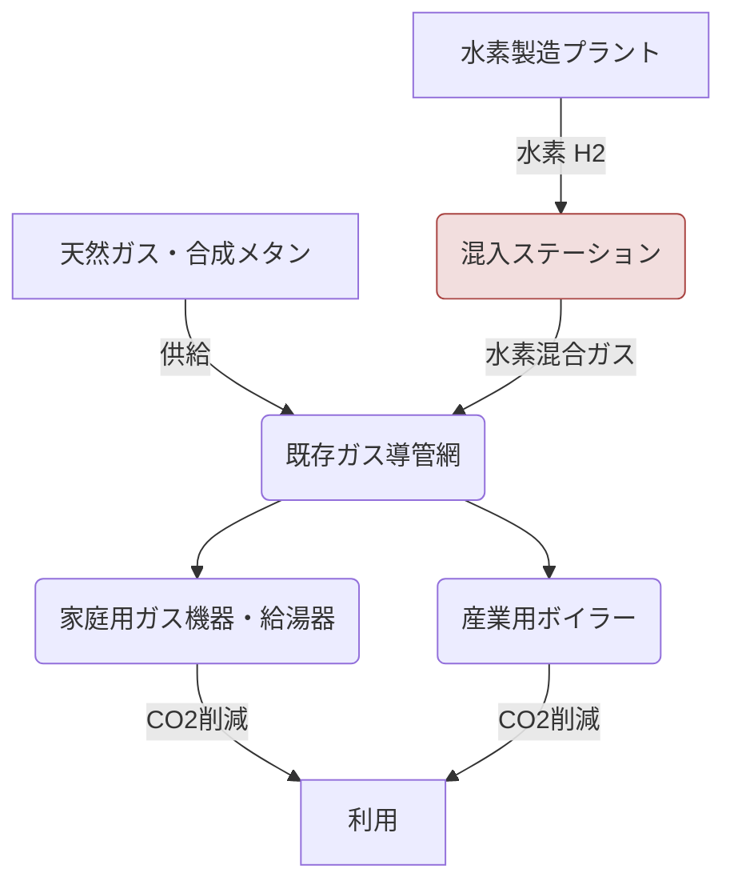

# T18-04-03 水素混焼ガス機器・インフラ整備

## Summary（5つの要点）

* **既存ガスへの混合**: 都市ガスに**水素を少量混合**（5%〜20%程度）して既存のガス導管を通じて供給し、使用時にCO2排出量を削減する手法である。
* **インフラ移行の中間解**: 既存のガスインフラ（導管、供給設備）と末端のガス機器を比較的低コストで利用できるため、**脱炭素化への現実的な第一歩**として位置づけられる。
* **機器の適合性**: 水素の混入率が高くなると、**燃焼速度の変化**による機器の不完全燃焼や、導管の**水素脆化**といった問題が発生するため、機器の改修や導管の材質選定が必須となる。
* **NOx対策**: 水素燃焼は高温になりやすく、**窒素酸化物（NOx）**の発生が増加する可能性があるため、低NOxバーナーの開発や排ガス処理技術の導入が必要となる。
* **実証と標準化**: 東京ガスなどが実証実験を実施しており、まずは**水素混入率2%〜5%**での安全性と機器適合性の確認が進められている。

---

#### 概念図: 水素混焼のサプライチェーン

---

## 技術評価表（定量的な視点）

| 項目 | 評価 | 詳細・理由 | 出典 |
| :--- | :--- | :--- | :--- |
| **導入コスト** | 低 | 既存インフラを活用するため、インフラ全体の改修コストは低い。 | |
| **技術成熟度** | 実証段階（TRL 6-7） | 混入率5%以下は比較的容易。高混入率（20%超）は機器改修が必要。 | |
| **日本の競争力** | 中～高 | ガス機器メーカー（リンナイ、ノーリツ）が混焼対応機器の開発に注力。 | |
| **市場性** | 中 | 段階的な脱炭素化のニーズに対応。将来的には純水素への移行が求められる。 | |
| **品質保証の重要性** | 極高 | 機器の安全性（不完全燃焼、爆発リスク）と導管の耐久性保証が最重要。 | |

---

## 日本の立ち位置・強み弱みのSummary

### 強み：
* **機器メーカーの技術力**: 家庭用・業務用ガス機器の世界的なシェアを持つメーカーが、水素混焼対応バーナー技術の開発をリードしている。
* **段階的移行の容易性**: 既存インフラへの影響が少なく、投資を段階的に進められるため、社会受容性が高い。
* **都市部の集中インフラ**: 都市部に集中したガス導管網があり、一斉に混焼供給を開始しやすい。

### 弱み：
* **水素脆化対策**: 既存の鋼管製ガス導管は水素脆化の懸念があり、混入率の上限が制限される。
* **安全性基準の整備**: 高濃度の水素混合に対する機器の長期安全性や、導管の法的な安全基準策定が遅れている。
* **最終的なCO2削減効果**: 混焼では部分的な削減に留まり、純粋なゼロエミッション化には至らない。

---

## 技術ロードマップ（短期/中期/長期）

### 短期目標（～2027年）
* **水素混入率2%〜5%**での**安全性評価**と導管・機器への影響調査完了。
* **家庭用・業務用ガス機器**の混焼対応モデルの市場投入。
* 特定地域・特定セクターでの**混焼実証試験**の開始。

### 中期目標（2028年～2031年）
* **水素混入率20%まで**を許容するためのインフラ改修と機器の標準化。
* 水素混焼用**低NOxバーナー**の普及と規制導入。
* 大都市圏での**混焼供給エリア**の段階的拡大。

### 長期目標（2032年～2035年）
* 水素専用導管網の整備を開始し、**純水素供給**への移行準備。
* 既存ガス導管の一部を水素専用に切り替え、**高濃度水素供給エリア**を構築。
* 混焼技術を**海外の既存ガスインフラ**への輸出パッケージとして確立。

---

### 📚 参照リンク
[Google Search: 水素混焼ガス機器・インフラ整備 プロセス図](https://www.google.com/search?q=%E6%B0%B4%E7%B4%A0%E6%B7%B7%E7%84%BC%E3%82%AC%E3%82%B9%E6%A9%9F%E5%99%A8%E3%83%BB%E3%82%A4%E3%83%B3%E3%83%95%E3%83%A9%E6%95%B4%E5%82%99+%E3%83%97%E3%83%AD%E3%82%BB%E3%82%B9%E5%9B%B3)
[内部資料: テクノロジーロードマップ2026-2035 第2部第18章 社会インフラ (T18-04-03)]