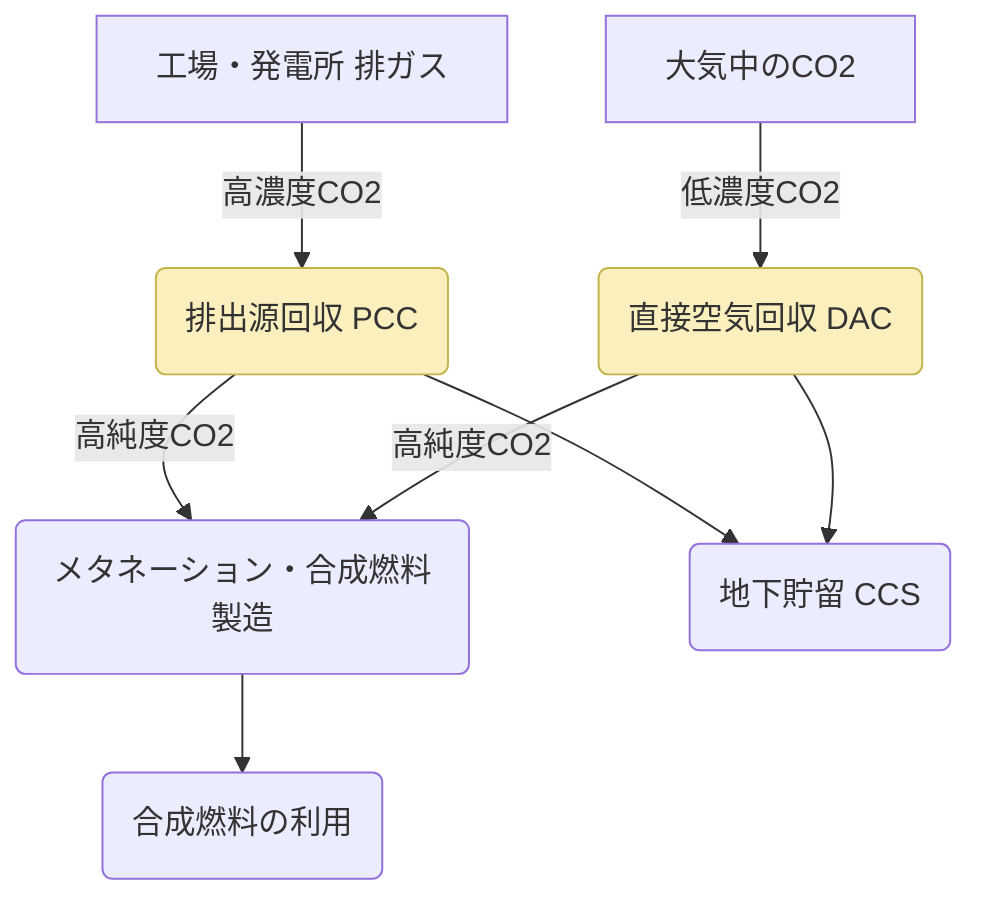

# T18-04-04 CO2分離回収技術（DAC・排ガスCO2回収）

## Summary（5つの要点）

* **排出源回収（PCC）**: 発電所や工場などの**大規模排出源**から排出される高濃度の排ガス中のCO2を、化学吸収法、物理吸収法、膜分離法などで分離回収する技術。
* **DAC（直接空気回収）**: 大気中に存在する低濃度のCO2を直接捕獲する技術（Direct Air Capture）。メタネーションや合成燃料の**原料供給**の自由度を高める。
* **CCUSの基盤**: 回収したCO2を地下に貯留する**CCS**（Carbon Capture and Storage）や、燃料・化学品に再利用する**CCU**（Carbon Capture and Utilization）を実現するための**基盤技術**である。
* **エネルギーコスト**: CO2の吸収・分離には**大きなエネルギー**（主に熱）を必要とするため、回収プロセスのエネルギー効率向上とコスト削減が最大の課題である。
* **グローバル展開**: Climeworks（スイス、DAC）やCarbon Engineering（カナダ、DAC）が商用プラントを稼働させており、日本もIHI、三菱重工などが回収技術で世界をリードしている。

---

#### 概念図: CO2回収技術（PCCとDAC）の役割

---

## 技術評価表（定量的な視点）

| 項目 | 評価 | 詳細・理由 | 出典 |
| :--- | :--- | :--- | :--- |
| **導入コスト** | 極高 | プラント建設費、吸収剤コスト、運転時の熱エネルギーコストが高い。 | |
| **技術成熟度** | 実用段階（PCCはTRL 8-9、DACはTRL 6-7） | PCCは既存技術。DACはまだコストが高く大規模化の途上。 | |
| **日本の競争力** | 高 | 化学吸収液や分離膜など、材料・プロセス技術で国際的に優位性を持つ。 | |
| **市場性** | 極高 | 2050年カーボンニュートラル達成に不可欠な技術であり、需要は爆発的に伸びる。 | |
| **品質保証の重要性** | 高 | 回収されたCO2の純度管理（CCU原料として）、貯留時の長期安定性。 | |

---

## 日本の立ち位置・強み弱みのSummary

### 強み：
* **化学吸収液技術**: 三菱重工などが開発した高効率なCO2吸収液は、回収コスト低減に大きく貢献している。
* **分離膜技術**: 東レ、AGCなどのメーカーが、高分離性能・高耐久性のCO2分離膜を開発している。
* **CCUとの連携**: メタネーションや合成燃料製造といったCO2利用（CCU）技術とセットで開発が進んでいる。

### 弱み：
* **DAC技術の遅れ**: DAC技術については、海外のスタートアップが先行しており、日本は技術導入とコスト競争力の確保が課題。
* **エネルギー制約**: 回収プロセスのエネルギー消費が大きく、日本国内で安価な再生可能エネルギー熱源を確保しにくい。
* **CCSの法制度**: 大規模なCO2貯留（CCS）を実施するための海底下の鉱業権、法整備が国際的に遅れている。

---

## 技術ロードマップ（短期/中期/長期）

### 短期目標（～2027年）
* **回収コストの削減**: PCC（排出源回収）の回収コストを**30%以上削減**するための吸収液・膜材の改良。
* **DAC実証プラント**の設計・建設と、運転データの取得を開始。
* CCUSハブとなる**複数の国内拠点の選定**と事業性評価。

### 中期目標（2028年～2031年）
* **大規模CCUSバリューチェーン**の構築と商用運転開始（年間百万トン規模）。
* DAC技術のコストを大幅に下げ、**メタネーション原料**としての競争力を確保。
* **CO2輸送・貯留**に関する法整備とガイドラインの国際標準化に貢献。

### 長期目標（2032年～2035年）
* DACを大規模化し、**ネガティブエミッション**（大気中CO2の純減）を実現できる体制を構築。
* 回収されたCO2の**トレーサビリティシステム**を国際規格として確立。
* **ゼロエミッション化が困難な産業**（セメント、鉄鋼）への回収技術の全面導入。

---

### 📚 参照リンク
[Google Search: CO2分離回収技術 DAC・排ガスCO2回収 プロセス図](https://www.google.com/search?q=CO2%E5%88%86%E9%9B%A2%E5%9B%9E%E5%8F%8E%E6%8A%80%E8%A1%93+DAC%E3%83%BB%E6%8E%92%E3%82%AC%E3%82%B9CO2%E5%9B%9E%E5%8F%8E+%E3%83%97%E3%83%AD%E3%82%BB%E3%82%B9%E5%9B%B3)
[内部資料: テクノロジーロードマップ2026-2035 第2部第18章 社会インフラ (T18-04-04)]