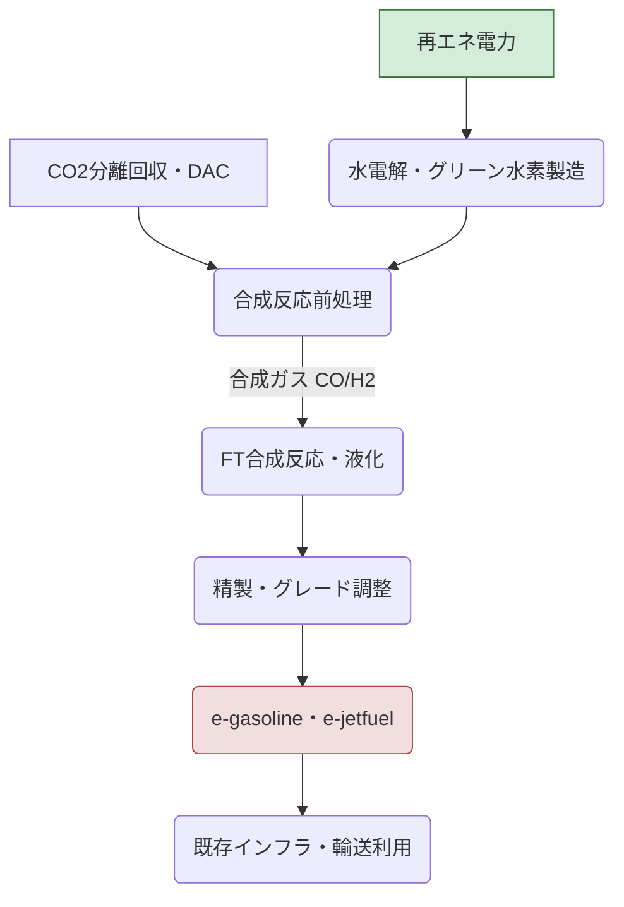

# T18-04-05 合成燃料（e-fuel）製造技術

## Summary（5つの要点）

* **CO2とH2からの合成**: CO2と再生可能エネルギー由来の水素（グリーン水素）を原料とし、**Fischer-Tropsch（FT）合成**やメタノール経由合成などによって、液体燃料（ガソリン、ディーゼル、ジェット燃料）を製造する技術（Power-to-Liquid: PtL）。
* **Drop-in Fuel**: 既存の自動車、航空機、船舶のエンジンを**そのまま使用可能**（Drop-in fuel）であり、輸送インフラ（給油所、タンクローリー）も活用できるため、EV化が難しい分野の脱炭素化の切り札となる。
* **製造コストの課題**: 製造コストは現在の化石燃料の**5〜10倍**と非常に高く、2030年代の普及に向けたコスト低減が最重要課題である。
* **航空・海運での期待**: 航続距離や重量の問題からバッテリーEV化が困難な**航空燃料（e-kerosene）**や**海運燃料**の脱炭素化に大きく貢献すると期待されている。
* **技術実証**: ポルシェ（自動車）、三菱重工などがFT合成技術を用いた実証を推進しており、特に欧州では自動車産業の要請も強く、大規模プラントの建設が始まっている。

---

#### 概念図: e-fuel（PtL）製造プロセス

---

## 技術評価表（定量的な視点）

| 項目 | 評価 | 詳細・理由 | 出典 |
| :--- | :--- | :--- | :--- |
| **導入コスト** | 極高 | 水素・CO2調達、プラント建設、エネルギー効率の低さからコストは非常に高い。 | |
| **技術成熟度** | 実証段階（TRL 6-7） | FT合成自体は既存技術だが、CO2・H2からの合成、大規模化の課題が多い。 | |
| **日本の競争力** | 中 | FT合成技術で先行する企業はあるが、原料（安価な再エネ水素）調達に課題。 | |
| **市場性** | 極高 | 航空・海運など脱炭素が困難な分野での需要が確実。市場規模は巨大。 | |
| **品質保証の重要性** | 極高 | 既存燃料と同等の燃焼性、安全性、貯蔵安定性を確保する必要がある。 | |

---

## 日本の立ち位置・強み弱みのSummary

### 強み：
* **化学プラント技術**: FT合成などのプロセスを構築・運用する化学工学、プラント建設技術に強みがある。
* **航空・海運産業**: 国内に強力な航空・海運産業があり、e-fuelへのニーズが明確である。
* **触媒開発**: メタネーションと同様に、FT合成に適した高効率な触媒開発が進んでいる。

### 弱み：
* **コスト競争力**: 安価な再生可能エネルギーが豊富な海外地域（チリ、豪州など）に比べて、e-fuel製造のコスト競争力で劣る。
* **エネルギー効率**: 水素・CO2製造、合成プロセスを経るため、エネルギー変換効率が非常に低い。
* **認証・規格の整備**: 航空燃料としての国際的な認証（ASTM）取得や国内規格の整備に時間が必要。

---

## 技術ロードマップ（短期/中期/長期）

### 短期目標（～2027年）
* **製造コストの削減**: 原料調達コストを除き、製造プロセス単体でのコストを**30%以上削減**する技術要素の特定。
* **FT合成触媒**の高性能化と耐久性の向上。
* 航空燃料としての**少量試験製造**と品質評価。

### 中期目標（2028年～2031年）
* **大規模実証プラント**を海外の安価な再エネ立地に建設し、長期安定運転を実現。
* **e-jetfuel**の国際認証（ASTM）取得と、商用便での混焼利用開始。
* 製造コストを化石燃料の**2〜3倍程度**に抑制するための技術パッケージ確立。

### 長期目標（2032年～2035年）
* **e-fuelの製造・輸入サプライチェーン**を確立し、国内への安定供給を開始。
* 航空・海運燃料の**20%以上**をe-fuelで賄うための体制構築。
* **合成効率**を現在の2倍以上に高める革新的なプロセスの導入。

---

### 📚 参照リンク
[Google Search: 合成燃料（e-fuel）製造技術 プロセス図](https://www.google.com/search?q=%E5%90%88%E6%88%90%E7%87%83%E6%96%99%EF%BC%88e-fuel%EF%BC%89%E8%A3%BD%E9%80%A0%E6%8A%80%E8%A1%93+%E3%83%97%E3%83%AD%E3%82%BB%E3%82%B9%E5%9B%B3)
[内部資料: テクノロジーロードマップ2026-2035 第2部第18章 社会インフラ (T18-04-05)]