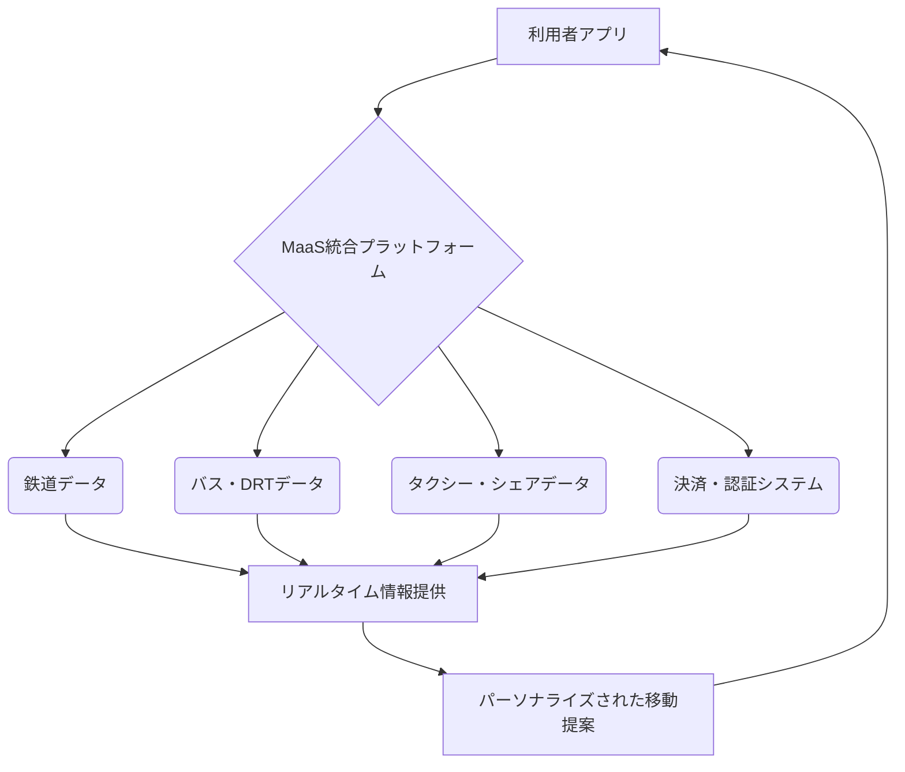

# T18-05-01 MaaS統合プラットフォーム

## Summary（5つの要点）

* **多様な交通手段の統合**: 鉄道、バス、タクシー、シェアサービスなどの**複数交通手段**を単一アプリで検索・予約・決済するサービスであり、移動の利便性を飛躍的に向上させる。
* **都市・地方の移動課題解決**: 地方の公共交通維持や高齢者の移動支援、観光振興など、地域特有の交通課題を解決する手段として期待されている。
* **データ連携が鍵**: 交通事業者の運行データ、人流データ、イベント情報など、多様なデータをリアルタイムで連携・統合するプラットフォーム技術が不可欠。
* **グローバル事例**: フィンランドの**Whim**が世界的な成功例であり、日本ではトヨタの**my route**、JR東日本の**Ringo Pass**が実証・展開を進めている。
* **将来の発展**: 自動運転、ドローン配送、地域デマンド交通（DRT）との連携により、よりパーソナライズされ効率的な移動サービスへと進化する。

#### 概念図: MaaS統合プラットフォームの基本構造

## 技術評価表（定量的な視点）

| 項目 | 評価（定量的・定性） | 詳細・補足 | 
| :--- | :--- | :--- |
| **導入コスト** | 高（データ連携・システム統合） | 多数の交通事業者のシステム統合、API整備費用が高い。 |
| **技術成熟度** | 実用化初期段階 | フィンランドなどで先行。日本は特定地域での実証・展開が中心。 |
| **日本の競争力** | 中～高（交通インフラ自体は高水準） | サービス企画力、データ連携の規制・壁の克服が課題。トヨタなど大企業が推進。 |
| **市場性** | 非常に高（全世界的な移動課題） | スマートシティ、観光、地方交通維持に必須。政府・自治体の投資が積極的。 |
| **品質保証の重要性** | 非常に高（予約・決済の正確性） | 経路探索ミス、二重決済、セキュリティリスクなどが重大な利用者クレームに繋がる。

---

## 日本の立ち位置・強み弱みのSummary

### 強み

* **高密度な交通網**: 鉄道、バス、タクシーが高密度に整備されており、MaaSの「素材」が豊富にある。
* **有力なプラットフォーマー**: トヨタ、JRグループなど、交通データと資本力を持つ大企業がMaaS事業を牽引している。
* **高い技術力**: 決済システムやアプリ開発技術は高水準であり、実現に必要な要素技術は揃っている。

### 弱み

* **データ連携の壁**: 交通事業者ごとのデータフォーマット、システム、提供ポリシーが異なり、統一的なデータ連携が遅れている。
* **法規制・既得権益**: 運賃制度や規制が複雑であり、フレキシブルなモビリティサービス（例：ダイナミックプライシング）の導入を阻害している。
* **地域展開の難しさ**: 各地域でニーズが異なるため、全国一律のサービス展開が難しく、ローカライズにコストがかかる。

---

## 技術ロードマップ（短期/中期/長期）

### 短期目標（～2027年）

* 主要都市圏・観光地での**MaaSアプリの普及率向上**（利用者数倍増）。
* **キャッシュレス決済**の完全統合と、複数の交通手段を組み合わせた**サブスクリプション型チケット**の導入（例：Whim型）。
* デマンド交通（DRT）との連携強化による、**地方都市におけるラストワンマイルのカバー**。

### 中期目標（2028年～2031年）

* 全国主要都市間での**シームレスなMaaS連携**の実現（地域間のアプリ・データの相互運用性）。
* AIによる**リアルタイム・ダイナミックプライシング**（混雑状況に応じた運賃変動）の実証導入。
* 自動運転バス・タクシーとMaaSプラットフォームの統合制御。

### 長期目標（2032年～2035年）

* MaaSプラットフォームを核とした**スマートシティOS**との統合。
* 移動データと医療・商業・防災データを連携させた**トータルライフサポートサービス**への進化。
* **空飛ぶクルマ**などの次世代モビリティとのシームレスな連携。

### 📚 参照リンク

[国土交通省：MaaSについて](https://www.mlit.go.jp/sogoseisaku/transport/maas/index.html)
