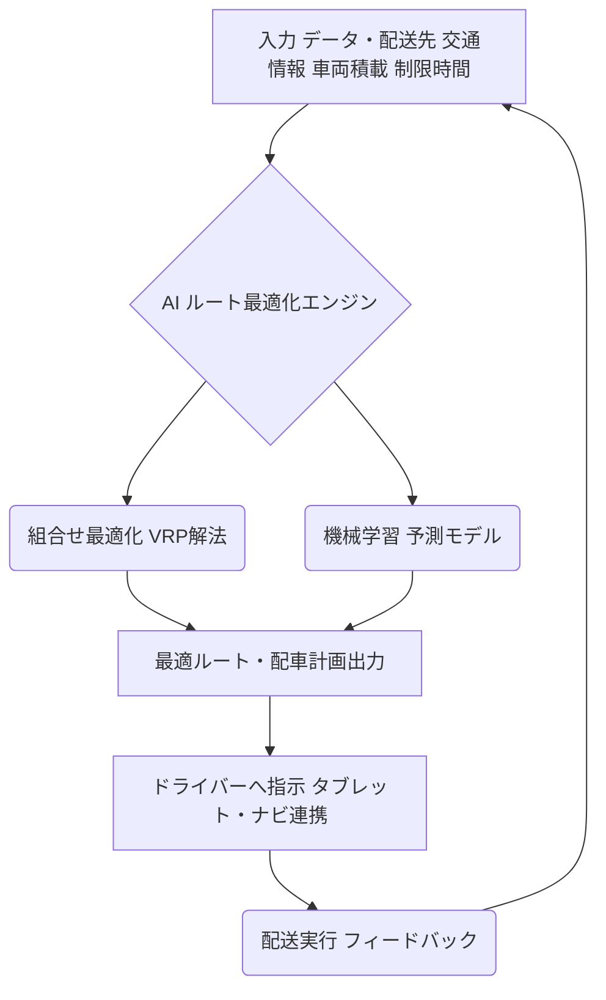

# T18-05-02 物流DX・配送ルート最適化AI

## Summary（5つの要点）

* **AIによる自動生成**: 配送先、交通状況、車両積載状況などの複雑な制約条件をAIでリアルタイム解析し、最適な配送ルートと配車計画を自動生成する。
* **組合せ最適化問題（VRP）**: 配送ルート最適化は**Vehicle Routing Problem**というNP困難な組合せ最適化問題であり、これを高速に解くアルゴリズム（ヒューリスティック、機械学習）が技術の核となる。
* **導入効果**: 再配達削減、ドライバーの労働時間短縮（負担軽減）、燃料費削減（走行距離短縮）によるカーボンニュートラル化に貢献する。
* **日本の先進事例**: ヤマト運輸、佐川急便などの主要物流企業がAI配車システムを導入し、業務効率化を実現している。
* **将来展望**: 自動運転トラックやドローン配送システムへ最適ルートを直接連携する機能が次の技術ステップとなる。

#### 概念図: AIによる配送ルート最適化プロセス

## 技術評価表（定量的な視点）

| 項目 | 評価（定量的・定性） | 詳細・補足 | 
| :--- | :--- | :--- |
| **導入コスト** | 中～高（AI開発・システム連携） | 専用のAIモデル開発と既存の基幹システムとのAPI連携が必要。 |
| **技術成熟度** | 実用化段階 | 大手物流企業では既に導入・効果が出ている。中小への普及が課題。 |
| **日本の競争力** | 高（物流インフラ・データ豊富） | 物流の密度が高く、最適化のニーズが強い。ヤマト、佐川など独自システムを開発。 |
| **市場性** | 非常に高（物流の2024年問題対応） | ドライバー不足、燃料高騰、CO2削減の要求から、必須の技術となっている。 |
| **品質保証の重要性** | 高（配送遅延・誤配リスク回避） | ルートミスは配送遅延に直結し、顧客満足度とコストに影響する。

---

## 日本の立ち位置・強み弱みのSummary

### 強み

* **緻密な配送網**: 宅配便の配送密度・件数が世界的に見ても高く、AI最適化のユースケースが豊富。
* **データ資産**: 長年の物流サービスで蓄積された大量の配送実績データがAI学習に活用可能。
* **政府の推進**: 「物流の2024年問題」を背景に、国土交通省などがDX導入を強く推進・支援している。

### 弱み

* **中小物流のIT化遅れ**: 中小の運送事業者は高コストやノウハウ不足からAI導入が進んでいない。
* **リアルタイムデータの精度**: 工事、交通規制、天候などのリアルタイム情報の収集・統合精度が完全ではない。
* **最適化と現場の乖離**: AIが出したルートが、ドライバーの長年の経験則と異なり、現場で受け入れられないケースがある。

---

## 技術ロードマップ（短期/中期/長期）

### 短期目標（～2027年）

* **ラストワンマイル領域**におけるAIルート最適化の導入率を50%超に引き上げ。
* **自動運転・ドローン配送**を見据えた、高精度地図データとの連携機能を標準化。
* ルート最適化による**CO2排出量削減効果**の定量評価・可視化を義務化。

### 中期目標（2028年～2031年）

* **複数事業者間**での共同配送・共同ルート最適化（**シェアリングエコノミー**）を実現。
* AIが個々のドライバーの**スキル・疲労度**を考慮した配車計画の自動作成。
* トラック隊列走行（T18-05-04）のルート計画への統合。

### 長期目標（2032年～2035年）

* **AIが主導**する完全無人・自動配送ネットワークの実現（最終配送地点までの自動最適化）。
* MaaS（T18-05-01）との連携による、**ヒト・モノ一体**の効率的移動サービス提供。
* 国際物流におけるコンテナ船・航空貨物との輸送ルートの完全最適化。

### 📚 参照リンク

[日本通運：AIによるルート最適化](https://www.nittsu.co.jp/solution/logistics/ai-route-optimization/)
