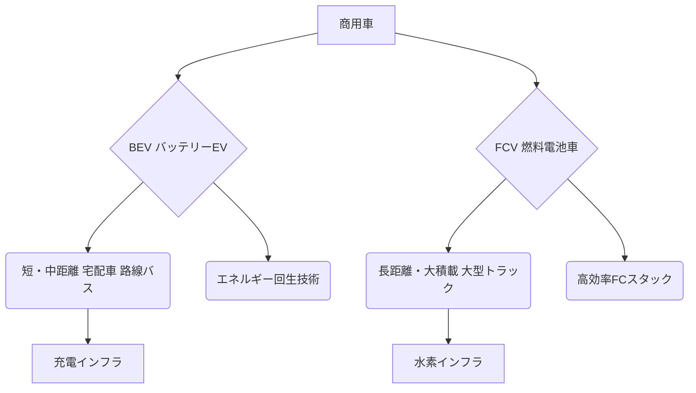

# T18-05-03 商用EV・燃料電池トラック

## Summary（5つの要点）

* **ゼロエミッション化**: 宅配車、路線バス、長距離トラックを対象に、走行時のCO2排出ゼロを目指す技術。
* **技術選択**: 宅配車や路線バスなどの**短・中距離輸送**には**バッテリーEV（BEV）**が、長距離・大積載が求められる**大型トラック**には**燃料電池車（FCV）**がそれぞれ有力視されている。
* **国内動向**: いすゞ、日野、三菱ふそうなどの商用車メーカーがEVトラックの量産を開始し、トヨタと日野は燃料電池大型トラックの実証を推進中。
* **最大の課題**: EVは**充電インフラ**と**航続距離**、FCVは**水素ステーションインフラ**と**水素製造・供給コスト**が普及の障壁となっている。
* **社会インフラとの連携**: 電力系統（T18-03）および水素・アンモニア産業（T18-02）におけるインフラ整備が、本技術の成否を左右する。

#### 概念図: 商用車ゼロエミッションの技術領域

## 技術評価表（定量的な視点）

| 項目 | 評価（定量的・定性） | 詳細・補足 | 
| :--- | :--- | :--- |
| **導入コスト** | 非常に高（車両・インフラ） | EV/FCV車両価格、大容量充電器・水素ステーション建設コストが高い。 |
| **技術成熟度** | 実用化初期段階 | 小型EVは普及開始。大型トラックのFCVは実証・量産立ち上げフェーズ。 |
| **日本の競争力** | 中～高（自動車メーカーの技術力） | 燃料電池技術は世界トップレベル。バッテリーEVは中国勢などの先行が課題。 |
| **市場性** | 非常に高（カーボンニュートラル目標） | 2050年カーボンニュートラル目標達成に必須。物流企業の導入インセンティブが高い。 |
| **品質保証の重要性** | 非常に高（安全性・稼働率） | バッテリーの熱管理、高圧水素タンクの安全性、長距離運行における信頼性が極めて重要。

---

## 日本の立ち位置・強み弱みのSummary

### 強み

* **燃料電池技術**: トヨタを中心にFCスタック、高圧水素貯蔵技術が世界的に優位性を持つ。
* **商用車メーカーの連携**: いすゞ、日野など商用車メーカーが共同開発を進める枠組みがあり、インフラとの連携がしやすい。
* **政府支援**: NEDOなどの公的機関による実証・開発支援が活発に行われている。

### 弱み

* **インフラ整備の遅れ**: 特に地方における充電・水素ステーションの密度が欧米・中国に比べて低い。
* **バッテリーの海外依存**: 車載用リチウムイオンバッテリーの主要材料や生産能力が海外に依存する傾向。
* **価格競争力**: 車両コストが高く、既存ディーゼルトラックとの価格差が導入の大きな障壁となっている。

---

## 技術ロードマップ（短期/中期/長期）

### 短期目標（～2027年）

* ラストワンマイル用小型EVトラックの**量産コスト低減**と普及率拡大（全国都市部）。
* 主要な物流拠点を中心とした**メガワット級急速充電インフラ**、および**水素ステーション**の重点的整備。
* 商用車向けバッテリー**リユース・リサイクルシステム**の構築。

### 中期目標（2028年～2031年）

* 大型FCVトラックの**本格量産開始**と主要幹線道路・港湾エリアでの運行。
* BEVの**バッテリーエネルギー密度**を2倍に向上させ、航続距離の課題を解消。
* 燃料電池の**耐久性**をディーゼルエンジンと同等レベル（100万km走行）に向上。

### 長期目標（2032年～2035年）

* 国内の新規販売商用車の**ゼロエミッション車比率**を80%以上に引き上げ。
* **水素・電力の供給網**を完全に整備し、エネルギーコストを化石燃料と同等以下に低減。
* FCVとEVを組み合わせた**最適フリート管理システム**の普及。

### 📚 参照リンク

[NEDO：燃料電池関連のプロジェクト](https://www.nedo.go.jp/activities/ZZJP_100194.html)
