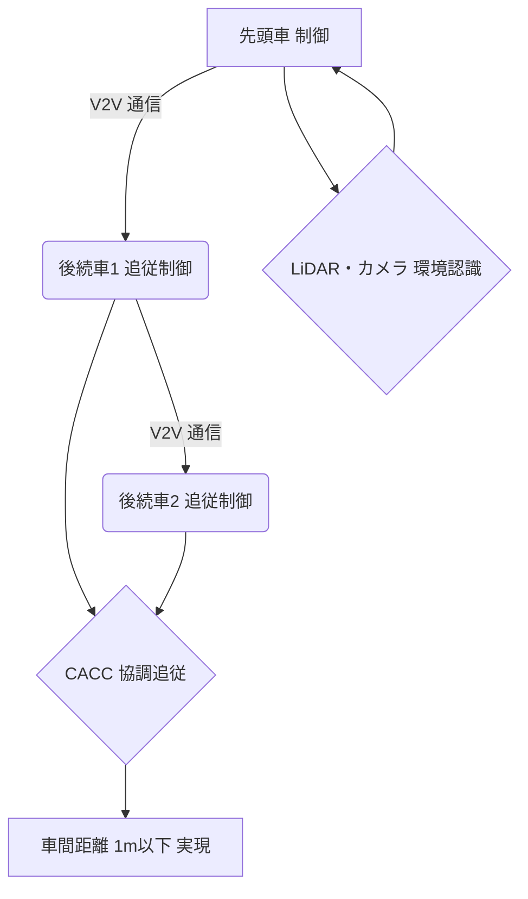

# T18-05-04 幹線道路トラック隊列走行

## Summary（5つの要点）

* **技術の定義**: 複数の大型トラックが無線通信（V2V）で連携し、車間距離を詰めて**自動追従走行**する技術。
* **主要な効果**: 後続車の空気抵抗が大幅に削減されることによる**燃費向上（CO2削減）**と、後続車の**運転負荷軽減（ドライバー不足対策）**が挙げられる。
* **コア技術**: **V2V（車車間通信）**によるリアルタイムの情報共有と、**CACC（協調型アダプティブ・クルーズ・コントロール）**による高精度な自動追従制御が中核をなす。
* **日本の目標**: 新東名高速道路などで実証実験が進められ、**2025年の商用化**を目標としている。
* **技術レベル**: 将来的には、先頭車両のみが有人で、後続車が無人となる**自動運転レベル4**での運用を目指す。

#### 概念図: トラック隊列走行の連携システム

## 技術評価表（定量的な視点）

| 項目 | 評価（定量的・定性） | 詳細・補足 | 
| :--- | :--- | :--- |
| **導入コスト** | 高（通信・センサー・制御システム） | V2V通信機器、高精度LiDAR・カメラ、CACC制御システムの車両搭載コスト。 |
| **技術成熟度** | 実証段階～初期商用化 | 有人での隊列走行は実証完了。無人走行は法制度・技術検証が進行中。 |
| **日本の競争力** | 高（自動車メーカー・政府連携） | トヨタ、日野、いすゞ、NEXCO、政府が一体となった開発体制が強み。 |
| **市場性** | 非常に高（物流の2024年問題、CO2削減） | ドライバー人件費・燃料費削減効果が大きく、物流企業にとって必須の投資対象。 |
| **品質保証の重要性** | 非常に高（事故時の被害拡大） | V2V通信途絶、センサー誤認識は大規模な多重衝突事故に直結するため、信頼性が最重要。

---

## 日本の立ち位置・強み弱みのSummary

### 強み

* **官民連携の推進体制**: 国土交通省が主導し、自動車メーカー、高速道路会社、物流事業者が連携して実証を行っている。
* **世界トップレベルの自動制御技術**: 協調型アダプティブ・クルーズ・コントロール（CACC）の制御精度が高い。
* **5G/通信インフラ**: 高速・大容量・低遅延な5G通信網の整備が進み、V2V通信の基盤が整いつつある。

### 弱み

* **法制度の整備遅れ**: 後続車の**無人走行**を可能にするための道路交通法や車両法などの法整備が国際的に見て遅れている。
* **天候への耐性**: 豪雨や濃霧、積雪などの悪天候下でのセンサー・通信の信頼性確保が依然として課題。
* **異種車両の混在**: 一般車両との混在区間での安全確保や、隊列の離脱・合流時のスムーズな制御が難しい。

---

## 技術ロードマップ（短期/中期/長期）

### 短期目標（～2027年）

* **有人の隊列走行**の特定幹線道路（例：新東名）での**本格的な商用サービス開始**。
* **後続車のドライバー補助システム（レベル3相当）**の標準搭載化。
* 隊列走行専用レーン、または休憩施設からの**優先的な合流システム**の整備。

### 中期目標（2028年～2031年）

* **後続車の無人化（自動運転レベル4）**を可能にする法制度の整備と、限定的な区域での実証運用開始。
* **5G通信**をフル活用した**車間距離1m以下**の超高密度隊列走行を実現。
* 隊列走行のサービスを主要幹線道路の**90%以上**に拡大。

### 長期目標（2032年～2035年）

* **トラックの隊列走行**を物流インフラの**標準機能**として確立。
* AIによる**自動編隊・自動離脱**をリアルタイムで行う完全自動化。
* 隊列走行と**物流DX（T18-05-02）**のAIルート最適化との完全統合。

### 📚 参照リンク

[国土交通省：高度な自動運転社会の実現に向けた取組](https://www.mlit.go.jp/jidosha/jidosha_tk8_000021.html)
