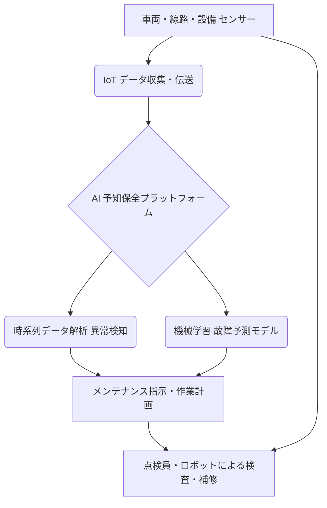

# T18-05-05 鉄道IoT・予知保全システム

## Summary（5つの要点）

* **予知保全への転換**: 車両、線路、信号設備などにセンサーを設置し、異常を事前検知することで、従来の**事後保全**や**時間ベース保全**から**状態ベース保全（CBM）**へ移行する。
* **データとAIの活用**: 振動、温度、音響などのセンサーデータをAIで解析し、台車異常、レール摩耗、架線劣化などの故障を**予知・判定**する。
* **導入効果**: 突発的な故障による**運行停止リスクの最小化**、メンテナンス周期の最適化による**コスト削減**、および**安全性向上**を両立する。
* **日本の先進事例**: JR東日本が**「新幹線車両状態監視システム」**を導入するなど、大手鉄道会社での実用化が進んでいる。
* **検査の自動化**: ドローンや自律走行ロボットによる線路・トンネルの**自動点検**と組み合わせ、人手不足に対応した検査体制を構築する。

#### 概念図: 鉄道予知保全システムのデータフロー

## 技術評価表（定量的な視点）

| 項目 | 評価（定量的・定性） | 詳細・補足 | 
| :--- | :--- | :--- |
| **導入コスト** | 高（センサー、通信、AIプラットフォーム） | 全ての車両・インフラへのセンサー設置と高精度なAIプラットフォーム構築費用が高い。 |
| **技術成熟度** | 実用化初期段階 | 新幹線など一部で導入。在来線や地方路線への展開が課題。 |
| **日本の競争力** | 非常に高（鉄道運行・技術） | 世界トップレベルの運行精度と車両技術。JR各社が独自のAI/IoTシステムを開発。 |
| **市場性** | 非常に高（インフラの老朽化対策） | 鉄道インフラの老朽化、熟練技術者不足から、予知保全へのニーズが極めて高い。 |
| **品質保証の重要性** | 非常に高（人命・社会的影響） | 故障は運行停止、脱線など人命に関わる重大事故に直結するため、AI予測の信頼性保証が最重要。

---

## 日本の立ち位置・強み弱みのSummary

### 強み

* **運行の正確性・安全性**: 蓄積されたノウハウとデータを活用した予知保全システム開発において世界をリードしている。
* **センサー・通信技術**: 高品質なセンサー、堅牢な通信技術（列車無線、5G）を鉄道環境に導入する技術力が高い。
* **AI開発体制**: JRの総合技術開発センターなど、鉄道に特化したAI・データサイエンス研究開発が進んでいる。

### 弱み

* **既存設備のデジタル化遅れ**: 信号・電気設備など、古い設備が多く、IoTセンサーの後付け・連携にコストと時間がかかる。
* **データのサイロ化**: 鉄道会社間で、また社内の部門間（車両、線路、電気）でデータが分断されており、統合的なAI解析が難しい。
* **ドローン・ロボットの規制**: 検査用ドローンやロボットの運用に関する安全規制が厳しく、自動点検の本格導入が遅れる可能性がある。

--舟

## 技術ロードマップ（短期/中期/長期）

### 短期目標（～2027年）

* 主要な**基幹インフラ（新幹線、首都圏主要路線）**でのIoTセンサー設置率を80%超に引き上げ。
* AIによる**予兆検知モデルの精度**を90%以上に向上させ、誤検知率を低減。
* ドローン・ロボットによる**トンネル・橋梁の検査**の自動化を試験的に開始。

### 中期目標（2028年～2031年）

* 予知保全システムを**地方の在来線**を含む**全国の鉄道網**に展開し、メンテナンスコストを20%削減。
* 鉄道会社間での**予知保全データの共有・標準化**（共通プラットフォームの構築）。
* AIが自動で**メンテナンス作業計画と部品発注**までを行う統合システムの構築。

### 長期目標（2032年～2035年）

* **完全無人**での車両・線路・設備点検を実現し、点検員による目視検査を最小化。
* **IoTデータ**に基づき、線路・車両の設計・製造にフィードバックする**デジタルツイン**基盤の構築。
* 予知保全情報を活用した**ダイヤ運行の最適化**（運行リスクを考慮したリアルタイム調整）。

### 📚 参照リンク

[JR東日本：先端技術を活用した次世代メンテナンスの実現](https://www.jreast.co.jp/press/2019/20190306_hg01.pdf)
