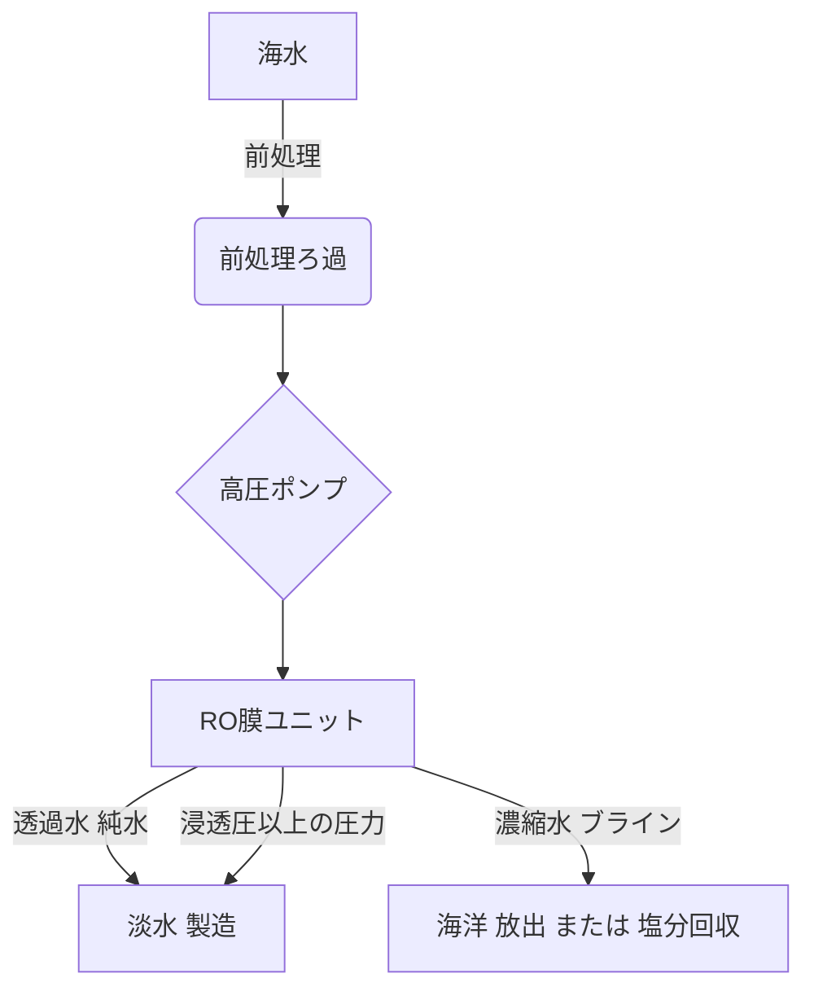

# T18-06-01 海水淡水化技術（RO膜・蒸発法）

## Summary（5つの要点）

* **RO膜の進化**: 逆浸透膜（RO膜）はエネルギー効率が高く、海水淡水化の主流技術であり、高性能膜の開発（東レ、日東電工など）により造水コストの低減が進んでいる。
* **原理**: 浸透圧以上の圧力を海水側にかけることで、水分子だけを半透膜（0.0001μmの微細孔）を通して純水側へ押し出す現象（逆浸透）を利用している。
* **用途拡大**: 中東、シンガポール、オーストラリアなどで大規模プラントが稼働しており、2050年の世界人口増加に伴う水不足問題解決の切り札として期待されている。
* **蒸発法との比較**: 逆浸透法は蒸発法よりも処理プロセスが簡単で経済的とされるが、蒸発法（多段フラッシュ、多重効用）も高純度水を必要とする産業などで依然活用されている。
* **課題**: RO膜の高性能化による造水コスト低減が進む一方で、膜のファウリング（目詰まり）対策、高圧ポンプに必要な**エネルギー消費**の削減が継続的な課題である。

#### 概念図: RO膜による海水淡水化プロセス

## 技術評価表（定量的な視点）

| 項目 | 評価 | 説明 |
| :--- | :--- | :--- |
| 導入コスト | **高** | 大規模プラント建設、高圧ポンプ、高性能RO膜の初期投資が大きい。 |
| 技術成熟度 | **高** | RO膜法は世界的に主流であり、安定した運用実績を持つ（商業化済）。 |
| 日本の競争力 | **高** | 東レ、日東電工などが高性能RO膜で世界シェア上位を占める。 |
| 市場性 | **極高** | 世界的な水不足の深刻化により、需要は継続的に拡大する見込み。 |
| 品質保証の重要性 | **極高** | 造水の安定性、飲料水の安全確保に直結するため、膜の健全性、水質管理が極めて重要。 |

## 日本の立ち位置・強み弱みのSummary

### 強み：

* **高性能RO膜技術**: 東レ、日東電工などが世界最高レベルの分離性能と低圧運転を両立するRO膜を開発・供給しており、国際競争力が高い。
* **プラントエンジニアリング**: 日揮、三菱重工など、大規模淡水化プラントの建設・運用実績が豊富であり、中東など海外市場で優位性を持つ。
* **複合技術**: 膜技術と熱回収技術を組み合わせたハイブリッド方式の開発・実用化に強み。

### 弱み：

* **国内需要の限定性**: 離島や渇水地域を除き、国内の淡水化プラントの新規大規模導入は限定的であり、技術の**内需**によるスケールアップが難しい。
* **エネルギーコスト**: 淡水化は依然として大きな電力を消費するため、再生可能エネルギーとの統合やコスト効率の改善が課題である。
* **塩水排出問題**: 濃縮海水（ブライン）の海洋排出が海洋環境に与える影響への対応技術開発が欧米に比べ遅れている側面がある。

## 技術ロードマップ（短期/中期/長期）

### 短期目標（～2027年）

* **超低圧RO膜の実用化**: 運転圧力をさらに低減し、電力消費を10%以上削減する次世代RO膜の商業規模での実証・導入。
* **AI/IoTによる運転最適化**: プラントの運転データ（水質、圧力、流量）をAIで解析し、膜洗浄（CIP）のタイミングを最適化するシステムの開発。

### 中期目標（2028年～2031年）

* **造水コストの目標達成**: 既存プラントの造水コストを、現状からさらに20%削減する技術（膜、エネルギー回収装置など）の確立。
* **モジュール型淡水化装置の普及**: 災害時や小規模地域向けのコンテナ型・移動型淡水化システムの国際標準化と輸出拡大。

### 長期目標（2032年～2035年）

* **次世代淡水化技術の確立**: 膜蒸留（MD）や正浸透（FO）など、熱や浸透圧を利用した低エネルギー型の革新的淡水化技術の商業化。
* **ブラインの資源化**: 排出される濃縮海水からリチウムやマグネシウムなどの有価資源を回収するゼロ・リキッド・ディスチャージ（ZLD）技術の確立。

### 📚 参照リンク

* [世界最高レベルの造水性能を有する海水淡水化向け逆浸透(RO)膜を創出 (TORAY)](https://www.toray.co.jp/news/article.html?contentId=1vbd4gcp)
* [逆浸透膜で水を処理する仕組みとは？メリット・デメリットも紹介 (ゼオライト株式会社)](https://www.zeolite.co.jp/column/3803/)
