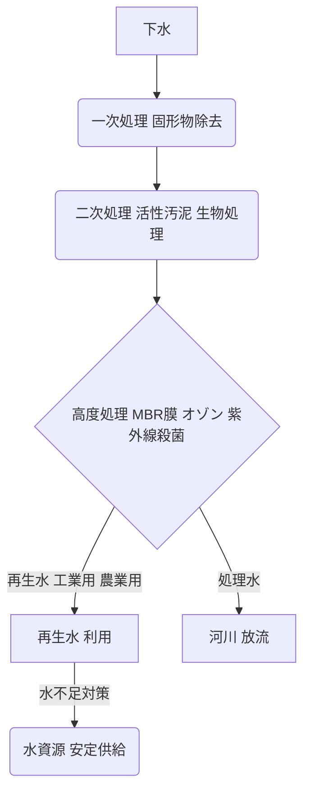

# T18-06-02 下水再生水・水循環システム

## Summary（5つの要点）

* **水資源循環の要**: 下水処理水を高度に浄化し、工業用水、農業用水、トイレ用水などとして再利用することで、水資源の循環利用を促進し、渇水リスクを低減する技術である。
* **主要技術**: 従来の活性汚泥処理に加え、**MBR膜（膜分離活性汚泥法）**、**オゾン処理**、**紫外線殺菌（UV）**などの高度処理プロセスを組み合わせることで、高水質の再生水を安定供給する。
* **国際事例**: シンガポールの「**NEWater**」は、下水処理水を飲料水レベルまで浄化し、国内需要の最大40%を賄う世界標準的な成功例である。
* **日本国内の状況**: 福岡市や東京都など、水資源に制約がある地域で工業用水などへの利用が進んでいるが、利用率はまだ低い。
* **課題**: 再生水利用への心理的抵抗（**パブリック・アクセプタンス**）の克服と、高度処理に必要なエネルギーコストの削減が課題である。

#### 概念図: 下水再生水処理の主要プロセス

## 技術評価表（定量的な視点）

| 項目 | 評価 | 説明 |
| :--- | :--- | :--- |
| 導入コスト | **中** | 既存の下水処理施設への高度処理設備（膜、オゾン、UV）の追加投資が必要。 |
| 技術成熟度 | **高** | MBR、オゾン、UVは実用化され、各国で大規模プラントの運用実績がある。 |
| 日本の競争力 | **中** | 膜技術（MBR）は高いが、再生水利用率（特に直接的な再利用）は欧米・アジア諸国に比べて低い。 |
| 市場性 | **高** | 世界的な水資源不足と環境意識の高まりから、都市部・工業地帯での導入が加速。
| 品質保証の重要性 | **極高** | 病原体、有害物質の除去レベルが高く求められ、利用用途に応じた水質の安定性が必須。 |

## 日本の立ち位置・強み弱みのSummary

### 強み：

* **高性能膜技術（MBR）**: 日本企業はMBR（膜分離活性汚泥法）用の高効率なろ過膜技術に優れており、コンパクトで高効率な再生水処理システムの提供が可能。
* **独自の高度処理技術**: オゾン処理や活性炭処理など、日本の水道・下水分野で培われた高度な水質浄化技術が豊富。
* **災害対策への応用**: 災害時の緊急用水源としての再生水供給システム開発が進んでいる。

### 弱み：

* **利用率の低さ**: 豊富な水資源に恵まれていた歴史的経緯から、他国に比べ再生水の利用に対する**社会的受容性（PA）**が低く、特に飲用水用途への展開が困難。
* **法規制・制度の遅れ**: 再生水の用途ごとの水質基準や、広域的な水循環システム構築を促進する制度設計が遅れている。
* **エネルギー消費**: 高度処理、特に膜分離と高圧ポンプの運転に要するエネルギーコストが高く、運用コスト削減が課題。

## 技術ロードマップ（短期/中期/長期）

### 短期目標（～2027年）

* **MBR膜処理の導入拡大**: 既存の下水処理場へのMBR膜システムの導入を加速し、再生水製造量を増加させる。
* **用途別水質基準の明確化**: 工業用、農業用など、再生水の用途に応じた水質基準とトレーサビリティシステムの確立。

### 中期目標（2028年～2031年）

* **エネルギー自立型処理場の実現**: 太陽光発電や下水汚泥の消化ガス発電などと組み合わせ、処理場のエネルギー自立度を向上させる。
* **広域水循環ネットワーク構築**: 複数の自治体や産業界を跨いだ再生水供給ネットワークの実証と運用開始。

### 長期目標（2032年～2035年）

* **飲料水直接再利用（DPR）技術の確立**: 心理的・技術的な課題を克服し、高度処理による飲用水直接再利用（DPR）の社会実装に向けた実証と法整備。
* **ゼロエミッション処理場の実現**: 下水からのリン、窒素、セルロースなどの資源回収技術を確立し、完全な資源循環型処理システムを完成させる。

### 📚 参照リンク

* [下水道事業の技術動向 (国土交通省)](https://www.mlit.go.jp/mizukokudo/sewerage/mizukokudo_sewerage_tk_000788.html)
