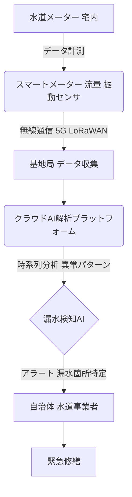

# T18-06-03 スマート水道メーター・漏水検知AI

## Summary（5つの要点）

* **機能**: IoT通信機能を内蔵した水道メーターにより、水道使用量を自動計測し、データをリアルタイムで収集・送信するシステムである。
* **漏水検知の仕組み**: 収集した使用量の時系列データをAIが解析し、**異常なパターン**（夜間の継続使用など）や、内蔵された**振動センサー**が捉えた配管の異常振動を基に、漏水箇所を自動で特定・警告する。
* **課題背景**: 日本の水道管は老朽化が進み、年間漏水率は15%と先進国平均（5%）より高く、貴重な水資源ロスと修繕コスト増大の要因となっている。
* **メリット**: 漏水の早期発見による水資源ロスと修繕コストの削減、検針業務の効率化（自動検針）、利用者への「見える化」サービス提供が可能になる。
* **導入状況**: 横浜市、大阪市などで導入が開始されており、2030年の全国展開が目標とされている。

#### 概念図: スマート水道メーターによる漏水検知プロセス

## 技術評価表（定量的な視点）

| 項目 | 評価 | 説明 |
| :--- | :--- | :--- |
| 導入コスト | **中高** | IoT通信機能、AI、振動センサーを搭載するため、従来のメーターより高価。通信インフラ整備も必要。 |
| 技術成熟度 | **中** | 検針自動化は成熟。漏水検知AIは実証・導入段階であり、精度向上が継続中。 |
| 日本の競争力 | **中高** | アズビル金門、東芝インフラシステムズなど国内メーカーがOCR、振動センサー技術を開発。 |
| 市場性 | **極高** | 水道管の老朽化対策、水資源ロス削減が喫緊の課題であり、全国的な導入が見込まれる。 |
| 品質保証の重要性 | **極高** | 計測データの正確性と、AIによる漏水検知の誤報・見逃しを最小化する精度保証が重要。 |

## 日本の立ち位置・強み弱みのSummary

### 強み：

* **アタッチメント型技術**: 既設の直読式メーターに後付け可能なOCR（光学文字認識）機能付きアタッチメント技術（振動センサー内蔵）の開発が進んでおり、既存インフラ活用が可能。
* **AI解析技術**: 日本の水道事業の特殊な漏水パターンに対応したAI・機械学習モデルの構築が進んでいる。
* **官民連携**: 国土交通省が導入促進を掲げており、自治体との連携による実証実験が活発。

### 弱み：

* **通信インフラの課題**: 全国的な通信規格の統一や、山間部などの通信環境整備の遅れが普及のボトルネックとなっている。
* **コスト負担**: メーター交換費用、通信費用、データ管理費用が高く、財政基盤の弱い自治体での導入が遅れる懸念。
* **データ活用人材の不足**: 収集されたビッグデータを解析し、漏水対策や需要予測に活用できる専門人材（データサイエンティスト）が水道事業体内で不足している。

## 技術ロードマップ（短期/中期/長期）

### 短期目標（～2027年）

* **全国導入の加速**: 主要な政令指定都市におけるスマートメーターの導入率を50%以上に引き上げ。
* **AI漏水検知精度の向上**: AIと振動センサーデータの統合解析による漏水検知の誤報率を5%以下に削減。

### 中期目標（2028年～2031年）

* **全国展開目標**: スマートメーターの全国導入率を80%以上とし、地方中小都市への導入を本格化。
* **広域連携システムの構築**: 複数自治体間でのデータ共有・共同解析プラットフォームを構築し、広域漏水対策を実現。

### 長期目標（2032年～2035年）

* **配水管の予知保全**: 漏水データ、管種、地盤情報などをAIで統合解析し、水道管の破裂リスクを事前に予測し、計画的な交換・補修を可能にするシステムの確立。
* **水需要予測の最適化**: スマートメーターデータに基づき、地域別・時間帯別の水需要を極めて高精度に予測し、配水ポンプの運転効率を最大化。

### 📚 参照リンク

* [水道スマートメーター (株式会社ウォーターデバイス)](https://www.waterdevices.co.jp/smartmeter/)
* [直読式水道メーターをスマート化する漏水検知機能付き OCR アタッチメントの開発 (アズビル金門)](https://ak.azbil.com/asset/document/news/news_20220930.pdf)
