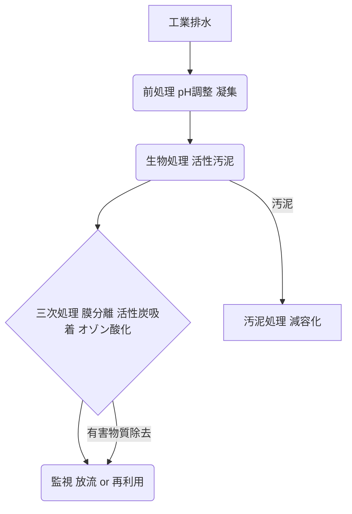

# T18-06-04 工業排水処理・有害物質除去技術

## Summary（5つの要点）

* **目的**: 工場排水に含まれる重金属、化学物質、有機物、そして近年注目される**マイクロプラスチック**などの有害物質を、環境規制基準を満たす水準まで高効率に除去し、水域への排出を抑制する。
* **主要技術**: **膜分離**（限外ろ過、逆浸透）、**活性炭吸着**、**オゾン酸化**、**高度な生物処理**など、多様な技術を排水の性状に応じて組み合わせる「複合プロセス」が主流である。
* **市場牽引**: 半導体工場や化学プラントなど、清浄度の高い水を要求する産業での再利用や、世界的な環境規制（例：PFAS規制）の強化が技術開発と市場導入を加速させている。
* **日本の競争力**: クボタ、栗田工業など、水処理専業メーカーが高度な分離膜やエンジニアリング技術で世界展開しており、高い競争力を持つ。
* **課題**: 極微量の有害物質（例：内分泌かく乱物質、医薬品）の除去、処理後の汚泥（廃棄物）の減量化と安全な処理、そして高効率化と低コスト化の両立が継続的な課題である。

#### 概念図: 工業排水処理の複合プロセス

## 技術評価表（定量的な視点）

| 項目 | 評価 | 説明 |
| :--- | :--- | :--- |
| 導入コスト | **高** | 複雑な複合設備（膜、オゾン発生器など）と高度な制御システムが必要。 |
| 技術成熟度 | **中高** | 一般的な有害物質除去は成熟。PFAS、マイクロプラスチックなど新規有害物質への対応技術は進化中。 |
| 日本の競争力 | **高** | 膜技術、生物処理、エンジニアリング力で世界的に優位性を保持。 |
| 市場性 | **極高** | 環境規制の強化、産業の高度化、排水の再利用ニーズにより、市場は拡大傾向。 |
| 品質保証の重要性 | **極高** | 排水基準の遵守は企業の存続に関わり、排出先の水域環境保全に直結する。 |

## 日本の立ち位置・強み弱みのSummary

### 強み：

* **水処理専業メーカーの技術力**: クボタ、栗田工業といった企業が、高度な膜ろ過技術や水質分析技術を保有し、グローバルにプラント供給を行っている。
* **高水質要求産業との連携**: 半導体・精密化学産業における超純水製造技術のノウハウが、排水の高度処理技術に応用されている。
* **コンパクトな設備設計**: 都市部や敷地制約の厳しい環境に対応できる、効率的な省スペース型処理プラントの設計技術に優れる。

### 弱み：

* **新規有害物質への対応の遅れ**: 世界的に規制が先行する**新興汚染物質（PPCPs、PFASなど）**に対する国内の規制導入と技術開発が、欧米に比べ遅れる場合がある。
* **処理汚泥の再利用**: 処理後の汚泥を安全に減量化・無害化し、有効利用（肥料、燃料など）に回す資源循環技術のコスト効率が課題。
* **中小工場への普及**: 高コストな高度処理技術を、資金力に乏しい中小規模の工場へいかに普及させるかが課題。

## 技術ロードマップ（短期/中期/長期）

### 短期目標（～2027年）

* **PFAS・マイクロプラスチック除去**: 新規環境規制に対応するため、フッ素化合物（PFAS）や5mm以下のマイクロプラスチックを90%以上除去する吸着材・膜技術の実用化。
* **AIによるプロセス制御**: 排水の性状変動に合わせ、薬剤注入量や膜洗浄頻度をリアルタイムで自動最適化するAI制御システムの導入。

### 中期目標（2028年～2031年）

* **ゼロ・リキッド・ディスチャージ（ZLD）のコスト低減**: 排水の外部排出ゼロを目指すZLDプラントのエネルギー消費を現状から30%削減し、普及を促進。
* **汚泥の資源化**: 処理汚泥から貴金属やレアメタルを回収する技術、またはバイオマス燃料への変換技術の商業化。

### 長期目標（2032年～2035年）

* **オンデマンド型処理技術**: 排水発生源の多様化に対応し、移動可能でモジュール化された「オンデマンド型」高度排水処理システムの国際標準化と展開。
* **環境影響評価の統合**: 処理技術のライフサイクル全体での環境負荷（CO2排出、水消費）を評価し、最も持続可能性の高い技術を選択・導入するシステムの確立。

### 📚 参照リンク

* [水処理事業の取り組み (クボタ)](https://www.kubota.co.jp/rd/column/water/01.html)
