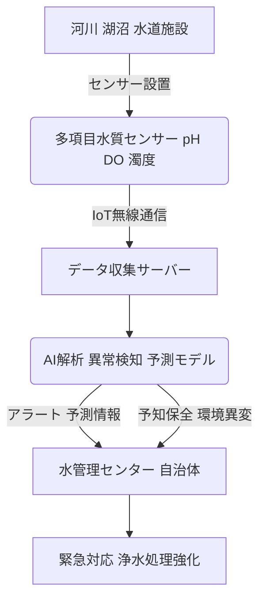

# T18-06-05 水質リアルタイムモニタリングシステム

## Summary（5つの要点）

* **目的**: 河川、湖沼、水道水の水質（pH、濁度、DO、有害物質など）を**センサーネットワーク**で常時監視し、異常を即座に検知することで、水質汚染事故の早期発見や飲料水の安全確保に貢献する。
* **要素技術**: 高精度な**水質センサー**（化学センサー、光学センサー）、**IoT通信技術**（LoRaWAN、5G）、そして収集データを解析する**AI異常検知アルゴリズム**（移動平均、管理図など）から構成される。
* **AI予測**: 単に異常を検知するだけでなく、過去データや気象データから藻類大発生（アオコ）などの**環境異変**を事前に警告するAI予測機能も開発されている。
* **適用事例**: 日本国内では霞ヶ浦、琵琶湖などの主要水域で導入が進んでおり、水道水の水源監視における重要性が高まっている。
* **課題**: センサーの**ファウリング**（汚染による目詰まり）対策、長期安定稼働のための**較正管理**、そして極微量・多種の有害物質に対応できる**多項目センサー**の開発が課題である。

#### 概念図: 水質リアルタイムモニタリングのデータフロー

## 技術評価表（定量的な視点）

| 項目 | 評価 | 説明 |
| :--- | :--- | :--- |
| 導入コスト | **中** | センサー、通信インフラ、データ解析プラットフォームの整備が必要。 |
| 技術成熟度 | **中** | 基本的な項目（pH、濁度）の監視は成熟。有害物質・微量物質の多項目・高感度監視は進化中。 |
| 日本の競争力 | **中高** | 分析機器や光学センサー技術に強みを持つが、IoTプラットフォーム開発では欧米スタートアップが先行。 |
| 市場性 | **高** | 水源汚染リスクの増加、環境規制の強化、スマートシティ化の流れで需要が拡大。 |
| 品質保証の重要性 | **極高** | 監視データの信頼性が飲料水の安全、公衆衛生に直結するため、センサーの較正・データ完全性の保証が必須。

## 日本の立ち位置・強み弱みのSummary

### 強み：

* **高性能センサー技術**: 日本メーカーは、高精度なpH計、DO計、分光分析計などの水質分析機器およびセンサー技術に優れる。
* **水質管理のノウハウ**: 水道水質の維持管理に関する長年の知見があり、これを基にした異常検知アルゴリズムの開発に優位性を持つ。
* **研究機関の連携**: 国立環境研究所など、河川・湖沼の環境異変予測に関する研究機関との連携が活発。

### 弱み：

* **多項目・微量センサーの開発**: 医薬品成分、マイクロプラスチックなど、多様化する微量有害物質をリアルタイムで同時に監視できる安価な多項目センサーの開発が遅れている。
* **データプラットフォームの分断**: 各自治体や水域ごとのシステムが独立しており、全国的なデータ統合・広域監視プラットフォームの構築が遅れている。
* **センサーのメンテナンス性**: 設置環境が厳しいため、ファウリング（汚染）対策や長期安定稼働を実現するための自動較正・清掃技術の改善が必要。

## 技術ロードマップ（短期/中期/長期）

### 短期目標（～2027年）

* **AI異常検知の導入拡大**: 主要な浄水場および水源地において、時系列データに基づくAIによる水質異常の自動検知システムを導入。
* **センサーの耐環境性向上**: 設置現場でのファウリングを抑制し、メンテナンス頻度を半減するセンサー保護技術・自動洗浄技術の実用化。

### 中期目標（2028年～2031年）

* **多項目センサーの商業化**: 1台で10種類以上の有害物質（PPCPs、農薬など）をリアルタイムで高感度監視できるセンサーデバイスの量産化。
* **AIによる環境異変予測**: 気象データと組み合わせたAIにより、アオコや水温躍層など、水域環境の異変を数日前に予測し、水管理者に警告するシステムの運用開始。

### 長期目標（2032年～2035年）

* **全国水質監視ネットワークの完成**: 全国の主要な河川・湖沼・水道施設をカバーする統合型リアルタイム水質モニタリングネットワークを構築し、広域的な水資源管理に活用。
* **自律型水中ドローンの活用**: センサーを搭載した自律型水中ドローンを導入し、人間が立ち入れない場所や広範囲の水域を自動で移動しながら高密度に水質監視を行う。

### 📚 参照リンク

* [下水道事業の技術動向 (国土交通省)](https://www.mlit.go.jp/mizukokudo/sewerage/mizukokudo_sewerage_tk_000788.html)
