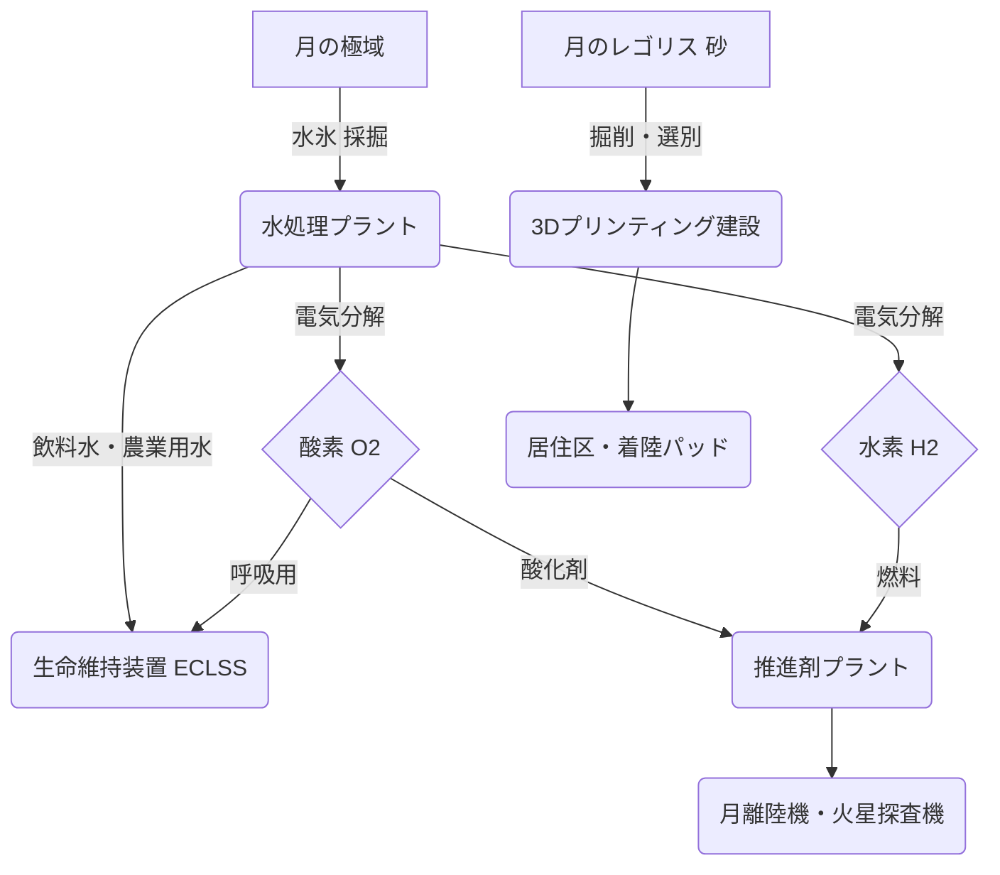

## Summary（5つの要点）

1.  **現地資源の活用**: 月のレゴリス（砂）や極域の水氷、火星の大気（CO2）など、現地にある資源を直接利用し、地球からの輸送質量を劇的に削減する技術群。
2.  **推進剤の現地生産**: 最も重要な応用は「水の電気分解」。水（H2O）を採掘・分解して水素（H2）と酸素（O2）を生成し、ロケットの推進剤を現地で製造する。
3.  **生命維持資材の生成**: 生成した酸素はクルーの呼吸用に、水は飲料水や農業用に利用する。火星大気のCO2と水素からメタンと水を生成するサバティエ反応も中核技術。
4.  **建材の3Dプリンティング**: レゴリスを焼結・溶融して3Dプリンターの材料とし、居住モジュール、着陸パッド、放射線遮蔽壁などを自動建設する。
5.  **アルテミス計画の鍵**: NASAのアルテミス計画では、月面での持続的滞在（2030年代）の実現にISRUが不可欠と位置付けられており、民間企業（Blue Origin, Astrobotic等）による実証が進行中。

#### 概念図: ISRUによる月面資源循環プロセス

## 技術評価表（定量的な視点）

| 項目 | 導入コスト | 技術成熟度 | 日本の競争力 | 市場性 | 品質保証の重要性 |
| :--- | :--- | :--- | :--- | :--- | :--- |
| 評価 | ★★★★★（高） | ★★☆☆☆（実証段階） | ★★★☆☆（中） | ★★★★★（高） | ★★★★★（極高） |
| 概要 | 初期プラント輸送コストは莫大。ただし輸送コスト削減効果（LEO-月面間）で相殺。 | 地上実証は成功。NASA VIPERローバー等による月面実証が2026年以降に本格化。 | JAXA、鹿島建設、清水建設がレゴリス3Dプリンティングや水電解技術で研究を推進。 | 月面経済圏の中核。水・推進剤が宇宙の「ガソリンスタンド」となる。 | 極低温、真空、放射線下でのプラントの無人運用と信頼性・安全性の確保が最重要。 |

## 日本の立ち位置・強み弱みのSummary

### 強み

* **建設自動化技術**: 鹿島建設や清水建設が持つ無人・自動建設技術（特に3Dプリンティング）は、レゴリス建材化において高い競争力を持つ。
* **水電解技術**: 日本企業（パナソニック、日立造船等）が持つ高性能な水電解スタック技術は、月面での水素・酸素生成に応用可能。
* **ロボティクス**: JAXAや民間企業（ispace等）が培ってきた小型ローバー、ロボットアーム技術は、資源探査・採掘作業に不可欠。

### 弱み

* **大型輸送システム不在**: ISRUプラントのような大型ペイロードを月面に輸送する手段（Starship級）を保有しておらず、米国民間に依存。
* **実証経験の不足**: 月面での実証ミッション（特に極低温環境での掘削）の経験がNASAや中国に比べて不足している。
* **法整備の遅れ**: 宇宙資源の所有権や利用権に関する国内法・国際ルールの整備が、米国のアルテミス合意に比べて遅れている。

## 技術ロードマップ（短期/中期/長期）

### 短期目標（～2027年）

* **資源探査の確定**: NASAのVIPERミッション等により、月の極域における水氷の正確な埋蔵量、分布、形態（土壌との混合比）を特定。
* **地上実証**: レゴリス模擬土壌を用いた3Dプリンティング建材の強度検証。小規模な水電解プラントの真空・低温環境試験。
* **ISRU実証ミッション**: NASA CLPS（民間月面輸送サービス）による小規模なISRUコンポーネントの月面技術実証（例: Moxyの火星CO2→O2生成の月版）。

### 中期目標（2028年～2031年）

* **パイロットプラント設置**: アルテミス計画ベースキャンプ近傍に、中規模ISRUパイロットプラント（年間数トン規模の水処理）を設置。
* **酸素の初生産**: 月面で生産した酸素を、生命維持または小型ロケットの酸化剤として初めて利用（実証）。
* **建設技術の実証**: レゴリス3Dプリンティングによる着陸パッドや防護壁の小規模建設実証。

### 長期目標（2032年～2035年）

* **商用プラント稼働**: 年間数十～数百トン規模の推進剤（液体酸素・液体水素）を生産する商用ISRUプラントが稼働開始。
* **推進剤の軌道上供給**: 月面で生産した推進剤を月周回軌道（Gateway等）へ輸送し、火星探査機への燃料補給を実現。
* **基地インフラの拡張**: レゴリス建材で構築された大型の有人居住モジュールが運用開始。

### 📚 参照リンク

* [NASA In-Situ Resource Utilization (ISRU)](https://www.nasa.gov/general/in-situ-resource-utilization-isru/)
* [JAXA 国際宇宙探査 ロードマップ (PDF)](https://www.jaxa.jp/projects/sas/planetary/files/roadmap_2_j.pdf)
* [J-Stage 人間が定住する月面拠点建設へのロードマップ](https://www.jstage.jst.go.jp/article/kjsass/70/7/70_156/_article/-char/ja/)
