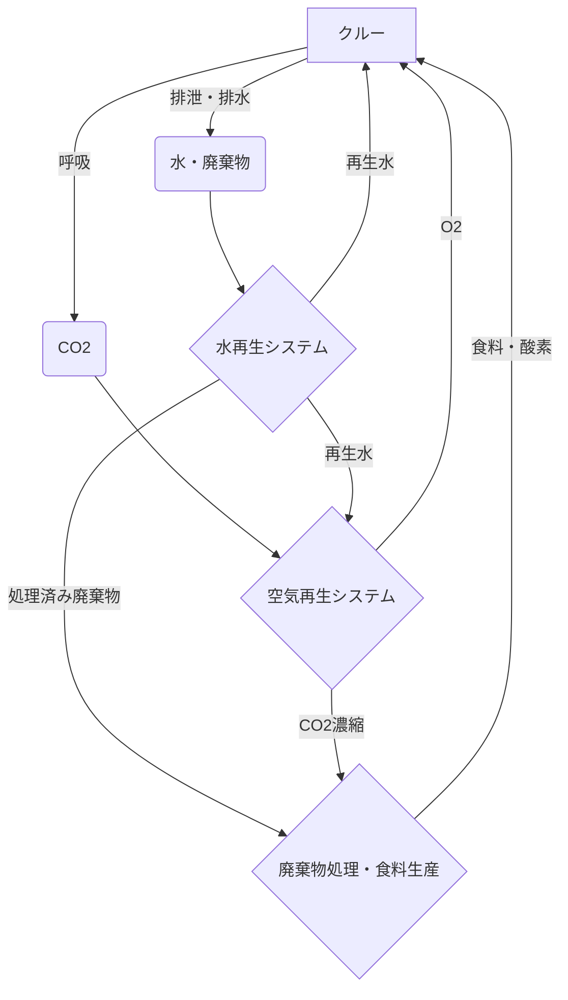

## Summary（5つの要点）

1.  **宇宙の生命線**: 宇宙船や基地内で、温度・湿度・気圧を管理し、クルーに必要な水、酸素、食料を供給・再生するシステム全体を指す。
2.  **空気再生（CO2除去）**: クルーが排出するCO2を除去し、酸素を供給。ISSではサバティエ反応（CO2とH2から水とメタン生成）で水を再生し、その水を電気分解して酸素を生成する。
3.  **水再生（尿・湿気の浄化）**: 尿、汗、呼吸による湿気、手洗い排水などをすべて回収・ろ過・蒸留し、90%以上を飲料水として再利用する（ISSでは達成済み）。
4.  **閉ループ化への挑戦**: 地球からの補給を最小限にするため、廃棄物（クルーの排泄物、食物残渣）を微生物やプラントで分解・再生し、食料や水、酸素に戻す「完全閉鎖循環型」が究極の目標。
5.  **JAXAとMELiSSA**: JAXAはISS「きぼう」でCO2除去装置や水再生装置を運用中。ESA（欧州宇宙機関）は「MELiSSA」プロジェクトで、微生物と藻類による究極の閉ループシステムを研究開発中。

#### 概念図: ECLSSにおける物質循環（閉ループ型）

## 技術評価表（定量的な視点）

| 項目 | 導入コスト | 技術成熟度 | 日本の競争力 | 市場性 | 品質保証の重要性 |
| :--- | :--- | :--- | :--- | :--- | :--- |
| 評価 | ★★★★★（高） | ★★★☆☆（ISSで実用） | ★★★★☆（高） | ★★★★☆（中） | ★★★★★（極高） |
| 概要 | システム開発・打上コストは極めて高い。長期ミッションでは補給コスト削減で回収可能。 | ISSで水・空気の「準閉鎖系」は実用化済。廃棄物を含めた「完全閉鎖系」は研究段階。 | JAXAはCO2除去、水再生で高い技術力を持つ。民間（日揮、栗田工業）の水処理技術も強い。 | 宇宙市場は限定的だが、地上（災害時、砂漠、潜水艦）の独立型生命維持システムに応用可能。 | 故障＝クルーの生命危機。100%の信頼性、冗長設計、消耗品交換の容易性が最重要課題。 |

## 日本の立ち位置・強み弱みのSummary

### 強み

* **水処理・膜技術**: 日揮グローバルや栗田工業、東レなどが持つ世界トップクラスの水処理技術（膜分離、触媒酸化）は、ECLSSの水再生システムに直結する。
* **CO2分離・再生技術**: JAXAが開発したCO2除去装置（CDRA）や、三菱重工などの化学プラント技術（CO2回収・触媒反応）は、空気再生システムの中核。
* **ISS運用実績**: JAXAは「きぼう」モジュールで独自のECLSS（温湿度管理、空気循環）を長期間安定運用してきた実績を持つ。

### 弱み

* **完全閉ループ研究の遅れ**: ESAの「MELiSSA」（微生物利用）のような、廃棄物から食料までを再生する革新的な完全閉ループ型の基礎研究では欧州に後れを取っている。
* **大型システムの統合経験**: ISSのECLSSは米国・ロシアが主導しており、大型宇宙船全体の生命維持システムを統合開発した経験は限定的。

## 技術ロードマップ（短期/中期/長期）

### 短期目標（～2027年）

* **ISSでの次世代機実証**: JAXAが開発中の次世代CO2除去装置や、より高効率な水再生システムのISSでの軌道上実証。
* **信頼性向上**: 既存システムの消耗品寿命延長、故障率低減、メンテナンスの自動化・遠隔化技術の確立。

### 中期目標（2028年～2031年）

* **Gatewayへの搭載**: 月周回ステーション「Gateway」向けに、小型・軽量化された高効率ECLSSコンポーネントの提供（日本も貢献予定）。
* **水再生率98%達成**: NASAが目標とする水再生率98%超（ISSは90-94%）を達成する次世代水処理システムの開発。
* **廃棄物処理（部分循環）**: 廃棄物（ゴミ）を熱分解し、ガスや水を回収する部分的な資源循環技術の実証。

### 長期目標（2032年～2035年）

* **月面基地での運用**: 月面基地（アルテミスベースキャンプ）で、ISRU（現地調達の水）と連携したECLSSの長期安定運用。
* **食料生産との統合**: 宇宙農業（T19-01-05）とECLSSを統合し、植物がCO2を吸収して酸素と食料を供給し、ECLSSが水分を管理する循環システムの構築。
* **火星探査機への応用**: 補給が不可能な火星ミッション（往復3年）に耐えうる、ほぼ100%の物質循環率を持つ自律型ECLSSの基本設計完了。

### 📚 参照リンク

* [NASA: Environmental Control and Life Support System (ECLSS)](https://www.nasa.gov/centers/marshall/history/eclss.html)
* [JAXA: 将来の有人宇宙活動を支える環境制御・生命維持システム](https://humans-in-space.jaxa.jp/space-job/specialist/voice/detail/07.html)
* [ESA: MELiSSA (Micro-Ecological Life Support System Alternative)](https://www.esa.int/Enabling_Support/Space_Transportation/MELiSSA)
* [Spaceship FR: ECLSS Technology Roadmap (PDF)](https://ttu-ir.tdl.org/server/api/core/bitstreams/9bcdb90d-4592-4cfb-93ef-80908a2911b7/content)
